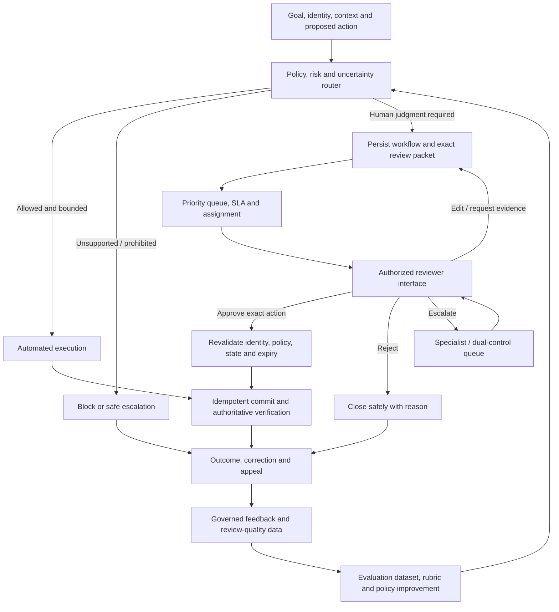
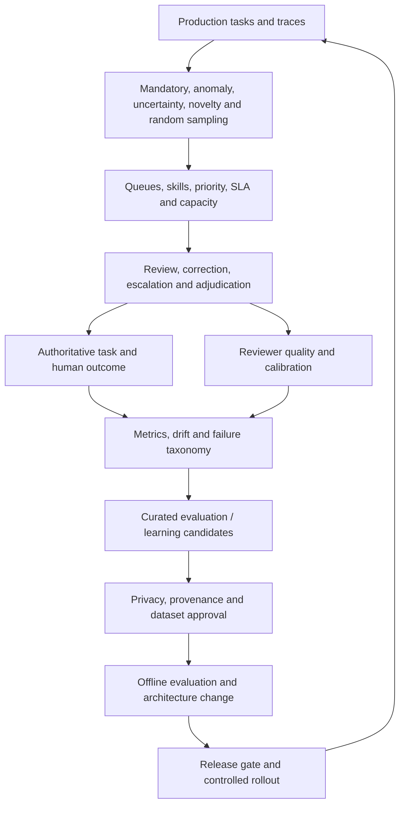
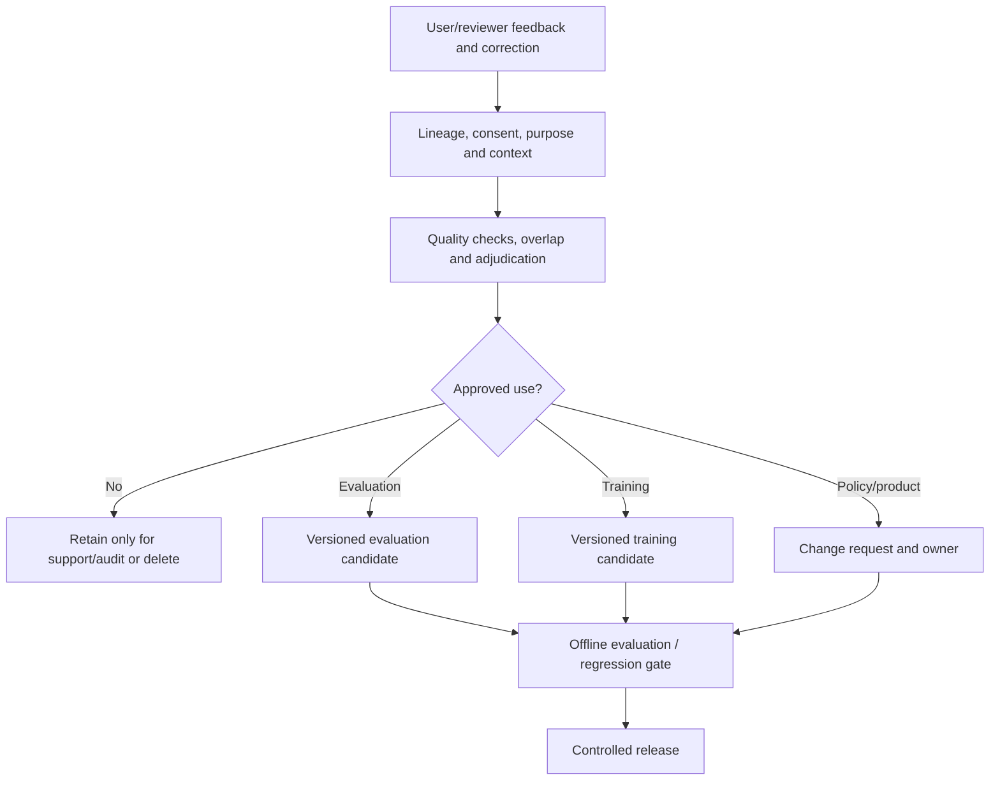

# Human-in-the-loop and HILOps

> _Last reviewed: 2026-07-24 — see the [freshness policy](../appendix/maintenance.md). “HILOps” is used here as an operating-model term for production human-review systems; it is not a formal standard or universally agreed product category._

## Learning objectives

After this chapter you will be able to:

- place human judgment where it can materially change an AI outcome;
- distinguish runtime approval, exception handling, evaluation labeling and model-improvement feedback;
- design durable interrupt, review, correction, escalation and resume contracts;
- operate reviewer queues with capacity, service levels, calibration, quality and privacy controls;
- select HITL libraries and platforms by role instead of expecting one product to solve the whole loop.

## Decision in one sentence

> **Use people for accountable judgment, exceptions and learning; use durable workflows, policy and evidence to ensure their intervention is timely, informed, authorized, measurable and operationally sustainable.**

Adding an **Approve** button does not create meaningful oversight. If the action already happened, the reviewer lacks evidence, the queue is overloaded, or the approval is not bound to the exact effect, the person is ceremonial.

This chapter extends [human-agent interaction, control and oversight](../04-llm-systems/05-human-oversight.md) from interaction design into production architecture and operations.

## Name the loop precisely

“Human-in-the-loop” is used for several different systems:

| Pattern | Human role | Timing | Example |
| --- | --- | --- | --- |
| Human-in-the-loop (HITL) | required input changes the next state | during a task | approve a refund preview |
| Human-on-the-loop (HOTL) | supervises behavior and intervenes by exception | during operation | halt an agent after anomaly alert |
| Human-in-command | owns scope, policy, deployment and shutdown authority | lifecycle/governance | approve an agent's allowed use profile |
| Human review | assesses an output or trace | before or after effect | domain expert grades a response |
| Human feedback | supplies preference, correction or experience signal | after interaction | user edits a draft or reports harm |
| Human labeling | creates evaluation or training data | offline/continuous | adjudicate policy-grounded answers |
| Human execution | person performs the consequential action | at commit | agent prepares, employee submits payment |
| RLHF/preference learning | human comparisons influence future model behavior | model training | rank candidate responses |
| HILOps | operates all human queues, quality, capacity, evidence and feedback paths | continuous | staffing, SLAs, calibration, audit and dataset promotion |

The [AAAI “Preposition Salad” paper](https://ojs.aaai.org/index.php/AAAI-SS/article/view/35571) documents why inconsistent “in/on/over the loop” terminology creates confusion. For architecture reviews, state the actor, decision, timing, authority and system effect instead of relying on the label.

## Decide where a person belongs

Use people when at least one of these is true:

- consequence is high or difficult to reverse;
- law, policy, contract or separation of duties requires accountable authority;
- valid behavior depends on contextual professional judgment;
- evidence is conflicting, missing, novel or outside supported scope;
- a person is needed to clarify intent, affected resources or acceptable trade-offs;
- the system cannot reliably detect or recover from a failure;
- a representative human sample is needed to calibrate automated evaluation;
- production cases must be curated into evaluation or learning data.

Do not add mandatory human review merely because a model is probabilistic. Low-risk, reversible, well-evaluated work can be automated with monitoring. Human attention is finite and must be reserved for decisions where it adds control or information.

### Control placement matrix

| Consequence | Reversibility | Evidence/novelty | Recommended control |
| --- | --- | --- | --- |
| Low | easy | familiar and well evaluated | automate; sample for quality |
| Low | easy | uncertain or novel | clarify, observe or post-review |
| Medium | reversible with cost | familiar | policy gate plus anomaly review |
| Medium | difficult | uncertain | pre-action review with evidence |
| High | reversible | familiar | explicit approval; verify and monitor |
| High | difficult/irreversible | any | human execution or dual control; consider abstaining |
| Prohibited/unsupported | any | any | block; a reviewer cannot legitimize it |

High model confidence does not waive a mandatory control. Low confidence alone should not flood a queue; combine uncertainty with consequence, novelty, policy and detectability.

## Reference architecture



| Stage | Required behavior | Evidence |
| --- | --- | --- |
| Intake | bind authenticated actor, goal, affected resources and proposed authority | task and identity IDs |
| Route | evaluate consequence, policy, uncertainty, novelty and queue policy in trusted code | policy/risk version and reason |
| Persist | suspend safely without holding a process or losing context | durable workflow/checkpoint ID |
| Queue | prioritize, assign, expire and escalate by service policy | timestamps, queue and owner |
| Review | show exact action, evidence, counterevidence, consequence and alternatives | review packet version |
| Decide | authorize reviewer and capture approve/edit/reject/escalate reason | signed decision receipt |
| Revalidate | detect changed target, state, policy, identity or expiry | canonical action hash and current reads |
| Commit | use idempotency and reconcile ambiguous outcomes | transaction ID and authoritative state |
| Feedback | separate operational decision from training/evaluation use | purpose, consent, lineage and approval |

## Design the review contract

The review packet is an API and audit artifact, not a screenshot of chat.

```yaml
review_request:
  review_id: rev_01J9H4
  workflow_id: shipment_case_8831
  created_at: 2026-07-24T18:22:13Z
  expires_at: 2026-07-25T18:22:13Z
  requesting_principal: agent://northstar/support/v7
  acting_for: user://employee/1042
  use_profile: shipment_support
  reason_codes: [high_value, conflicting_policy]
  proposed_action:
    type: open_carrier_investigation
    target: order_8831
    parameters:
      carrier: ExampleCarrier
      evidence_refs: [scan_91, policy_P17_v4]
    canonical_hash: sha256:9c0...
  evidence:
    verified: [order_owner_match, latest_scan]
    conflicting: [policy_P17_v4, exception_note_12]
    missing: [carrier_damage_report]
  consequence:
    customer_visible: true
    reversible: true
    expected_cost_cad: 18
  choices: [approve, reject, edit, request_evidence, escalate]
  required_role: shipment_exception_specialist
  policy_version: investigation_control_6
```

An approval is valid only for the exact action. A change to target, amount, recipient, data disclosure, policy, identity, expiry or material parameter invalidates it.

## Build durable interrupt and resume

A production HITL workflow can wait minutes or days. It must survive application restarts, deployment, lost browser sessions and duplicate messages.

### State model

```text
PROPOSED → REVIEW_REQUIRED → QUEUED → CLAIMED → DECIDED
    → REVALIDATING → COMMITTING → VERIFIED
                         ↘ UNKNOWN → RECONCILING

REVIEW_REQUIRED / QUEUED / CLAIMED → EXPIRED | CANCELLED
DECIDED → REJECTED | ESCALATED | SUPERSEDED
VERIFIED → CORRECTION | APPEAL | COMPENSATION
```

Persist transitions with optimistic concurrency or an equivalent single-writer rule. Store the decision independently of chat history. The workflow engine may orchestrate; the system of record remains authoritative for the business effect.

### Engineering requirements

- Durable checkpoint or workflow history before notifying a reviewer
- Stable review and workflow IDs
- Exact action hash and policy/version references
- Idempotent decision submission and commit
- Reviewer authentication, role and separation-of-duty enforcement
- Claim/lease semantics so two reviewers do not unknowingly race
- Expiry and safe default—normally reject, cancel or escalate
- Revalidation immediately before commit
- Cancellation that distinguishes pending from already committed work
- Reconciliation for lost responses and unknown outcomes
- Immutable decision/effect evidence under appropriate retention
- No production secret or unnecessary personal data in notifications

Framework pause/resume is useful, but it does not automatically provide authorization, queue operations, reviewer UX, action binding, idempotency or audit policy.

## Design the reviewer experience

The interface must help a qualified person detect error—not persuade them to accept the model.

Show:

- the customer's/user's goal and the exact decision requested;
- verified facts, source dates and provenance;
- material missing and conflicting evidence;
- the proposed effect, target, parameters, recipient and data disclosure;
- relevant policy/rule and any exception;
- consequence, reversibility, deadline and safe fallback;
- what changed since any earlier preview;
- approve, edit, reject, request-evidence and escalate options;
- post-decision status and authoritative receipt.

Avoid:

- preselected approval;
- “recommended” styling that anchors the reviewer without evidence;
- decorative confidence that is not calibrated to the decision;
- raw chain-of-thought or excessive trace noise;
- burying counterevidence behind another panel;
- pressure countdowns unrelated to a real deadline;
- asking the reviewer to infer whether the action already occurred.

The 2019 CHI [Guidelines for Human-AI Interaction](https://doi.org/10.1145/3290605.3300233) remain useful for setting expectations, supporting efficient correction and adapting to change. Recent human-factors research continues to warn that automation bias and complacency can make “human oversight” weaker than it appears. Test the joint system under plausible wrong recommendations, time pressure and alert fatigue.

## HILOps: operate human judgment as a service

HILOps covers the people, process, tooling and evidence required to keep human intervention effective in production.



| HILOps capability | Questions the SA must answer |
| --- | --- |
| Demand generation | Which events require review, which are sampled, and which are blocked automatically? |
| Routing | What skill, jurisdiction, clearance, language and separation of duty are required? |
| Priority | How do consequence, deadline, age, uncertainty and customer impact affect order? |
| Capacity | What arrival rate, handling-time distribution, concurrency, coverage and surge reserve exist? |
| Service level | What response/expiry targets apply, and what safe action occurs when missed? |
| Quality | How are rubrics, overlap, calibration, adjudication, appeals and reviewer drift managed? |
| Experience | Can reviewers understand, decide, correct and recover accessibly? |
| Governance | Who owns policy, workforce, model, dataset, tooling, privacy and residual risk? |
| Learning | How do reviewed cases become approved evaluation/training data and released changes? |
| Economics | What is the cost per reviewed and verified successful task? |

### Generate review work intentionally

Use multiple routes:

- **Mandatory:** law, policy, transaction threshold, dual control
- **Risk:** high consequence, hard-to-reverse or externally visible effect
- **Uncertainty:** calibrated ambiguity near a decision boundary
- **Novelty:** new intent, tool path, data source, population or model behavior
- **Anomaly:** unusual trajectory, cost, latency, loop, denial or content signal
- **Outcome:** negative feedback, correction, appeal, recontact or business failure
- **Random:** unbiased sample for prevalence and false-negative estimation
- **Calibration:** known gold or adjudicated cases mixed into reviewer work where ethical

Pure uncertainty sampling produces a biased dataset and may miss confident failures. Pure random sampling wastes expert time on obvious cases. Combine routes and record the inclusion probability/reason so analysts know what the sample represents.

### Capacity and service levels

Estimate demand before launch:

```text
review hours per period
  = review items × mean handling minutes / 60
  + calibration, adjudication, training and incident reserve
```

Also model peaks and the handling-time distribution. A four-minute average hides 30-minute exception cases. Review queues require:

- business-hours or 24×7 coverage;
- skill/language/jurisdiction pools;
- queue age and deadline alerts;
- surge/failover and absence coverage;
- safe timeout behavior;
- maximum work-in-progress;
- reviewer breaks and rotation for sensitive content;
- a degraded system mode when capacity is unavailable.

Do not route all excess demand to “approve by default.” When the review service is unavailable, reduce agent authority, defer the task, use a safe alternative, or transfer to an existing human workflow.

### Reviewer roles

| Role | Responsibility |
| --- | --- |
| Domain reviewer | decide normal cases within delegated authority |
| Specialist | handle policy, legal, safety, security or technical exceptions |
| Adjudicator | resolve structured disagreement and update guidance |
| Queue lead | monitor load, aging, escalations and service levels |
| Quality lead | calibration, overlap, sampling and reviewer drift |
| Policy owner | define allowed, mandatory-review and prohibited boundaries |
| Dataset steward | approve lineage, privacy, labels and evaluation/training use |
| Product/model team | fix causal system failures and run release evaluations |
| Risk/change authority | accept residual risk and approve expanded authority |

Reviewers must have time, training, evidence and authority to reject. Productivity incentives that reward speed or approval volume can destroy the control.

## Measure the joint system

### Operational metrics

- arrival rate by reason, risk, tenant, language and channel;
- queue age, time to claim, handling time, decision time and SLA miss;
- abandonment, expiry, reassignment and escalation;
- reviewer utilization and work-in-progress;
- cost per review and cost per verified successful task.

### Decision-quality metrics

- correct detection and correction of seeded/adjudicated errors;
- reviewer false approval and false rejection;
- edit, reject and escalation outcome;
- inter-reviewer agreement and adjudication rate;
- override precision: proportion of overrides that improve authoritative outcome;
- missed-error rate from independent audit/random sample;
- policy adherence and separation-of-duty violations;
- accessibility and comprehension.

### System-learning metrics

- production cases promoted to evaluation;
- time from incident/review finding to regression case;
- automated grader agreement with adjudicated human labels;
- recurring failure rate after fix;
- suite coverage by review reason and critical slice;
- reduction in review demand caused by verified architecture improvements.

Approval rate alone is ambiguous. A 99.9% rate can mean excellent routing or rubber-stamping. Pair it with seeded error detection, audit, dwell-time distribution, reviewer interviews and downstream outcomes.

## Operate labeling and adjudication

For human evaluation or dataset creation:

1. Define a narrow question and label ontology.
2. Supply positive, negative, boundary and abstain examples.
3. Train reviewers on the actual rubric and interface.
4. Independently double-label a representative subset.
5. Track agreement by criterion and slice.
6. Adjudicate disagreements and record the rationale.
7. Version guidance and re-evaluate labels affected by changes.
8. Monitor individual and population drift without punitive misuse.
9. Preserve raw decision, adjudicated label and provenance separately.
10. Recalibrate automated judges against current adjudicated labels.

Disagreement can be signal. It may expose missing context, ambiguous policy, competing stakeholder values or a scale that pretends an ordinal judgment is precise.

## Keep feedback out of the runtime control plane



| Transition | Control |
| --- | --- |
| Feedback → lineage | identify source, task, affected person, consent/purpose and selection route |
| Lineage → quality | remove unsupported labels, duplicates, leakage and malicious instructions |
| Quality → approved use | dataset steward and policy decide evaluation, training, support-only or deletion |
| Candidate → change | version data, prompt, policy, model and expected impact |
| Change → release | run applicable evaluation, security, human-workflow and rollback gates |

Never let a thumbs-down, reviewer note, user-provided “correction,” or model-generated critique directly rewrite policy, memory, prompts or training data. Feedback is untrusted evidence until validated.

## Secure the human loop

Human review expands the attack surface:

- malicious content can socially engineer a reviewer;
- notifications can leak case data;
- attackers can flood expensive queues;
- reviewers may access cases outside their purpose or region;
- an approval link can be replayed or forwarded;
- compromised reviewer accounts can authorize effects;
- model rationales can anchor or deceive;
- labels and corrections can poison evaluation or training data.

Controls include:

- strong reviewer authentication and short-lived, audience-bound links;
- RBAC/ABAC by tenant, case, role, geography and data class;
- least-data review packets and redaction/pseudonymization;
- trusted UI separation between instructions and untrusted content;
- anti-CSRF/replay, action hashing and idempotency;
- rate limits, queue abuse detection and workload isolation;
- dual control for defined effects;
- reviewer access logs and anomaly detection;
- protected feedback ingestion, dataset quarantine and provenance;
- retention/deletion aligned to original and secondary purposes.

Do not send a sensitive case to email or chat merely because those channels are convenient for approval. Use the notification to direct the authorized reviewer to a controlled decision surface.

## Modern libraries and platforms

No single library supplies the entire HILOps system. Separate runtime coordination, review/annotation, evaluation/observability and workforce operations.

### Runtime interrupt and approval

| Tool | Useful capability | What the SA still owns |
| --- | --- | --- |
| [LangChain HITL middleware / LangGraph persistence](https://docs.langchain.com/oss/python/langchain/human-in-the-loop) | intercept tool calls, persist graph state, pause and resume with approve/edit/reject decisions | enterprise identity, queue, exact action binding, expiry, audit, commit and recovery |
| [OpenAI Agents SDK HITL](https://openai.github.io/openai-agents-python/human_in_the_loop/) | tool approvals, interruptions and serializable run state | authorization policy, reviewer service, long-running durability choice and evidence retention |
| [Microsoft Agent Framework HITL workflows](https://learn.microsoft.com/en-us/agent-framework/workflows/human-in-the-loop) | request/response events, tool approval and checkpoint resume | business policy, Foundry/host boundaries, queue operations and authoritative effects |
| [Temporal AI approval pattern](https://go.temporal.io/platform-hub/ai-engineering/ai-patterns) | durable workflow wait, Signal/Update response, timeout and history | reviewer UI, identity, action hashes, privacy and domain-specific compensation |
| Custom workflow/service | exact fit with existing BPM, case management or transaction platform | all orchestration, UX, availability, audit and integration engineering |

Framework-native HITL is best viewed as a **pause/resume primitive**. It is not proof of meaningful human oversight.

### Review, annotation and evaluation

| Tool | Strong fit | Architectural caution |
| --- | --- | --- |
| [Label Studio](https://labelstud.io/guide/ml.html) | configurable multimodal labeling, pre-annotation, model backend integration and active-learning workflows | open-source and enterprise capabilities differ; design reviewer quality and data governance explicitly |
| [LangSmith annotation queues](https://docs.langchain.com/langsmith/annotation-queues) | single-run/pairwise trace review, multiple reviewers and export to datasets | avoid coupling production authorization to an evaluation queue |
| [Langfuse annotation queues](https://langfuse.com/docs/evaluation/evaluation-methods/annotation-queues) | domain-expert scoring/comments on traces, observations and sessions | define assignment, adjudication, compliance and action workflows outside simple annotation |
| [Braintrust human review](https://www.braintrust.dev/docs/annotate/human-review) | review assignments, structured scores, corrections and production-to-dataset workflow | verify plan/hosting/access requirements and preserve independent release authority |
| [Arize Phoenix datasets and experiments](https://arize.com/docs/phoenix/learn/datasets-and-experiments/datasets-concepts) | versioned examples from production/manual review and experiment/evaluator workflow | a dataset/trace platform is not a transactional approval engine |

Evaluation annotation and runtime approval have different semantics:

- **annotation** says what a reviewer believes about an example;
- **approval** authorizes an exact effect for an authenticated principal;
- **adjudication** establishes the governed label when reviewers disagree;
- **appeal** challenges an already made consequential decision;
- **feedback** is a candidate signal for future improvement.

Do not implement all five as one generic `human_feedback` table.

### HumanSignal awesome list and HumanLayer freshness

The [HumanSignal awesome-human-in-the-loop list](https://github.com/HumanSignal/awesome-human-in-the-loop) is a useful trail into RLHF papers and older tools, but it is small and primarily focused on retraining/RLHF. Treat awesome lists as discovery indexes, not architecture recommendations; verify maintenance, license, security, deployment and current scope.

The name **HumanLayer** is especially instructive. Earlier versions of the `humanlayer/humanlayer` repository provided general agent-to-human approval/escalation concepts. As of this review, the repository states that its code is largely deprecated, while the current [HumanLayer product](https://www.humanlayer.dev/) is an AI coding IDE and software-factory collaboration platform. It may be relevant for human-agent software design/review workflows, but it should not be selected as a general production approval library based on older articles or package examples.

## Build, buy or integrate

| Option | Choose when | Main trade-off |
| --- | --- | --- |
| Agent-framework interrupt | interactive, application-local approval with modest operational needs | fast integration, limited HILOps surface |
| Durable workflow engine | long-running, failure-sensitive, multi-stage business process | stronger recovery, more platform engineering |
| Existing BPM/case platform | reviewers already work in governed enterprise queues | integration friction, less agent-native context |
| Annotation/evaluation platform | main need is labeling, calibration, experiments and dataset curation | not a transactional authorization system |
| Custom review service | differentiated UX/policy or strict data/control requirements | highest product and operations ownership |
| Hybrid | different tools for runtime approval, annotation and eval | integration and identity/lineage consistency |

Prefer existing case-management and workforce systems when they already provide the required identity, jurisdiction, audit, appeals and staffing. Do not force domain experts to monitor a developer observability dashboard for production approvals.

## Northstar HILOps worked example

Northstar's shipment agent processes 30,000 cases per month. It may read orders and draft responses. A human is required for high-value investigations and conflicting policy; refunds remain human-executed.

Review demand is estimated as:

- mandatory high-value/policy cases: 1% = 300;
- anomaly/uncertainty routing: 2% = 600;
- random audit sample: 1% = 300;
- total before duplicates: 1,200 reviews/month.

At four minutes mean handling time, direct review is 80 hours/month. Northstar adds 25% for calibration, adjudication, training and incident reserve, producing 100 hours/month before peak/schedule coverage. It retains its existing specialist queue rather than creating a new “AI reviewer” team.

The review packet shows order ownership, latest scan, effective policy, conflicting exception, proposed investigation and cost. The workflow is durably suspended for 24 hours. Approval is role-bound and hashed to the exact investigation request. Immediately before commit, Northstar re-reads the order, policy and existing investigations. Timeout transfers the case to normal manual handling; it never auto-approves.

Every week:

- a random reviewed and auto-completed sample is independently audited;
- reviewer disagreement and seeded-error detection are analyzed;
- confirmed production failures become regression candidates;
- the dataset steward approves evaluation use;
- prompt, retrieval, policy or workflow fixes pass the normal release suite;
- review-rate changes require evidence and risk-owner approval.

Northstar's success metric is not “percentage automated.” It is verified resolution with bounded harm, review burden, latency and cost.

## Anti-patterns

- **Approval after effect:** reviewer can only acknowledge what already happened.
- **Human as policy engine:** a reviewer interprets every normal case because rules were not implemented.
- **Unbounded queue:** no capacity, expiry, escalation or degraded mode.
- **Default approve:** silence, timeout or overload authorizes action.
- **Chat-only state:** the approval disappears with a process or context window.
- **Generic yes/no:** reviewer cannot edit, request evidence or escalate.
- **Reviewer without authority:** the person is accountable but cannot refuse or correct.
- **Reviewer without independence:** incentives reward approvals or speed over detection.
- **Confidence routing only:** confident errors never enter review.
- **Feedback equals truth:** every edit or complaint becomes a label automatically.
- **Annotation equals authorization:** a scoring tool is used to approve transactions.
- **Tool-feature selection:** framework “supports HITL,” so the organization assumes operations are solved.
- **Automation-rate KPI:** teams hide necessary escalations to improve a vanity metric.

## Practical artifact: HILOps specification

Produce:

1. use profile, authority boundary and human-control placement matrix;
2. review-trigger and sampling policy with reason codes;
3. durable workflow states, pause/resume, timeout, cancel and reconciliation;
4. review request/decision/effect schemas and action binding;
5. reviewer UX with evidence, counterevidence, choices and accessibility;
6. identity, authorization, separation of duty and privacy design;
7. queues, skills, priority, SLAs, capacity, surge and degraded mode;
8. roles, training, calibration, overlap and adjudication;
9. operational, decision-quality, joint-outcome and economic metrics;
10. feedback lineage and evaluation/training promotion gates;
11. tooling decision, integration boundaries and exit strategy;
12. incident, correction, appeal and audit process.

## Lab

Design HILOps for Northstar's investigation workflow.

Deliver:

- a control-placement matrix for eight action types;
- one versioned review contract and state machine;
- an architecture using either framework interrupts, a durable workflow engine or an existing case platform;
- identity, action-hash, expiry, idempotency and unknown-outcome controls;
- queue demand, peak capacity, skill routing, SLA and safe timeout behavior;
- a reviewer interface prototype for approve/edit/reject/escalate;
- a calibration and random-audit plan;
- a governed feedback-to-evaluation flow;
- a build/buy decision covering at least three current tools.

Inject duplicate approval, changed amount/target, reviewer timeout, two-reviewer race, malicious evidence, lost commit response and sudden 5× queue demand. The design passes only if every case reaches a safe, explainable and recoverable state.

## Check yourself

1. What exact decision can the human change, and is intervention early enough?
2. What happens if no reviewer is available before the deadline?
3. How is an approval bound to the authenticated reviewer and exact action?
4. Which sample estimates true production failure prevalence rather than only uncertain cases?
5. How will you detect reviewer automation bias or rubber-stamping?
6. Which feedback is eligible for evaluation, training, policy change or support-only retention?
7. Does the selected library solve pause/resume, authorization, review operations, annotation—or only one of them?

## Further reading

### Human factors and governance

- Amershi et al., [Guidelines for Human-AI Interaction](https://doi.org/10.1145/3290605.3300233), CHI 2019.
- Gombolay et al., [Preposition Salad: Placing Humans & AI in/on/over/along/under “the-loop”](https://ojs.aaai.org/index.php/AAAI-SS/article/view/35571), AAAI Symposium 2025.
- NIST, [Artificial Intelligence Risk Management Framework: Generative Artificial Intelligence Profile](https://doi.org/10.6028/NIST.AI.600-1).
- [Google People + AI Guidebook](https://pair.withgoogle.com/guidebook/).
- [Human-agent interaction, control and oversight](../04-llm-systems/05-human-oversight.md).

### Libraries and operating tools

- HumanSignal, [awesome-human-in-the-loop](https://github.com/HumanSignal/awesome-human-in-the-loop); use as a discovery list and verify freshness.
- [Label Studio ML backend and human review](https://labelstud.io/guide/ml.html).
- [LangChain human-in-the-loop middleware](https://docs.langchain.com/oss/python/langchain/human-in-the-loop).
- [OpenAI Agents SDK human-in-the-loop](https://openai.github.io/openai-agents-python/human_in_the_loop/).
- [Microsoft Agent Framework HITL workflows](https://learn.microsoft.com/en-us/agent-framework/workflows/human-in-the-loop).
- [Temporal human-in-the-loop approval pattern](https://go.temporal.io/platform-hub/ai-engineering/ai-patterns).
- [LangSmith annotation queues](https://docs.langchain.com/langsmith/annotation-queues), [Langfuse annotation queues](https://langfuse.com/docs/evaluation/evaluation-methods/annotation-queues), and [Braintrust human review](https://www.braintrust.dev/docs/annotate/human-review).
