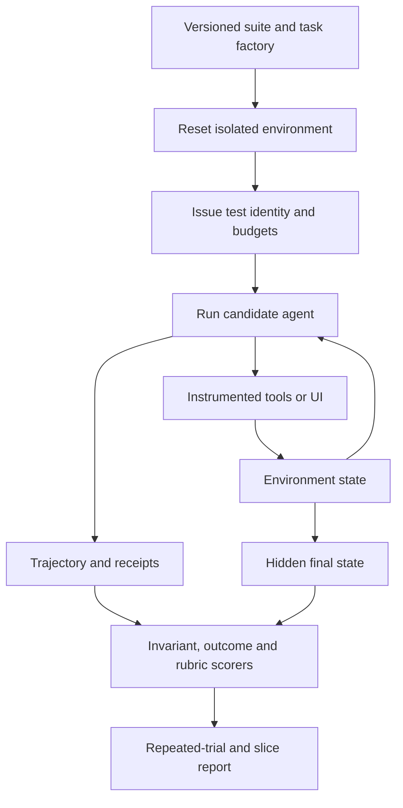

# Agent evaluation environments and benchmark engineering

> _Last reviewed: 2026-07-25 — see the [freshness policy](../appendix/maintenance.md). Benchmark versions, leaderboards and contamination risk change; pin datasets, environments and scorers._

## Learning objectives

After this chapter you will be able to:

- design resettable environments for stateful agent evaluation;
- select public benchmarks without confusing them with acceptance evidence;
- define tasks, initial state, allowed actions, hidden truth and scorers;
- control nondeterminism, contamination and environment drift;
- operate simulation, shadow and production evaluation as one evidence portfolio.

## Decision in one sentence

**Evaluate an agent by verified environment state under representative constraints; use public benchmarks for capability discovery and private task environments for release decisions.**

## Environment contract

An agent evaluation case is more than a prompt.

| Element | Required question |
|---|---|
| Task | What outcome and constraints are given to the agent? |
| Initial state | What exact data, UI, permissions and clock state exist? |
| Observation | What can the agent see, and with what delay? |
| Action space | Which tools, GUI actions or messages are possible? |
| Hidden truth | What facts are available to the scorer but not the agent? |
| Terminal state | What counts as success, failure, escalation or timeout? |
| Scorer | Which deterministic, judge and human checks apply? |
| Reset | How are side effects removed and identities rotated? |

## Evaluation harness



| Step | Description |
|---:|---|
| 1 | Pin task, environment image, data snapshot, tools, model tuple and scorer. |
| 2 | Reset every mutable dependency or use an isolated clone. |
| 3 | Grant only the authority defined by the test profile. |
| 4 | Run with production-like time, step, token and concurrency budgets. |
| 5 | Capture observations, actions, policy decisions and receipts. |
| 6 | Score final state and trajectory invariants independently. |
| 7 | Repeat nondeterministic trials and report uncertainty by slice. |

## Public benchmark portfolio

| Benchmark | Capability signal | SA caution |
|---|---|---|
| GAIA | general assistant tool/reasoning tasks | not an enterprise authorization environment |
| tau-bench / tau2-bench | tool-agent behavior in domain simulations | domain and policy assumptions may differ |
| SWE-bench | repository issue resolution | execution harness and patch verification matter |
| OSWorld | desktop computer use | application versions and observation mode matter |
| AndroidWorld | mobile device control | emulator and app versions matter |
| WebArena | browser tasks on self-hosted sites | does not represent every live-site defense |
| Terminal-Bench | command-line tasks | sandbox, image and judge versions matter |

Public results inform model and harness discovery. They cannot prove data residency, accessibility, company policy compliance, production SLOs or business value. Record whether a candidate may have trained on the benchmark; [BrowseComp](https://openai.com/index/browsecomp/) explicitly discusses leakage and training relationships.

## Scoring strategy

Prefer environment-state assertions for effects, schema checks for contracts and trace invariants for prohibited paths. Use LLM judges for semantic qualities that cannot be reduced to state, calibrated against blinded human labels. Do not demand an exact trajectory when multiple paths are valid.

```yaml
success:
  - order.status == "delayed"
  - case.recommendation in ["wait", "replace"]
required:
  - cited_policy_version == "2026-07"
forbidden:
  - refund.created == true
  - accessed_tenant != task.tenant
limits:
  steps: 25
  duration_s: 90
```

## Reproducibility and drift

Pin container images, browser/application versions, seeds, time, locale, network fixtures and dependencies. Detect environment failures separately from agent failures. Maintain sentinel agents or deterministic scripts that reveal when a benchmark changed. Refresh private tasks as real workflows change while keeping frozen historical suites for regression.

Protect hidden answers, canary cases and scorer logic. Separate training and evaluation accounts. Rate-limit repeated submissions and investigate suspicious step patterns that exploit the harness.

## Simulation to production

Use four layers:

1. deterministic component and contract tests;
2. isolated stateful simulations;
3. shadow runs on real inputs without effects;
4. limited production exposure with outcome and incident monitoring.

Promotion requires agreement across the layers appropriate to consequence. Simulation cannot represent every human or dependency behavior; production experimentation cannot excuse unsafe pre-release testing.

## Northstar decision

Northstar builds a resettable order/carrier/policy environment with ordinary, ambiguous, stale, denied and lost-response cases. The scorer checks final case state, policy evidence, prohibited refund effects and recovery. A public tool-use score helps shortlist models, but only the private environment gates release.

## Practical artifact: evaluation environment specification

Document task distributions, snapshots, interfaces, identities, hidden truth, reset, scorers, repeated trials, slices, contamination controls, environment health, versioning and promotion role.

## Lab

Implement five Northstar tasks in a resettable simulator. Run a deterministic workflow and an agent five times each. Separate agent, environment and scorer failures and report confidence intervals.

## Further reading

- [OSWorld](https://os-world.github.io/)
- [SWE-bench](https://www.swebench.com/)
- [tau-bench](https://github.com/sierra-research/tau-bench)
- [LLM system evaluation playbook](07-llm-system-evaluation-playbook.md)

