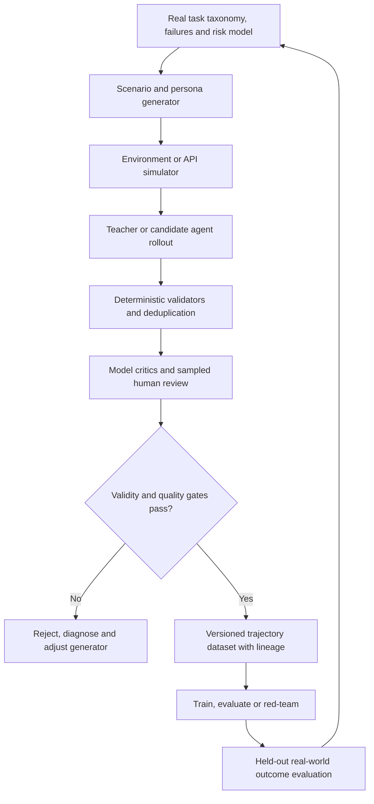

# Synthetic data and trajectory factories

> _Data and evaluation guide — last reviewed: 2026-07-25._

## Learning objectives

- generate synthetic tasks and agent trajectories with traceable lineage;
- filter contamination, impossible scenarios, and teacher-model error;
- use synthetic data without replacing real outcome evidence.

## The decision in one sentence

Use synthetic trajectories to expand controlled coverage; anchor their generation, filtering, and value claims to real tasks and held-out human evidence.

## Factory architecture

An agent trajectory includes observations, context, reasoning-relevant state, tool intents/results, approvals, artifacts, terminal outcome, and rewards or labels. It may train a model, evaluate a harness, or exercise an environment. More volume is useful only if scenario validity and label quality survive.

| Stage | Main risk | Control |
|---|---|---|
| Seed | narrow coverage | taxonomy from real workflows and incidents |
| Generate | unrealistic or biased scenarios | constraints and distribution targets |
| Simulate | impossible tool behavior | contract/state-machine validation |
| Rollout | teacher error propagation | multiple sources and executable oracles |
| Filter | judge bias | deterministic checks plus human sampling |
| Publish | contamination and leakage | hashes, splits, lineage, deduplication |
| Use | synthetic gain fails in reality | held-out real outcome gate |

## Design the data product

Define intended use separately for training, regression, safety, load, and rare-event exercises. Preserve generator, model, prompt, tool/environment versions, random seed, source taxonomy, filters, scores, reviewer decisions, license, and dataset hash. Never place private production data into an external generator without authorization.

Generate counterfactuals around decision boundaries, degraded dependencies, prompt injection, multilingual inputs, ambiguous goals, and recovery—not only ideal success paths. Include failed and repaired trajectories; filtering every failure teaches neither detection nor recovery.

Detect duplicates and benchmark leakage. Hold out scenario families, not merely random rows, so templates cannot inflate results. Estimate real/synthetic distribution distance across task, language, tool, length, risk, and outcome. Sample human review by uncertainty and harm, and measure reviewer agreement.

Apple’s [environment-free API-agent research](https://machinelearning.apple.com/research/environment-free) illustrates teacher rollouts against simulated API responses; synthetic self-reflected trajectories are also an active research area. These methods are evidence inputs, not proof of production safety.

## Northstar example

Northstar seeds the factory with adjudicated case archetypes and real incident classes, then generates privacy-safe variants. A state-machine simulator enforces valid case APIs. Calculation code provides an oracle. Reviewers examine all high-risk and a stratified sample of routine trajectories. Training promotion still depends on a sequestered real-case set and a limited live pilot.

## Practical artifact: trajectory dataset card

Record purpose, prohibited use, sources, generation graph, distributions, environment fidelity, labels/oracles, filtering, human review, privacy, licenses, contamination checks, splits, known gaps, real-world validation, owner, version, and expiry.

Connect factory releases to [agent post-training](../02-ai-landscape/07-agent-post-training.md) and [regression gates](05-regression-gates.md).

## Further reading

- [Data Statements for NLP](https://aclanthology.org/Q18-1041/)
- [Datasheets for Datasets](https://doi.org/10.1145/3458723)
