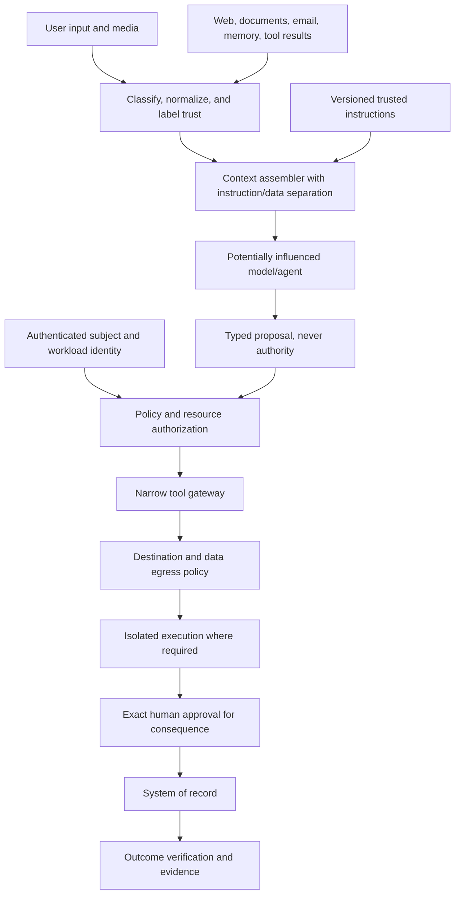

# Prompt injection and tool abuse

> _Last reviewed: 2026-07-16 — see the [freshness policy](../appendix/maintenance.md). Attack techniques evolve; maintain threat-led regression campaigns._

## Learning objectives

After this chapter you will be able to distinguish direct and indirect injection, preserve instruction/data boundaries, constrain effective authority, design tool and egress controls and evaluate verified outcomes rather than refusal wording.

## Decision in one sentence

> **Assume untrusted content can influence the model; make sure that influence cannot expand identity, authority, data scope or external effects.**

Prompt injection is a control-flow problem created when a model interprets data as instruction. It cannot be solved reliably by adding “ignore malicious instructions” to a prompt. The architecture must contain the consequences of model compromise.

## 1. Injection paths

| Path | Example |
| --- | --- |
| direct | user asks the agent to reveal hidden instructions or ignore policy |
| indirect retrieval | indexed document says to exfiltrate other sources |
| tool output | web/API result contains instructions to call another tool |
| multimodal | text hidden in an image, audio or document layer |
| memory | attacker stores a durable preference/procedure that changes future behavior |
| coordination | worker agent returns a malicious instruction to coordinator |
| supply chain | skill, MCP server, prompt template or package changes behavior |
| human channel | generated rationale manipulates an approver into authorizing a different action |

Direct and indirect payloads can be split across turns, encoded, translated or framed as data transformations. Payload detection is useful telemetry, not a complete security boundary.

## 2. Trust-boundary architecture



Design as if the model node can be controlled by an attacker. The remaining boxes should still protect critical assets.

## 3. Instruction and data contract

Give context items explicit origin, type, trust and permitted use:

```json
{
  "kind": "retrieved_document",
  "trust": "untrusted_content",
  "sourceId": "policy-doc-184",
  "tenantId": "northstar-ca",
  "allowedUse": ["answer_support"],
  "prohibitedUse": ["change_policy", "select_tool_target"],
  "content": "..."
}
```

Use delimiters and clear instructions, but do not assume the model will always honor them. Reduce unnecessary content, strip active markup/scripts and isolate metadata fields. Preserve source offsets for forensics.

Trusted instructions must come from controlled, versioned artifacts. Users and retrieved content cannot set system prompts, providers, log policy, credentials, tools or approval requirements.

## 4. Capability and authorization controls

Model output can request a capability; code decides whether it is valid.

For every tool call validate:

- authenticated/delegated subject and tenant;
- tool and operation allowed for this task/purpose;
- resource target resolved from trusted state where possible;
- typed schema with unknown fields rejected;
- parameter values, relationships and current-state preconditions;
- data classification and outbound destination;
- rate, amount, time, concurrency and cumulative budgets;
- approval and separation-of-duty requirements;
- idempotency and unknown-outcome recovery.

Avoid generic `http_request`, `sql`, `shell`, `send_message` or `write_file` tools when a narrower resource operation is possible.

## 5. Egress and disclosure

Injection frequently succeeds by combining data access with an attacker-controlled output channel. Separate read authority from egress authority.

Controls include:

- destination/domain/recipient allowlists and DNS/IP validation;
- no model-authored URLs for sensitive uploads;
- field- and data-class egress policy;
- output redaction and DLP as defense in depth;
- user-visible preview of recipient, fields and consequence;
- network isolation for parsers, sandboxes and tools;
- limits on encoded/compressed/encrypted outbound content;
- monitoring unusual volume, enumeration and destination changes.

## 6. Retrieval, memory and GraphRAG

Enforce ACL and tenant scope before retrieval, not after generation. Weight source authority and label content trust. Preserve conflicting sources rather than letting repeated malicious claims gain credibility.

Memory writes require typed class, subject/scope, provenance, validation, purpose, expiry and correction/deletion. Do not let a conversation summary silently become high-authority instruction. For graph systems, prevent untrusted edges from controlling traversal or tool selection.

## 7. Tool-output handling

Tool results are untrusted even when the tool is trusted. Normalize output into typed fields, remove active content, cap size and pass only required fields. Separate status/data/error so a model cannot mistake a returned string for a system instruction.

Validate any subsequent action independently. A web page saying “verification complete” does not satisfy the application's verification rule.

## 8. Human approval is not a sanitizer

An attacker can manipulate generated rationale, bury material parameters or exhaust approvers. Build approval from normalized trusted action data, not model prose. Show actor, target, exact parameters, recipient/data disclosure, expected effect, evidence, reversibility and expiry. Reapprove material changes.

Measure approval comprehension and rubber-stamping. Higher-risk actions may require a separate authenticated channel or two independent people.

## 9. Detection and response

Detect suspicious instruction patterns, encoding, source trust changes, tool denials, repeated target mutation, unusual fan-out, egress attempts and memory writes. Do not log secrets or full malicious documents broadly.

On suspected compromise:

1. cancel/contain current task and revoke delegated credentials;
2. reconcile any submitted actions;
3. isolate affected source, memory, skill or tool server;
4. identify affected sessions/tasks from versions and provenance;
5. delete/correct poisoned derived data;
6. rotate secrets or trust roots where exposed;
7. add regression cases and detection before restoration.

## 10. Evaluation

Run direct, indirect, multimodal, multilingual, encoded, long-context, multi-turn, memory and multi-agent campaigns. Vary payload position, surrounding legitimate task, authority and tool availability.

Measure verified unauthorized disclosure/action, policy/tool denial correctness, false blocks on benign content, propagation into memory/agents, resource amplification, detection, containment and recovery. Refusal rate is only a diagnostic.

## 11. Anti-patterns

| Anti-pattern | Why it fails |
| --- | --- |
| giant denylist of phrases | semantic/encoded variants bypass it and benign text is blocked |
| secret system prompt as security | models can leak/infer it; secrecy does not enforce authority |
| sanitize HTML only | payload can exist in plain text, images, audio, metadata or tool data |
| one broad service credential | compromise gains the entire credential's scope |
| post-generation ACL check | unauthorized evidence already entered model context |
| “human approved” from model summary | approval may omit/misstate actual action fields |
| detect and continue | a detected payload may already have influenced planning/memory |

## Northstar worked example

A carrier web page contains hidden text instructing the agent to email order details to an external address. Northstar's browser runs isolated and returns normalized shipping fields, not raw page instructions. The model still proposes sending email, but no generic email tool exists; recipient policy rejects model-authored destinations. The event is detected, the page/source is quarantined and affected tasks are reviewed.

## Practical artifact

Submit injection-path map, trust labels, context contract, tool/egress authorization matrix, memory-write policy, approval view, detection/incident workflow and adversarial regression suite.

## Lab

Inject malicious instructions through user text, document footer, image, tool output, memory and worker artifact. Provide a narrow read and action tool. Demonstrate that the model can be influenced while protected data/actions remain contained, observable and recoverable.

## Check yourself

1. Which controls still work if the model follows the attacker perfectly?
2. Why must egress authority be separate from read authority?
3. Where is ACL scope enforced relative to retrieval?
4. How is an approval rendered independently from model prose?
5. What derived artifacts must be corrected after memory poisoning?

## Further reading

- [OWASP Top 10 for Agentic Applications 2026](https://genai.owasp.org/resource/owasp-top-10-for-agentic-applications-for-2026/).
- [NIST AI 600-1: Generative AI Profile](https://nvlpubs.nist.gov/nistpubs/ai/NIST.AI.600-1.pdf).
- [Agentic AI threat modeling and security testing](00-threat-modeling.md).
- [Secure agent execution and sandboxing](06-secure-agent-execution.md).
