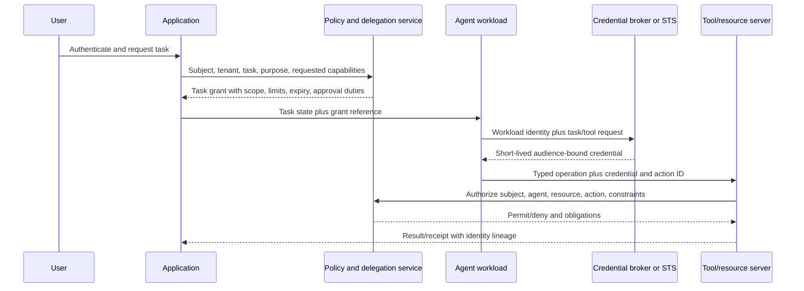

# Identity, secrets and least privilege

> _Last reviewed: 2026-07-16 — see the [freshness policy](../appendix/maintenance.md). Identity protocols and provider implementations change; verify current standards and product behavior._

## Learning objectives

After this chapter you will be able to model user, workload, agent and tool identities; constrain delegation; broker short-lived credentials; protect secrets from model context and govern revocation and long-running tasks.

## Decision in one sentence

> **An agent may act only through a verifiable identity chain with authority no broader than the initiating subject, task policy and target resource allow.**

## 1. Identity is a chain



Keep these principals distinct:

| Principal | What it proves | What it does not prove |
| --- | --- | --- |
| human/user | authenticated subject and assurance | that every model-proposed action is intended |
| client/application | trusted request channel and session | business authority beyond user/policy |
| agent/workload | running software identity/version/environment | end-user consent or resource permission |
| delegated worker | bounded subtask actor | authority greater than delegator |
| tool/resource server | authoritative capability boundary | correctness of model reasoning |
| approver | exact action authorization | that the action succeeded |

## 2. Authentication, delegation and authorization

- **Authentication** establishes a principal and assurance.
- **Delegation** conveys bounded authority to act for/on behalf of another principal or task.
- **Authorization** decides whether this principal chain may perform this action on this resource now.
- **Approval** is a human/policy decision bound to a proposed consequential action.
- **Verification** confirms the authoritative outcome.

Do not collapse them into one bearer token or a Boolean `is_authenticated` prompt variable.

## 3. Authorization tuple

Evaluate at the resource server or policy enforcement point:

```text
(subject, tenant, agent/workload, delegator, task, purpose,
 resource, action, parameters, data class, environment,
 approval, time, region, cumulative budget, policy version)
```

The model may propose resource/action/parameters, but trusted code supplies identity, tenant, task, purpose, policy and approval. Resolve critical targets from server state rather than free text.

## 4. Token and credential design

Prefer short-lived, audience-bound and capability-specific credentials. Important properties:

- intended resource/audience and operation scope;
- subject plus authorized-party/workload identity where supported;
- tenant and task/delegation reference;
- issued/expiry times and unique token ID;
- proof-of-possession when threat/risk justifies it;
- no raw prompt, sensitive context or mutable policy decisions;
- revocation/denylist strategy for long-running work.

[OAuth 2.0 Security Best Current Practice (RFC 9700)](https://www.rfc-editor.org/rfc/rfc9700.html) documents current OAuth security guidance. [OAuth Token Exchange (RFC 8693)](https://www.rfc-editor.org/rfc/rfc8693.html) provides a standard mechanism for exchanging subject/actor tokens, but exchanged credentials still need application-specific authorization and constrained scope.

Do not forward a user's broad access token through every agent and tool. Exchange or broker it for a narrower audience and task.

## 5. Workload identity

Authenticate services/agents from the runtime platform rather than embedded API keys. Use cloud workload identity, mTLS certificates, service accounts or systems such as [SPIFFE](https://spiffe.io/docs/latest/spiffe-about/overview/) according to environment.

Bind identity to environment, namespace/service, deployment/version and trust domain. Attestation proves workload properties; it does not grant arbitrary business permission. Policy still maps the workload plus subject/task to resources/actions.

## 6. Delegation invariants

1. A delegate cannot receive more authority than the delegator and policy allow.
2. Delegation is explicit about task, purpose, capabilities, resource scope, budget and expiry.
3. Further delegation is denied by default or bounded by depth/fan-out.
4. The complete chain is preserved in tool decisions and evidence.
5. Revocation/cancellation propagates to active workers and future credentials.
6. A worker result is untrusted evidence, not inherited authority.
7. The resource server authorizes every action; possession of a model session is insufficient.

## 7. Credential broker pattern

The agent asks a broker for access to one tool/resource. The broker verifies workload identity, task grant, user/delegator state, policy, approval and remaining budget, then issues a short-lived credential or performs the call on the agent's behalf.

Benefits:

- provider/tool secrets never enter prompts or agent memory;
- credentials can be scoped per audience/action;
- rotation and provider changes remain outside agent code;
- issuance and denial become observable control decisions;
- egress destinations can be fixed by the broker.

The broker is high-value infrastructure: isolate it, rate-limit requests, require attestation, protect signing keys and alert unusual issuance.

## 8. Secrets lifecycle

| Stage | Control |
| --- | --- |
| create/import | approved vault/KMS, owner, purpose, environment and rotation class |
| distribute | runtime injection/broker; no repository, image, prompt or broad environment dump |
| use | narrow process/tool, audience and egress; prevent output/log exposure |
| rotate | overlapping validity and tested consumer reload |
| revoke | immediate deny and active-session/task containment |
| detect | secret scanning, canaries, anomalous use and provider alerts |
| recover | rotate related credentials, identify affected tasks/data and preserve evidence |

Environment variables are not automatically safe: tools, crash dumps and generated diagnostics can expose them. Prefer direct broker/vault APIs and filtered process environments.

## 9. Long-running agents

Do not issue a credential for the maximum possible workflow duration. Persist a task grant reference and reacquire narrow credentials when needed. Re-check policy, user employment/account state, resource ownership, approval expiry and change freezes before consequential steps.

On pause/resume, distinguish task state from credential state. A resumable workflow must not assume yesterday's authorization remains valid.

## 10. Human approval binding

Approval contains approver identity/role, proposal hash, action, target, material parameters, affected data/recipient, expected effect, maximum scope, expiry and policy version. The tool verifies the approval matches the submitted action.

Do not treat a chat “yes,” model summary or prior blanket consent as approval for changed parameters.

## 11. Observability and privacy

Record pseudonymous subject/actor/workload references, task/delegation/approval IDs, policy decision, audience/scope, tool/resource/action, token issuance/expiry/revocation and outcome. Never log tokens, secret values or unnecessary identity attributes.

Monitor:

- denied and over-scoped credential requests;
- unusual delegation depth/fan-out;
- audience/region/environment mismatch;
- expired/revoked credential use;
- new resource/recipient patterns;
- bulk actions or issuance after cancellation;
- tasks whose identity lineage is incomplete.

## 12. Failure and incident behavior

| Failure | Safe response |
| --- | --- |
| identity provider unavailable | deny new consequential access; use explicitly public/read-only fallback |
| policy unavailable | fail closed for protected resources/actions |
| broker unavailable | pause/resume task; do not reveal stored provider secret |
| credential expired | reauthorize from durable task state; do not reuse |
| revocation/cancellation | stop issuance/workers and reconcile submitted effects |
| signing key/secret exposed | revoke/rotate, identify affected calls/tasks and re-establish trust |
| lineage missing | do not execute action requiring attribution/audit |

## 13. Anti-patterns

- one service account for all agents, tenants and tools;
- long-lived provider keys in prompts, code, images or memory;
- trusting caller-supplied tenant/resource IDs without relationship checks;
- delegating an unrestricted user token;
- treating caller ID, voice likeness or email text as authentication;
- authorizing from model confidence or natural-language intent;
- approvals without exact action binding/expiry;
- logging Authorization headers for debugging.

## Northstar worked example

An authenticated employee asks the operations agent to restart a service. The application creates a task grant limited to one namespace and read tools. The agent proposes a restart; policy requires on-call approval. After approval, the credential broker issues a 60-second audience-bound credential for `deployment.restart` on one resource. The tool verifies proposal hash, current revision and blast limit, executes once and records user, workload, approver and transaction lineage.

## Practical artifact

Submit principal/identity map, authorization tuple, token exchange/broker design, delegation invariants, workload attestation, secret lifecycle, approval schema, long-running reauthorization, evidence model and incident runbook.

## Lab

Implement a mock credential broker and two tools. Attempt token forwarding, cross-tenant target substitution, delegated fan-out, expired approval, resumed stale task, secret logging and broker compromise. Demonstrate narrow issuance, denial, revocation and identity lineage.

## Check yourself

1. Which principal is the resource server authorizing?
2. Why is a valid user token still too broad for an agent worker?
3. What does workload attestation prove—and not prove?
4. How does cancellation affect delegated credentials and submitted actions?
5. Which exact fields bind approval to execution?

## Further reading

- [OAuth 2.0 Security Best Current Practice, RFC 9700](https://www.rfc-editor.org/rfc/rfc9700.html).
- [OAuth 2.0 Token Exchange, RFC 8693](https://www.rfc-editor.org/rfc/rfc8693.html).
- [SPIFFE overview](https://spiffe.io/docs/latest/spiffe-about/overview/).
- [Agent identity, tools and delegated authorization](../05-agents/01-tools-authorization.md).
