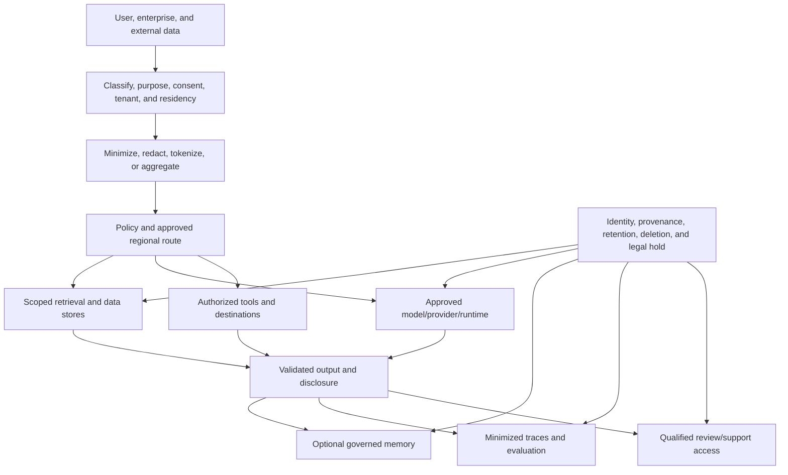

# Privacy, residency and confidential data

> _Last reviewed: 2026-07-16 — see the [freshness policy](../appendix/maintenance.md). Privacy and residency obligations vary by jurisdiction, contract and date; obtain qualified legal/privacy review._

## Learning objectives

After this chapter you will be able to map AI data flows and derived artifacts, enforce purpose/minimization and regional routes, design deletion/correction, govern provider/human access and evaluate confidential-computing boundaries.

## Decision in one sentence

> **Apply privacy and residency to the complete data lifecycle—including prompts, derived indexes, memory, logs, evaluation and human review—not only the primary database region.**

## 1. Inventory data and purpose

For each workload record:

- data subject/owner and accountable business owner;
- fields/content classes, sensitivity and tenant;
- collection source and notice/consent or other lawful basis;
- business purpose and prohibited secondary uses;
- model/provider/tool/human recipients;
- countries/regions for processing, storage, support and backup;
- derived artifacts and whether they can identify or affect people;
- retention, correction, deletion and legal hold;
- incident contact and evidence.

“Prompt” is not a data class. A prompt may contain public text, trade secrets, authentication data and another person's personal information simultaneously.

## 2. End-to-end privacy architecture



## 3. Data-flow record

| Stage | Data | Key questions |
| --- | --- | --- |
| collection | prompt, upload, audio/video, identifiers | was it necessary, expected and disclosed? |
| preprocessing | OCR, transcript, redaction, labels | what transformations and confidence exist? |
| retrieval | query, filters, candidate documents | was scope derived from authenticated state? |
| inference | instructions, context, tool schemas/results | where processed, retained, logged or trained on? |
| tools | resource fields and external destinations | is disclosure/action authorized for purpose? |
| output | text/media/action | could it reveal another person or infer sensitive facts? |
| memory | preferences, episodes, summaries | is durability justified and user-correctable? |
| telemetry/evals | traces, prompts, feedback, labels | can content be minimized while preserving evidence? |
| human operations | support, labeling, red team, incident | who, why, where, and how is access monitored? |

## 4. Minimize before model processing

Use field allowlists, tokenization, pseudonymous IDs, aggregation, document-region selection and on-prem/on-device preprocessing. Retrieve only the evidence required for the current task. Avoid placing complete profiles, documents or conversation histories in context by default.

Redaction is contextual. Names may be unnecessary for classification but required for a customer-approved letter. Keep re-identification keys outside the model/tool boundary and authorize detokenization separately.

## 5. Residency and sovereignty routing

Residency can apply to input, transient processing, caches, output, logs, model improvement, support access, backups, keys and subprocessors. Model these explicitly.

```yaml
route_policy: confidential-ca-v6
data_classes: [customer_confidential]
processing_regions: [ca-central]
storage_regions: [ca-central]
providers: [approved-provider-a]
model_training_use: prohibited
provider_content_logging: prohibited
support_access_regions: [ca]
customer_managed_keys: required
fallback:
  cross_region: prohibited
  mode: deterministic_or_human
```

Do not fail over protected workloads across regions/providers unless the fallback is pre-approved for the same obligations. An outage may require queuing, a local deterministic path or human service rather than policy bypass.

## 6. Provider and model assessment

Evaluate:

- data ownership, permitted use and model-improvement defaults;
- transient/abuse-monitoring retention and opt-out applicability;
- processing/storage/support regions and subprocessors;
- encryption, key control and private networking;
- isolation, incident notification and evidence access;
- deletion/correction and backup propagation;
- model/version lifecycle and change notice;
- export/exit and independent assurance.

Contract language and product configuration must agree. Test runtime configuration and logs rather than relying solely on marketing claims.

## 7. Memory and derived data

A summary, embedding, graph edge or model-generated profile can remain personal/confidential even when it omits the original text. Record derivation and purpose.

Memory writes should be opt-in or policy-justified, visible where appropriate, scoped, source-linked, expiring and correctable. Do not infer sensitive attributes and persist them because they might improve personalization.

Derived-data inventory includes chunks, vectors, graph claims, caches, transcripts, summaries, feature stores, fine-tuning files/checkpoints/adapters, feedback, evaluation sets and backups.

## 8. Correction and deletion

Use stable subject/source/artifact lineage and tombstone events. A deletion workflow should:

1. authenticate and authorize the request/trigger;
2. identify source and every derived artifact in scope;
3. stop new processing and future memory retrieval;
4. delete or restrict live stores, indexes, caches and work queues;
5. propagate to providers, review platforms and approved subprocessors;
6. manage backups/legal holds according to policy;
7. verify completion with canary/reference queries;
8. retain minimal non-content evidence of fulfillment.

Corrections should supersede false claims while preserving audit lineage when lawful. Re-evaluate affected decisions or notify owners where material.

## 9. Human access and operational privacy

Support engineers, labelers, red teams and reviewers can become the broadest access path. Use role/task-based just-in-time access, purpose display, field minimization, watermarking where appropriate, session recording/audit, export controls and independent monitoring.

Provide safe handling for harmful content and protect workers' own privacy. Production replay and incident debugging need explicit authorization and retention, not an unrestricted “debug” exemption.

## 10. Confidential computing and attestation

Encryption at rest/in transit does not protect data while ordinary software processes it. Trusted execution environments and confidential computing may reduce host/operator exposure, but validate the entire chain:

- hardware/firmware/runtime attestation and trust roots;
- workload/image/model identity and update policy;
- key release bound to accepted measurements;
- accelerator, memory, I/O and side-channel assumptions;
- retrieval, tools, logging and human support outside the enclave;
- availability, performance, regional and operational trade-offs.

Attestation proves selected runtime properties, not model correctness, purpose compliance or authorization.

## 11. Privacy-preserving patterns

| Pattern | Use | Limitation |
| --- | --- | --- |
| local/on-device preprocessing | redact/classify before upload | device variance and update/telemetry constraints |
| pseudonymization/tokenization | reduce identity exposure | re-identification service remains sensitive |
| aggregation/minimum groups | analytics disclosure control | differencing and rare combinations |
| differential privacy | bounded aggregate/model leakage | utility and parameter/accounting complexity |
| federated learning | train without central raw collection | updates can leak; coordination/device bias |
| confidential computing | reduce infrastructure-operator exposure | incomplete boundary and performance/cost |
| synthetic data | develop/test without direct records | may reproduce or misrepresent real distribution |

## 12. Observability without surveillance

Prefer event types, hashes, lengths, classifications, route/version IDs, policy decisions and outcome references. Keep raw content in protected sampled traces only when necessary and permitted.

Never put prompts, emails, names, account IDs or secrets in metric labels. Bound trace access/retention and support subject/source deletion. Test that error paths do not log more content than success paths.

## 13. Threats and tests

Test cross-tenant retrieval/cache/memory, provider-region failover, support access, prompt/log leakage, secret exposure, unauthorized tool disclosure, model-output inference, deletion propagation, backup restoration, injected external content and feedback poisoning.

Measure leakage threshold zero for protected scope; deletion/freshness SLOs; unnecessary-field exposure; route-policy correctness; human access; provider logging configuration; correction effectiveness; and privacy-safe task success.

## Northstar worked example

Canadian restricted tenants use a Canadian model/retrieval/tool route with provider training and content logging disabled. Customer IDs are tokenized before inference; order details are fetched by a scoped tool. Raw conversations are not retained by default, while action receipts and policy decisions remain. A deletion request propagates to transcript, summary, memory, embeddings, evaluation samples and provider artifacts, with verified completion.

## Practical artifact

Submit data/purpose inventory, end-to-end flow, provider/subprocessor record, residency/fallback policy, minimization and tokenization design, memory/derived-data inventory, correction/deletion workflow, human-access controls, confidential-computing assumptions, tests and evidence.

## Lab

Model a multi-region Northstar workload with public, internal and confidential classes. Attempt unsafe failover, cross-tenant cache, provider logging, support export and incomplete deletion. Demonstrate policy routing, minimization, tombstone propagation and privacy-safe telemetry.

## Check yourself

1. Which derived artifacts remain personal or confidential?
2. What happens during an outage when cross-region failover is prohibited?
3. What does attestation prove—and not prove?
4. How is deletion verified across indexes and providers?
5. Which operational roles can access raw content and why?

## Further reading

- [NIST Privacy Framework](https://www.nist.gov/privacy-framework).
- [NIST AI RMF](https://www.nist.gov/itl/ai-risk-management-framework).
- [Multi-tenant AI, privacy and confidential data](../04-llm-systems/04-state-tenancy.md).
- [Agentic memory systems](../03-data-context/04-context-memory.md).
