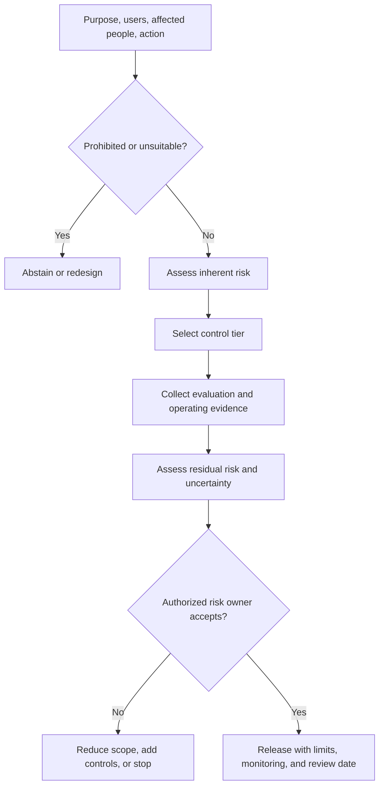

# Responsible AI & risk classification

> Last reviewed: 2026-07-16. See the [freshness policy](../appendix/maintenance.md). This chapter is architecture guidance, not legal advice.

## Learning objectives

After this chapter you will be able to:

- classify an AI use profile by consequence, autonomy, exposure, and evidence;
- select proportional human, fairness, transparency, and contestability controls;
- distinguish inherent risk from residual risk;
- write a risk card that supports a defensible release decision.

## Classify the use, not the model

The same model can summarize public documents or recommend denial of a loan. Risk arises from the purpose, affected people, decision, data, authority, interface, scale, and operating context. Assigning one risk label to a shared model hides this difference.

A **use profile** is the smallest deployable purpose with consistent users, affected groups, authority, controls, and evidence. Northstar’s shipment advice and refund execution are separate profiles even if they share the same interface.

## Risk-classification flow



Begin with an abstention screen. Some purposes conflict with law, rights, organizational values, available evidence, or acceptable risk. A control checklist should not legitimize an unsuitable use.

## Inherent-risk factors

Score is less important than explicit reasoning, but a consistent scale helps portfolio triage:

| Factor | Lower inherent risk | Higher inherent risk |
|---|---|---|
| Consequence | Convenience or reversible draft | Health, liberty, livelihood, finance, safety, rights |
| Autonomy | Informational output | Executes or materially influences a decision |
| Reversibility | Easy correction before effect | Irreversible, delayed, or costly remedy |
| Exposure | Small trained internal group | Public, vulnerable, or captive population |
| Data | Public or low sensitivity | Sensitive, inferred, biometric, or protected data |
| Scale | Low volume and local | Large population or systemic dependency |
| Detectability | Error is obvious and immediate | Harm is hidden, cumulative, or delayed |
| Novelty | Known process and evidence | New modality, model, population, or authority |
| Adversarial pressure | Low incentive | Fraud, abuse, manipulation, or hostile input |

Do not average away a catastrophic factor. Use escalation rules such as “any high-consequence autonomous action enters the highest internal tier.” Record uncertainty and missing evidence separately from risk.

## Control tiers

| Tier | Typical profile | Minimum design posture |
|---|---|---|
| 1: assistive | Drafting and low-impact search | disclosure where material, quality eval, feedback, privacy/security baseline |
| 2: influential | Recommendations affecting workflow | representative slice eval, trained reviewer, explanation/evidence, appeal, monitoring |
| 3: consequential | Decisions or external actions | independent challenge, strong identity, approval/dual controls, full audit, incident exercises |
| 4: intolerable/unsupported | Prohibited purpose or uncontainable uncertainty | abstain, constrain, or redesign |

Controls are cumulative and context-specific. Human review is not automatically protective: reviewers may automate their judgment, lack authority, or see too little evidence.

## Human oversight as a system

Design the human role around a decision right:

- **in the loop:** human authorizes before a consequence;
- **on the loop:** human supervises, samples, and can interrupt;
- **in command:** human owns policy, deployment, and emergency disablement.

A reviewer needs time, domain competence, source evidence, uncertainty, alternatives, and freedom to disagree. Measure override quality, not merely override rate. Bind approvals to the exact action and state. For high-consequence profiles, separate the delivery owner from residual-risk acceptance.

## Fairness and distributional harm

Fairness is a context and governance question before it is a metric. Identify affected groups, allocation or quality harms, historical inequity, proxy variables, accessibility, and who bears errors. Work with domain, legal, and affected-stakeholder expertise to select relevant comparisons.

Evaluate performance and outcome slices at intersections where sample size permits. Report uncertainty and missingness. A single aggregate disparity metric can hide low-quality service for a small group. If protected attributes cannot be processed, document how unfair impact will be detected through alternative audits, complaints, or carefully governed studies.

Mitigations may include changing the use, collecting better data, removing a feature, thresholding by consequence, providing an alternative channel, adding review, limiting automation, or abstaining. Mathematical parity does not by itself establish fair treatment.

## Transparency and explanation

Give each audience what supports an action:

| Audience | Needed transparency |
|---|---|
| Affected person | AI involvement, purpose, material factors/evidence, limits, correction and appeal |
| Operator | uncertainty, source freshness, policy state, alternatives, required action |
| Auditor | versions, lineage, control evidence, evaluation, approvals, incidents |
| Public | capability and limitation description, governance contact, material impact information |

Do not expose private model reasoning or security-sensitive prompts as an “explanation.” Prefer source evidence, applied business rules, counterfactual factors where appropriate, and a plain-language account of the system’s role.

## Contestability and remedy

People need a usable route to correct data, challenge an outcome, receive human review, and obtain timely remedy. The appeal must reach someone with authority to change the result, not another model call. Preserve the decision evidence long enough to review it while respecting privacy and retention limits.

Track appeal volume, overturn rate, time to resolution, affected slices, recurring causes, and whether upstream records were corrected. Feed substantiated failures into regression tests and control changes.

## Safety case and residual risk

For consequential profiles, write a structured argument:

```text
Claim: the shipment assistant is acceptably safe for read-only advice
  Context: approved users, corpus, regions, and prohibited uses
  Argument: bounded authority + verified evidence + human remedy contain credible harms
  Evidence: eval results, threat tests, accessibility study, incident exercise
  Assumptions: source freshness < 4h; no financial action capability
  Defeaters: cross-tenant retrieval; unsupported medical advice; stale source
  Residual risk: documented with accountable acceptance and expiry
```

Evidence supports a scoped claim; it does not prove universal safety. Record counter-evidence, open findings, uncertainty, and the conditions that invalidate approval. Residual risk belongs to an authorized business/risk owner, not the model team alone.

## Lifecycle review

Reclassify on changes to purpose, population, geography, model, data, autonomy, tools, interface, scale, vendor terms, evaluation results, or incident history. Monitor real outcomes, complaints, accessibility, overrides, and distributional effects. Approvals and exceptions expire.

Retirement includes disabling endpoints and tools, revoking credentials, deleting or archiving data under policy, notifying dependent users, preserving required evidence, and verifying that embedded copies and shadow workflows no longer operate.

## Northstar risk card

Northstar classifies read-only shipment help as Tier 2 because wrong guidance affects customers but is reversible through a human channel. Refund execution is Tier 3 because it changes financial state. It requires strong delegated identity, exact action approval, amount limits, idempotency, reconciliation, independent evaluation, and appeal. Autonomous refunds remain out of scope until outcome evidence and control testing justify a new decision.

## Architecture artifact

Produce an **AI use-profile risk card** containing purpose, prohibited uses, users and affected groups, decision/action, alternatives, inherent-risk factors, obligations, control tier, human authority, transparency/appeal, slice evaluation, safety claim and defeaters, residual risk, owner, approval expiry, monitoring, and material-change triggers.

## Lab

Classify Northstar shipment advice, agent-written customer email, and refund execution. Create separate risk cards, challenge each safety claim with three defeaters, and decide whether to approve, constrain, redesign, or abstain.

## Check yourself

1. Why should risk be assigned to a use profile rather than a model?
2. When can human review fail as a control?
3. What is the difference between inherent and residual risk?
4. Which evidence and defeaters bound a safety claim?

## Further reading

- [NIST AI Risk Management Framework 1.0](https://airc.nist.gov/airmf-resources/airmf/0-ai-rmf-1-0/)
- [NIST AI 600-1: Generative AI Profile](https://doi.org/10.6028/NIST.AI.600-1)
- [ISO/IEC 42001:2023 overview](https://www.iso.org/standard/42001)
- [EU Artificial Intelligence Act: official text](https://eur-lex.europa.eu/eli/reg/2024/1689/oj)
