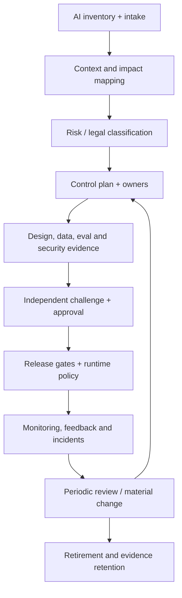

# AI governance operating system, audit and regulation

> _Last reviewed: 2026-07-16 — see the [freshness policy](../appendix/maintenance.md). This chapter is architecture guidance, not legal advice._

## Learning objectives

After this chapter you will be able to:

- build a lifecycle governance system rather than a one-time review board;
- inventory AI systems, actors, purposes, components, data, and obligations;
- tier risk and assign accountable decisions, controls, and evidence;
- connect policy, design, evaluation, release, monitoring, incident, and retirement;
- produce an auditable system dossier while minimizing sensitive evidence.

## Decision in one sentence

> **No AI system enters or changes production without a named owner, approved purpose, current risk classification, control evidence, release authority, monitoring, incident path, and retirement plan.**

Governance that exists only in slides is neither control nor evidence. The operating system must be embedded in procurement, architecture, data access, delivery pipelines, runtime policy, incident response, and portfolio review.

## Use frameworks as maps, not substitutions

The [NIST AI RMF 1.0](https://airc.nist.gov/airmf-resources/airmf/0-ai-rmf-1-0/) organizes voluntary AI risk management into Govern, Map, Measure, and Manage and describes trustworthy characteristics including validity/reliability, safety, security/resilience, accountability/transparency, explainability, privacy, and fairness. The [NIST Generative AI Profile](https://doi.org/10.6028/NIST.AI.600-1) adds GenAI-specific risks and actions.

[ISO/IEC 42001:2023](https://www.iso.org/standard/81230.html) specifies requirements for an AI management system and continual improvement. A management standard can structure organizational controls; it does not automatically satisfy a law or prove that one system is safe.

The [EU AI Act, Regulation (EU) 2024/1689](https://eur-lex.europa.eu/eli/reg/2024/1689/oj), establishes obligations based on role and risk, including prohibited practices, high-risk systems, certain transparency duties, and general-purpose AI model rules. Determine applicability, dates, role, and sectoral obligations with qualified legal counsel. Maintain a dated obligations register because laws, guidance, standards, and product features change.

## Governance architecture



## Inventory the real system

One registry record should include:

- purpose, users, affected people, decision/action, and explicit prohibited uses;
- provider, deployer/operator, importer/distributor, internal owner, and vendors;
- system boundary: models, prompts, data, retrieval, memory, tools, agents, interfaces, humans;
- autonomy, permissions, modalities, scale, geography, and deployment channels;
- data categories, sources, lawful basis or authority, retention, residency, and transfers;
- risk tier, legal/contractual/sector obligations, and assumptions;
- versions/environments, status, dependencies, incidents, last/next review, and retirement owner.

Discover shadow AI through procurement, expenses, network/API gateways, cloud inventories, repositories, browser extensions, data-loss controls, and staff reporting. Give teams a usable intake path; hidden use grows when approved paths are impractical.

## Map context and impact

Identify benefits, reasonably foreseeable misuse, affected groups, failure consequences, power asymmetries, alternatives, appeal, accessibility, environmental/resource effects where material, and interaction with existing processes. Include non-users affected by an agent's actions.

Classify by consequence, autonomy, reversibility, data sensitivity, scale, exposure, novelty, detectability, vulnerable populations, and regulatory category. Inherent risk determines required controls; residual risk after evidence determines approval. A generic chatbot label must not hide that it can execute payments or influence employment.

## Control domains and evidence

| Domain | Control examples | Evidence examples |
| --- | --- | --- |
| Accountability | RACI, competency, separation of duties | named approvals, training, minutes |
| Purpose/data | minimization, provenance, rights, retention/deletion | data sheet, lineage, deletion test |
| Quality/safety | representative evals, limits, human fallback | dataset card, slice report, residual risk |
| Security | threat model, identity, sandbox, red team | test report, findings closure, config attestations |
| Human impact | disclosure, control, accessibility, appeal | usability/accessibility tests, appeal log |
| Operations | manifest, SLO, monitoring, rollback, incident | signed release, dashboards, exercises |
| Third party | diligence, terms, change notice, exit | assessment, contract, subprocessor/model register |

Evidence must be attributable, versioned, time-bounded, reproducible where possible, and linked to a requirement and owner. A policy document is design intent; a passing control test is operating evidence.

## Decision rights and independent challenge

The product owner owns benefit and appropriate use; technical owners own architecture and operation; data, security, privacy, legal/compliance, accessibility, domain experts, and affected-stakeholder functions provide specialized challenge. High-risk decisions require independence from delivery incentives and a named risk-acceptance authority.

Define who may approve initial use, material changes, exceptions, emergency disablement, incident closure, and retirement. Committees advise only if decision rights and records are explicit.

## Material change management

Reassess when purpose, affected population, autonomy, tools/permissions, model, provider/terms, training or retrieval data, memory, policy, geography, interface, scale, evaluation method, or incident history changes materially. Automate technical change detection through the release manifest; require owners to assess contextual change.

Use expiry dates on approvals and exceptions. Vendor alias updates and silent service changes need monitoring and contract controls. No “pilot” exemption for real affected users or production data.

## Audit dossier

Organize evidence so a reviewer can reconstruct:

```text
why this system exists → who/what it affects → applicable obligations
→ architecture/data/authority → identified risks → selected controls
→ evaluation and independent review → approved release manifest
→ production behavior/incidents → changes → retirement
```

The dossier includes inventory record, impact/risk assessments, architecture and data flows, model/system/data cards, threat and privacy analysis, vendor diligence, control matrix, evaluations/red-team results, human-control design, approvals/exceptions, release manifests, monitoring/SLO reports, incidents/corrections, user notices, and retirement evidence.

Minimize and protect audit content. Use hashes, references, structured decisions, access controls, retention schedules, and legal holds rather than copying every prompt and personal record into a permanent archive.

## Assurance case: connect claims to evidence

A dossier is a collection; an assurance case is the reviewable argument that the collection supports. For each consequential use profile, state a bounded claim, its context and assumptions, the control argument, supporting evidence, counter-evidence, credible defeaters, residual uncertainty, and accountable acceptance.

```yaml
claim: "The assistant cannot issue an unapproved refund"
scope: "Northstar production refund profile v3"
argument:
  - "The model can only propose a typed refund action"
  - "Policy and a supervisor authorize the exact action hash"
  - "The payment adapter rejects absent or stale approval"
evidence:
  - control_test: approval-binding-2026-07-15
  - fault_campaign: ambiguous-payment-2026-Q3
defeaters:
  - "privileged operator bypasses the action broker"
residual_risk_owner: payments-risk-director
expires: 2026-10-16
```

Trace each claim to current evidence and each release tuple to the applicable claims. A passing test does not establish more than its population, environment, and confidence support. Open findings and negative results remain visible. If a defeater becomes credible or evidence expires, the release gate must reduce scope or stop the affected profile.

## Runtime governance

Translate policy into enforceable mechanisms: eligible model/provider/region routes, data-loss and residency checks, authorization, tool allowlists, approval thresholds, sandbox profiles, budget/depth limits, logging/redaction, and kill switches. Monitor both technical SLOs and impact indicators. Sample decisions and appeals; investigate leading indicators before incidents.

Governance needs feedback from users, reviewers, security findings, drift, complaints, overrides, access requests, correction/deletion, vendor notices, and regulatory change. Each material failure becomes a control improvement and regression case.

## Third-party and supply-chain governance

Assess model/service intended use and limits, data use/retention, security and privacy, regions/subprocessors, version and deprecation, evaluation evidence, incident/change notification, intellectual-property terms, audit rights, availability, and export/exit. Validate vendor claims against your system context. Your organization retains deployer/operator responsibilities that procurement cannot outsource.

## Northstar worked decision

Northstar registers the shipment assistant as one system with separate read-only advice and refund-action use profiles. The action profile receives a higher tier because it processes customer data and changes financial state. Its dossier links delegated authorization, RAG evidence, critical-slice evaluations, approval UX, sandbox/tool policy, canary manifest, SLOs, complaint/appeal path, and refund incident runbook. Adding autonomous refunds is a material purpose/authority change requiring reassessment—not a prompt update.

## Practical artifact: AI system dossier index

Produce the registry record, role/obligation analysis, impact and risk assessment, RACI/decision rights, control-to-evidence matrix, approved architecture and data flows, evaluation and residual-risk statement, vendor record, release/monitoring/incident plan, notices and human remedies, material-change triggers, periodic review, and retirement checklist.

## Lab

Build Northstar's dossier and classify two profiles: advisory shipment help and refund execution. Map NIST Govern/Map/Measure/Manage outcomes to your controls, then identify—not assume—where ISO/IEC 42001 or EU AI Act obligations may require specialist confirmation. Simulate a model/provider change and a cross-tenant incident; show the approval, containment, evidence, reporting decision, corrective action, and regression gate.

## Check yourself

1. What is the difference between a policy and operating evidence?
2. Which changes trigger reassessment?
3. Who can accept residual risk and who independently challenges it?
4. Why can one product need multiple use profiles?
5. How does retirement prove data, credentials, integrations, and access were removed?

## Further reading

- [NIST AI RMF 1.0](https://airc.nist.gov/airmf-resources/airmf/0-ai-rmf-1-0/) and [Playbook](https://www.nist.gov/itl/ai-risk-management-framework/nist-ai-rmf-playbook).
- [NIST AI 600-1: Generative AI Profile](https://doi.org/10.6028/NIST.AI.600-1).
- [ISO/IEC 42001:2023 overview](https://www.iso.org/standard/81230.html).
- [EU Artificial Intelligence Act official text](https://eur-lex.europa.eu/eli/reg/2024/1689/oj).
- [Privacy, residency and confidential data](03-privacy-residency.md).
