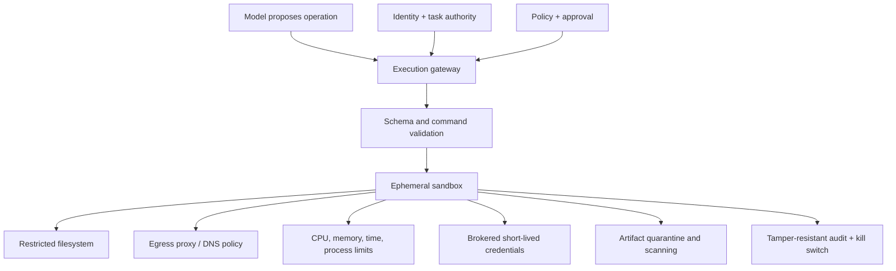

# Secure agent execution and sandboxing

> _Last reviewed: 2026-07-16 — see the [freshness policy](../appendix/maintenance.md)._

## Learning objectives

After this chapter you will be able to:

- threat-model code, shell, browser, computer-use, and tool execution;
- separate sandbox isolation from authorization and business policy;
- design ephemeral filesystems, network egress, credentials, and artifact controls;
- contain prompt injection, command injection, persistence, and resource abuse;
- operate kill switches, evidence collection, and recovery.

## Decision in one sentence

> **Execute agent-chosen operations in a disposable, least-privileged environment whose network, credentials, resources, tools, and lifetime are controlled outside the model.**

A sandbox limits consequences; it does not decide whether an action is allowed. Authorization without isolation leaves exploitation paths. Isolation without policy permits the agent to perform harmful actions inside the permitted environment.

## Threat model by executor

| Executor | Typical threats | Strong boundary |
| --- | --- | --- |
| Typed business tool | excess authority, bad arguments, replay | resource authorization + schema/state validation |
| Code interpreter | arbitrary code, package malware, data exfiltration | ephemeral OS/container/microVM + egress policy |
| Shell/coding agent | command injection, persistence, credential theft | isolated workspace, allowlisted mounts, no host socket |
| Browser agent | prompt injection, CSRF, deceptive UI, data upload | isolated profile, origin/egress rules, staged writes |
| Computer-use agent | broad UI authority, visual deception | dedicated desktop/VM, app allowlist, human approval |

The [OWASP MCP command-injection guidance](https://owasp.org/www-project-mcp-top-10/2025/MCP05-2025%E2%80%93Command-Injection%26Execution) documents the risk of untrusted input reaching shell or execution sinks. Parameterization and typed operations are preferable to constructing command strings.

## Reference control plane

The agent never chooses its own isolation profile. The gateway selects a reviewed profile from task type, data class, tenant, and authority.

## Isolation profile

For untrusted code or broad tools, prefer a fresh container or microVM per task or tenant boundary. Run as a non-root identity; remove Linux capabilities; block privilege escalation; use seccomp or an equivalent syscall policy; cap processes, CPU, memory, disk, wall time, and output; and never mount container engines, host credentials, home directories, or control-plane sockets.

An in-process language sandbox is not a general security boundary for hostile code. Defense depth may combine language restrictions with an OS-level boundary and a distinct cloud account/project/subscription for high-risk execution.

Destroy the environment after completion or timeout. Persistence must occur only through a narrow artifact or state API that applies classification, validation, ownership, retention, and audit policy.

## Filesystem and artifacts

Use an empty writable workspace plus explicit read-only inputs. Normalize paths and reject traversal, symlinks that escape mounts, device files, oversized archives, decompression bombs, and unsafe executable formats. Treat generated files as untrusted: quarantine, scan, label provenance, and require a deliberate export step.

Never allow an agent to overwrite its own policy, runtime launcher, audit collector, or approved skill/tool definitions. Version-controlled changes require diff review, tests, and the normal delivery pipeline.

## Network and data egress

Default-deny outbound network access. Route allowed traffic through a proxy that enforces destination, protocol, method, data-class, rate, and byte limits. Pin destinations to reviewed services where practical; defend against DNS rebinding and redirects to private/control-plane addresses. Block cloud instance metadata and internal management networks.

Browser access is not harmless read access: pages can inject instructions, initiate downloads, and submit data. Separate browsing from authenticated action sessions, show the destination and material payload before high-impact submissions, and test malicious pages.

## Secrets and credentials

Keep secrets outside prompts, environment dumps, shell history, and persistent files. A credential broker issues short-lived, audience-bound credentials after policy permits a specific operation. Inject them only into the process or connection that needs them; revoke on task completion, cancellation, anomaly, or sandbox destruction.

Use distinct identities and accounts for development, evaluation, and production. Honeytokens and secret-scanning can improve detection, but they do not replace isolation and least privilege.

## Validate operations, not natural-language intent

Prefer a typed API call to free-form shell. Validate command, arguments, working directory, input/output sizes, URLs, content type, and expected side effects. Use allowlists for high-risk interpreters and package installation. If arbitrary code is the product requirement, assume it is hostile and rely on containment.

Prompt injection can cross agent and tool boundaries. The [OWASP secure coding with AI guidance](https://cheatsheetseries.owasp.org/cheatsheets/Secure_Coding_with_AI_Cheat_Sheet.html) recommends sandboxed agent execution and review of AI-generated code. Retrieved instructions cannot change the sandbox profile or grant network, secret, or tool access.

## Approval and reversibility

Require human approval for destructive, externally visible, legally significant, financially material, credential-changing, or broad data-export actions. The preview must name target, operation, material parameters, destination, data, reversibility, and consequence. Bind approval cryptographically or transactionally to that exact operation and expiry.

Prefer preview, dry run, staged artifact, transactional write, versioned update, and compensating workflow. A confirmation dialog after execution is telemetry, not control.

## Detection and response

Capture sandbox image/profile, task and principal, inputs by reference, policy decision, commands/tool calls, network destinations, resource use, file hashes, credential issuance, approvals, exit status, exported artifacts, and destruction result. Minimize sensitive content and protect audit storage from the sandbox.

Provide kill switches at task, tenant, tool, model route, egress destination, and platform levels. On suspicious execution: revoke credentials, cut egress, preserve governed evidence, terminate or freeze the environment, identify derived artifacts and downstream actions, reconcile side effects, and add the event to adversarial evaluation.

## Northstar worked decision

Northstar allows a support coding agent to analyze sanitized logs in an ephemeral microVM. It receives read-only input objects and cannot reach production, source-control credentials, instance metadata, or arbitrary internet hosts. Package downloads use a curated mirror. A scanned report is the only export. Refunds remain typed business tools outside the sandbox and require independent authorization and approval.

## Practical artifact: execution profile

Document threat actors, data class, isolation primitive, base image and patch owner, user/capabilities/syscalls, mounts, egress, credentials, resource/time limits, allowed executors, artifact flow, approval points, telemetry, destruction evidence, incident controls, tests, and residual risk.

## Lab

Run a benign coding task and an adversarial corpus containing instructions to read credentials, access metadata, fork processes, escape directories, contact an unapproved host, and persist a script. Demonstrate containment, alerts, cancellation, artifact quarantine, and environment destruction. Then show that a typed refund API remains unreachable without its separate delegated authority.

## Check yourself

1. Why are authorization and sandboxing separate controls?
2. Which host resources must never be mounted into an agent sandbox?
3. How can a browser page become an execution attack?
4. When is package installation allowed?
5. What evidence proves the environment and credentials were destroyed?

## Further reading

- [OWASP MCP05: Command Injection and Execution](https://owasp.org/www-project-mcp-top-10/2025/MCP05-2025%E2%80%93Command-Injection%26Execution).
- [OWASP Agentic AI: Insufficient Sandboxing and Validation](https://cornucopia.owasp.org/edition/companion/AAI8/1.0/en).
- [Prompt injection and tool abuse](01-prompt-injection.md).
- [Agent identity, tools and delegated authorization](../05-agents/01-tools-authorization.md).
