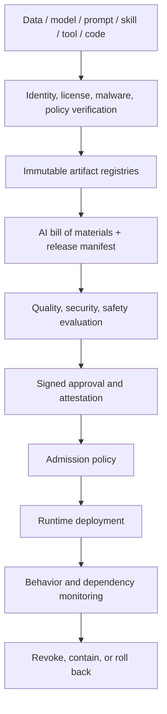

# AI supply chain & content provenance

> Last reviewed: 2026-07-16. See the [freshness policy](../appendix/maintenance.md).

## Learning objectives

After this chapter you will be able to:

- inventory model, data, prompt, skill, tool, and runtime dependencies;
- verify artifact identity, origin, integrity, policy, and promotion evidence;
- defend against poisoned artifacts and dependency substitution;
- attach and validate provenance for AI-generated media without overstating trust.

## The AI system is a dependency graph

A conventional software bill of materials is necessary but incomplete. AI behavior also depends on model weights or endpoints, tokenizers, adapters, datasets, prompts, retrieval corpora, embeddings, evaluation sets, policies, agent skills, MCP servers, tools, and hosted services. Any can change behavior or authority.



## AI bill of materials

Record for each component:

| Component | Identity and evidence |
|---|---|
| Model | provider/repository, exact version/digest, license, card, tokenizer, template, quantization, evals |
| Adapter | base-model compatibility, training data lineage, digest, merge method |
| Data/corpus | source authority, snapshot, rights, purpose, classification, lineage, deletion process |
| Prompt/policy | immutable version, owner, tests, approval, included templates |
| Skill/plugin/MCP | package digest, publisher, instructions, resources, tools, permissions, network scope |
| Tool/API | schema version, endpoint identity, auth scope, side-effect class, owner |
| Runtime | container, libraries, drivers, kernels, compiler, accelerator firmware |
| Hosted service | provider, model alias mapping, region, terms, retention, subprocessors, change notice |

The deployment identity is the whole tuple. A provider alias or mutable `latest` tag is not reproducible.

## Threats by lifecycle stage

| Stage | Threat | Control |
|---|---|---|
| Acquisition | Typosquatted model/skill, malicious pickle, license conflict | Approved registry, sandboxed inspection, safe formats, legal review |
| Training/indexing | Poisoned samples, label tampering, hidden triggers | Source controls, anomaly checks, lineage, robust evaluation |
| Build | Compromised runner or dependency | Isolated build, pinned dependencies, least privilege, provenance attestation |
| Registry | Artifact substitution or tag movement | Content digests, signatures, immutability, transparency/audit log |
| Promotion | Evaluation bypass or evidence mismatch | Policy gate binds evidence to exact manifest digest |
| Runtime | Model endpoint drifts, skill expands tools | Admission, version monitoring, capability envelope, kill switch |
| Output | False origin claims or stripped credentials | Content provenance, validation, clear unknown state |

Do not deserialize untrusted executable model formats on a privileged host. Scan and inspect artifacts in an isolated environment without credentials or unrestricted network access.

## Signed attestations and admission

SLSA provenance provides a useful model for describing where, when, and how a software artifact was produced. Apply the same principle to the release manifest: build and evaluation attestations should bind their subjects to content digests and identify the trusted builder/evaluator.

An admission policy checks:

```yaml
release_digest: sha256:...
required:
  - artifact_signatures_valid
  - approved_publishers
  - licenses_allowed
  - critical_findings_closed
  - eval_manifest_subject_matches_release
  - risk_approval_current
  - model_and_tool_regions_allowed
deny:
  - mutable_artifact_reference
  - unregistered_mcp_server
  - expired_exception
```

Signatures prove control of a signing identity, not that the artifact is safe. Trust policy decides which identities, build systems, and evidence are acceptable.

## Skills, plugins, MCP servers, and tools

Treat natural-language instructions as executable influence. Review a skill’s instruction file, referenced resources, scripts, tool declarations, install hooks, update path, and requested permissions. Pin it by digest and rerun behavioral and security tests after any change.

An MCP server is a remote dependency and authority surface. Authenticate both sides, allowlist server identity and tools, validate schemas and returned content, constrain egress, and require fresh user/delegated authorization for consequential calls. Tool descriptions and retrieved content are untrusted input, not policy.

## Vendor and hosted-model change

Contract for model/version identification, deprecation, material-change notice, data handling, incidents, regions, and export. At runtime, record returned model/version identifiers where available and monitor behavior canaries. If the provider cannot pin a version, shorten approval windows and maintain rapid regression and rollback routes.

## Generated-content provenance

C2PA Content Credentials provide a standard, cryptographically bound structure for assertions about a media asset’s origin and history. For generated or edited images, audio, video, and documents:

1. create assertions describing the generating/editing action and relevant tool identity;
2. bind the manifest to the asset and sign with an approved credential;
3. validate structure, binding, signature, certificate status, and trust chain on ingestion;
4. preserve ingredient history through transformations where possible;
5. show users valid, invalid, absent, and unknown provenance distinctly.

Content Credentials are trust signals, not truth certificates. A valid signer can make a false assertion, provenance can be absent, and ordinary transformations may strip metadata. Never label an asset false merely because credentials are missing.

## Revocation and incident response

Maintain the ability to revoke publisher keys, model/skill/tool versions, release manifests, and content credentials. Scope queries should identify every deployment and output using a component digest. Contain first, preserve evidence, rotate credentials, rebuild from trusted inputs, rerun evaluations, and restore through admission and canary gates.

## Northstar decision

Northstar’s release manifest pins model endpoint/version, tokenizer behavior, prompt, policy, corpus snapshot, skills, MCP servers, tool schemas, runtime, and evaluation evidence. Only approved registries can supply artifacts. Skills cannot add tool authority. Customer-facing generated media receives C2PA credentials; ingestion displays absent provenance as unknown, not fraudulent.

## Architecture artifact

Produce an **AI BOM and promotion policy** containing component identities/digests, publishers, licenses, lineage, trust roots, build/evaluation attestations, admission rules, vendor-change handling, runtime detection, generated-content provenance, revocation, and rollback procedure.

## Lab

Build a Northstar release manifest, then inject a mutable model tag, an unsigned skill update, a poisoned corpus item, a mismatched evaluation attestation, and an invalid content credential. Show which control detects each case and how affected deployments are discovered.

## Check yourself

1. Why is a traditional software BOM insufficient for an agentic system?
2. What does a signature prove, and what does it not prove?
3. Why must evaluation evidence bind to the release digest?
4. How should a product display absent C2PA provenance?

## Further reading

- [SLSA v1.1: Provenance](https://slsa.dev/spec/v1.1/provenance)
- [NIST Secure Software Development Framework, SP 800-218](https://csrc.nist.gov/pubs/sp/800/218/final)
- [NIST AI 100-2e2025: Adversarial Machine Learning](https://doi.org/10.6028/NIST.AI.100-2e2025)
- [C2PA Specifications 2.2](https://spec.c2pa.org/specifications/specifications/2.2/index.html)
- [OWASP Top 10 for Agentic Applications 2026](https://genai.owasp.org/resource/owasp-top-10-for-agentic-applications-for-2026/)
