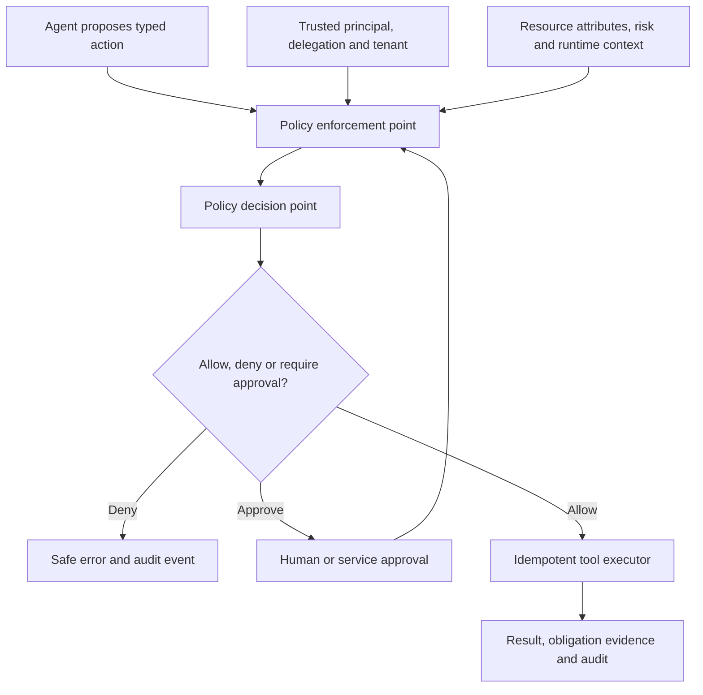

# Policy-as-code for agent actions

> _Security architecture — last reviewed: 2026-07-25._

## Learning objectives

- externalize action authorization from prompts and model reasoning;
- model delegated authority with principal, action, resource, and context;
- test, deploy, observe, and roll back agent policy safely.

## The decision in one sentence

The model proposes intent; a deterministic policy decision point authorizes the exact action and an enforcement point controls execution.

## Authorization path

Prompt instructions are useful behavior guidance, not a security boundary. [Open Policy Agent](https://www.openpolicyagent.org/docs) decouples policy decisions through Rego; [Cedar](https://docs.cedarpolicy.com/) models principal-action-resource-context authorization with default deny and forbid-overrides-permit semantics.

| Input | Trusted source | Example |
|---|---|---|
| Principal | identity provider/workload identity | employee or agent instance |
| Delegation | signed grant/session | may draft but not submit |
| Action | tool manifest | `case.update_address` |
| Resource | system of record | case owner, region, sensitivity |
| Context | trusted runtime | time, device, amount, risk, approval |
| Policy | reviewed repository/store | version and effective date |

## Policy engineering

Normalize tool intents before evaluation; do not let free text become an action name or resource ID. Default deny. Scope allow rules narrowly and add explicit forbids for high-harm combinations. Return obligations such as redact fields, require step-up authentication, cap amount, log evidence, or obtain approval.

Treat policy like production code: schema/type validation, unit tests, decision tables, property tests for invariants, negative tests, historical replay, peer review, signed artifact, staged rollout, decision telemetry, and rapid rollback. Evaluate changes against real authorization traces with sensitive values minimized.

Keep policy-decision availability in the service SLO. For consequential writes, fail closed. For low-risk reads, a carefully defined cached decision may be acceptable if identity, policy version, and resource attributes remain valid. Never let the agent reinterpret a deny into another semantically equivalent tool call; enforce action families and rate/sequence constraints.

## Northstar example

The Northstar agent can read policy for the user’s region and draft a case note. It may update a mailing address only with a live user session, matching case ownership, verified source evidence, and human confirmation. It can never change eligibility or payment destination. A policy change is replayed against 90 days of minimized decision logs before canary release.

## Practical artifact: action-control matrix

For every tool/action record principal types, delegation, resources, conditions, forbidden combinations, obligations, approval, rate/sequence limits, fail behavior, policy tests, decision retention, owner, and review date.

Apply the matrix to [production tool engineering](../05-agents/08-production-tool-engineering.md) and retain its decisions for [agent incident forensics](../08-platform-operations/12-agent-incident-forensics.md).

## Further reading

- [OPA documentation](https://www.openpolicyagent.org/docs)
- [Cedar authorization](https://docs.cedarpolicy.com/auth/authorization.html)
