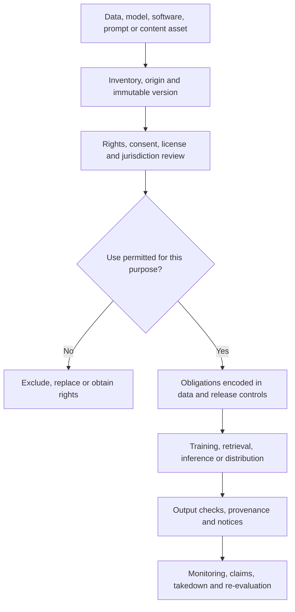

# Legal, licensing, and IP architecture

> _Governance architecture — last reviewed: 2026-07-25. This chapter is not legal advice; involve qualified counsel for the use case and jurisdictions._

## Learning objectives

- trace rights and obligations across data, models, software, prompts, and outputs;
- implement use restrictions and evidence in architecture;
- make legal and licensing review continuous rather than a launch checklist.

## The decision in one sentence

No asset enters training, context, generation, or distribution without known provenance, permitted use, retained evidence, and an owner for obligations.

## Rights and obligations pipeline

| Asset | Questions | Architectural evidence |
|---|---|---|
| Training/fine-tune data | source, consent, copyright, privacy, geographic/use limits | dataset card and lineage |
| Model/weights | license, acceptable-use terms, derivative/distribution rights | model bill of materials |
| Software/tools | dependency and copyleft obligations, patents | SBOM and notices |
| Enterprise content | access rights, purpose, retention, confidentiality | ACL and retrieval trace |
| Prompts/skills | ownership, secrets, third-party material | repository history and review |
| Outputs | customer ownership, similarity, attribution, disclosure | provenance and release record |

## Encode obligations

Tag assets with owner, source, license, consent/purpose, jurisdiction, data class, allowed operations, attribution, expiry, and deletion requirements. Enforce tags during ingestion, dataset assembly, retrieval, training jobs, model registry promotion, and artifact publication. A policy document disconnected from pipelines will drift.

Use [SPDX](https://spdx.dev/) for machine-readable software and broader system inventory where suitable, and [C2PA Content Credentials](https://spec.c2pa.org/specifications/) for tamper-evident media provenance where the channel supports it. These formats do not establish that a use is legally permitted; they carry evidence and claims.

Contract terms must cover input/output rights, training use, derived telemetry, confidentiality, retention/deletion, subprocessors, model changes, infringement claims, indemnity, audit evidence, suspension, export, and termination. Map applicable law from roles and use case. For example, the official [EU AI Act Regulation 2024/1689](https://eur-lex.europa.eu/eli/reg/2024/1689/oj) assigns obligations by system risk and actor role; implementation requires jurisdiction-specific counsel.

## Output and retrieval controls

Honor source ACLs and purpose limitation during retrieval. Prevent one user’s content from becoming another user’s training data by default. For public output, check sensitive data, required attribution, policy, high-similarity risk where appropriate, and provenance disclosure. Provide takedown/correction workflow that can find affected datasets, indexes, model versions, and published artifacts.

## Northstar example

Northstar’s policy documents are licensed for internal decision support but not public redistribution. Retrieval returns short cited passages only to entitled staff. Fine-tuning uses separately approved adjudication records with consent/purpose and deletion lineage. Marketing image generation uses an approved model and licensed brand assets, with C2PA provenance on publication.

## Practical artifact: AI rights register

For each asset record immutable ID/version, origin, owner, license/contract, consent and purpose, allowed/prohibited uses, jurisdictions, attribution, retention/deletion, downstream products, model/index versions, evidence location, review date, and incident/takedown owner.

Join the register to the [AI supply-chain inventory](07-ai-supply-chain.md) and the [agent marketplace admission dossier](../08-platform-operations/13-agent-marketplaces.md).

## Check yourself

1. A team wants to fine-tune on customer adjudication records 'because we already have them'. What must be true first?
2. Does an SPDX or C2PA record make a use legal?
3. A document must be taken down. Which artifacts must you be able to find?
4. Why is a licensing policy document alone insufficient?

What a strong answer covers

<ol>
<li>Known provenance, permitted use, consent and purpose, deletion lineage, and an owner for the obligations. Northstar uses separately approved adjudication records, and tags are enforced at ingestion, dataset assembly, training, and registry promotion.</li>
<li>No. They carry evidence and claims — software inventory and media provenance — but do not establish that a use is permitted; that remains a legal determination.</li>
<li>Every dataset, index, model version, and output derived from it. The rights register joins each asset to its downstream products, versions, and evidence, and to a takedown owner.</li>
<li>A policy disconnected from pipelines drifts. Obligations must be tagged on assets and enforced technically, and contracts must cover input and output rights, training use, telemetry, retention, subprocessors, model changes, and indemnity.</li>
</ol>

## Further reading

- [SPDX specification](https://spdx.dev/use/specifications/)
- [C2PA guidance for AI/ML](https://spec.c2pa.org/specifications/)
