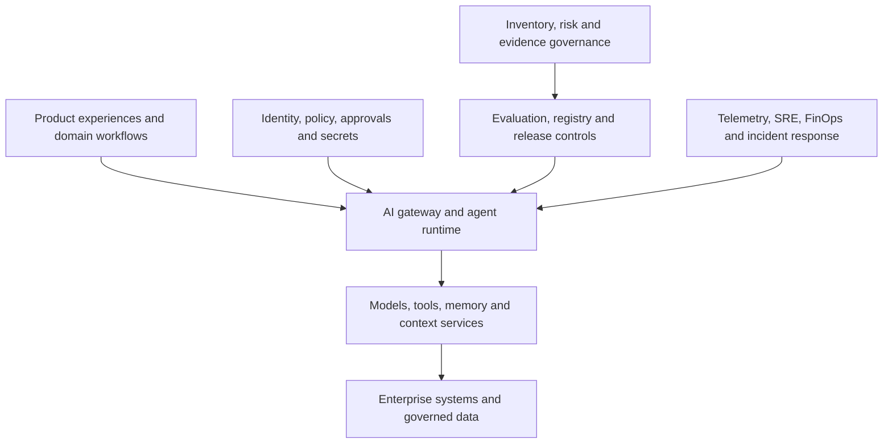

# AI platform capability map

> _Platform design guide — last reviewed: 2026-07-25._

## Learning objectives

- map product needs to reusable platform capabilities;
- separate control-plane responsibilities from runtime data paths;
- define paved roads without creating a central-team bottleneck.

## The decision in one sentence

Standardize high-risk, high-duplication capabilities as platform products while leaving domain logic and outcome ownership with product teams.

## Map capabilities before products

A platform capability map is a stable vocabulary for evaluating cloud services, open-source components, and internal products. It prevents architecture from becoming a vendor screenshot.

| Plane | Core capabilities | Key contract |
|---|---|---|
| Experience | channels, streaming, artifacts, feedback, accessibility | session and response contract |
| Agent/runtime | orchestration, model routing, tools, memory, sandbox | run and tool-call contract |
| Data/context | ingestion, retrieval, graph, lineage, consent | evidence and provenance contract |
| Trust | identity, authorization, policy, approvals, moderation | principal-action-resource-context decision |
| Quality | datasets, evaluators, experiments, release gates | versioned evaluation result |
| Operations | deployment, telemetry, SLOs, incidents, cost | trace and service ownership |
| Governance | inventory, risk tier, attestations, audit, retirement | system card and change record |

## Reference capability topology

| Flow | Description | Ownership |
|---|---|---|
| Experience → runtime | submits a versioned task and receives events/artifacts | product team |
| Runtime → context/tools | accesses only authorized capabilities | platform plus domain provider |
| Trust → runtime | makes deterministic allow/deny/approval decisions | security/governance |
| Quality → runtime | promotes approved configurations and evaluators | quality platform |
| Operations → runtime | observes, budgets, degrades, and recovers | SRE/platform |
| Governance → quality | binds risk evidence to each release | accountable system owner |

## Decide what becomes a paved road

Use a two-axis test: reuse across teams and control criticality. High-reuse/high-criticality capabilities—identity propagation, secrets, model gateway, telemetry schema, evaluation runner, artifact store, and policy enforcement—deserve a supported platform. Low-reuse domain retrieval or specialized tools remain product-owned but implement platform contracts.

Offer three layers:

1. **golden path:** supported templates, defaults, dashboards, and runbooks;
2. **extension points:** documented contracts for approved variation;
3. **exception path:** time-boxed review with an owner and convergence plan.

Track the platform as a product: adoption, time to first safe deployment, developer satisfaction, change-failure rate, policy coverage, unit cost, and number of unsupported forks. A mandatory platform that cannot meet team needs creates shadow infrastructure.

## Build-versus-consume by capability

Do not make one global “single cloud versus best of breed” choice. Evaluate each capability for differentiation, control, maturity, portability, operating burden, and ecosystem fit. Managed model access may coexist with an internal gateway, an open evaluation format, a cloud-native workflow engine, and a portable trace schema.

The control plane stores definitions, policies, versions, evaluation results, and deployment intent. The data plane handles live prompts, context, tool calls, and artifacts. Separate them to limit blast radius and support regional runtimes without duplicating governance.

## Northstar example

Northstar standardizes workload identity, a model gateway, retrieval entitlements, tool manifests, run events, evaluation gates, and audit retention. The benefits team owns policy retrieval and adjudication tools. A second claims product reuses the platform while supplying its own datasets, rubrics, risk tier, and service owner.

## Practical artifact: capability heat map

For each capability record current state, target state, consumer teams, criticality, data class, buy/build choice, owner, SLO, portability boundary, maturity score, and next investment. Review quarterly; a map without owners and consumers is only taxonomy.

## Further reading

- [OpenTelemetry documentation](https://opentelemetry.io/docs/)
- [NIST AI RMF Core](https://airc.nist.gov/airmf-resources/airmf/5-sec-core/)
