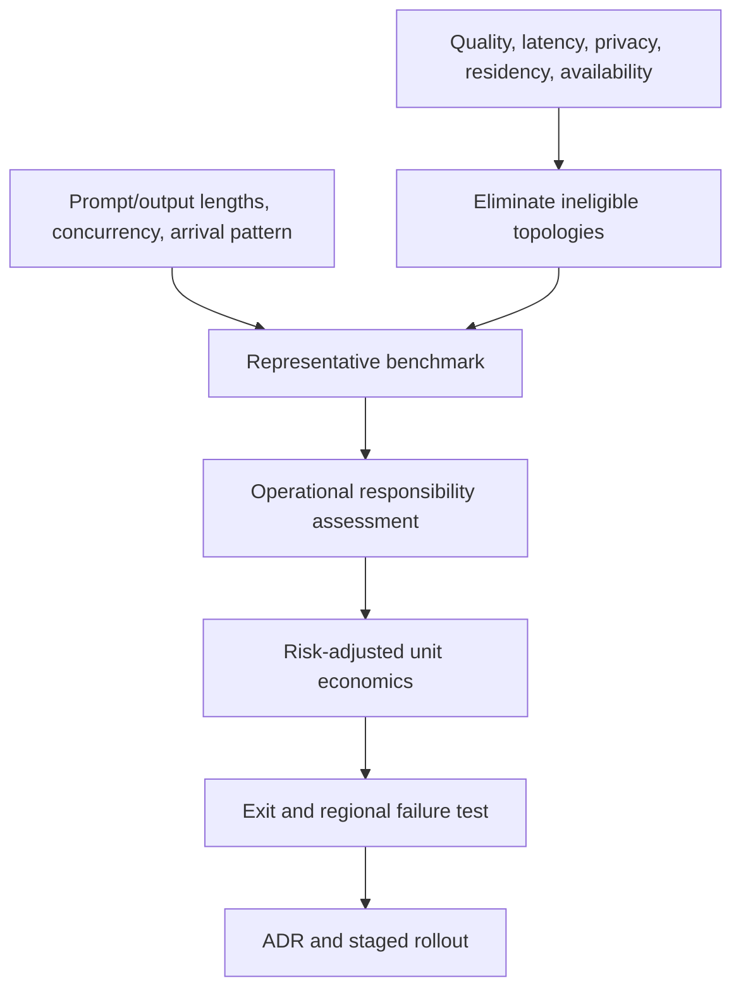
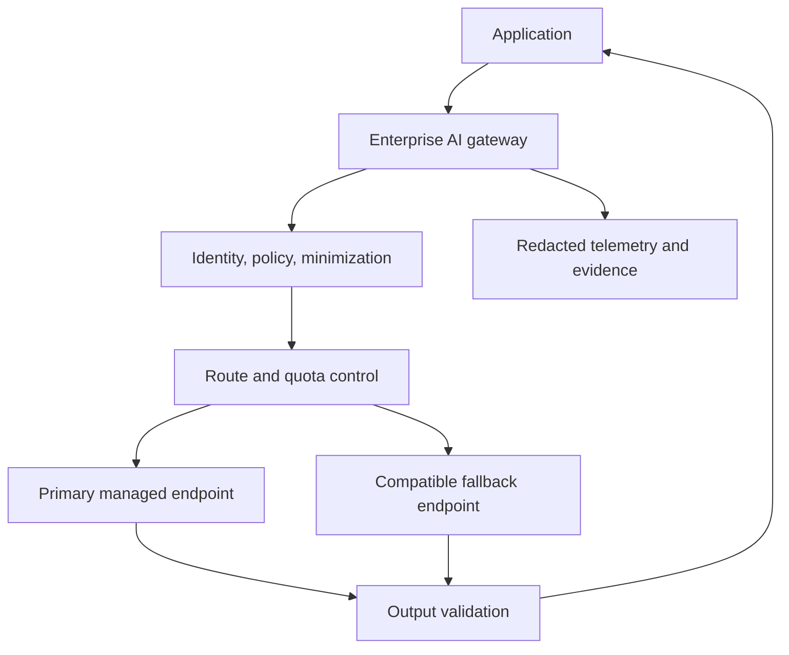
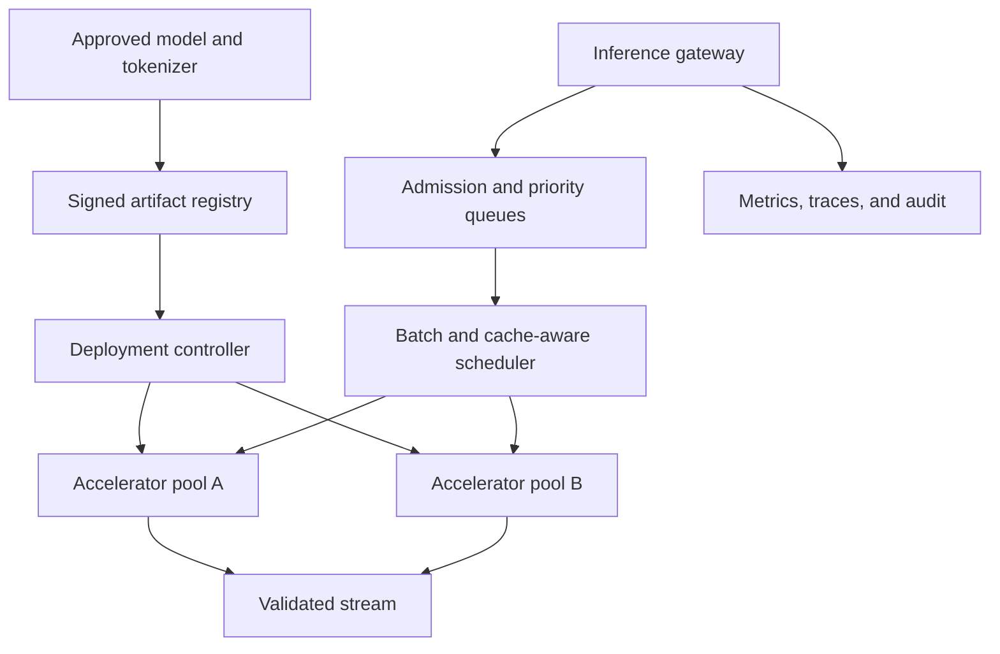
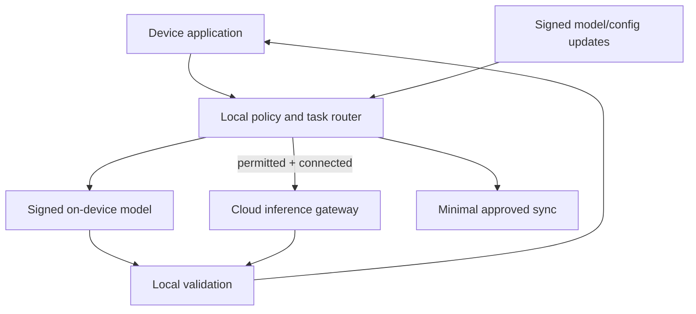

# Managed APIs, cloud AI, self-hosting & edge

> Last reviewed: 2026-07-16. See the [freshness policy](../appendix/maintenance.md).

## Learning objectives

After this chapter you will be able to:

- select a deployment topology from requirements rather than ideology;
- account for control-plane, data-plane, and supply-chain responsibilities;
- benchmark managed and self-hosted options against the real workload;
- design portability, regional failure, edge, and offline behavior.

## Hosting is a responsibility allocation

“Managed or self-hosted?” is not a binary technology question. A production system may use a managed frontier model, a self-hosted classifier, an on-device safety filter, and regional retrieval. The architecture decision is which party operates each control and data path under what guarantees.

| Option | You gain | You own or accept |
|---|---|---|
| Public model API | Fast access, elastic capacity, low platform burden | Provider limits, external data path, model/version dependency |
| Cloud-managed AI endpoint | Cloud identity/network/governance integration | Regional/service constraints and cloud coupling |
| Dedicated managed capacity | Isolation and predictable quota | Commitment, sizing, failover design |
| Self-hosted serving | Runtime, weights, topology, and scheduling control | Accelerators, serving software, security, reliability, optimization |
| Edge/on-device | Locality, offline use, low network latency | Small models, device diversity, updates, physical exposure |

The same model name across options does not guarantee the same weights, quantization, context behavior, tokenizer, safety layer, or throughput.

## Decision process



Start with hard constraints: approved data locations, disconnected operation, model quality, maximum latency, required context, licensing, and availability. Benchmark only eligible options.

## Capture the workload distribution

Average tokens per request is insufficient. Record:

- input and output token distributions, including long tails;
- arrival rate, burstiness, concurrency, and priority classes;
- time to first token (TTFT) and inter-token latency targets;
- streaming versus batch and interactive versus asynchronous work;
- repeated prefixes, multi-turn cache reuse, and adapter mix;
- model quality target, quantization tolerance, and fallback compatibility;
- regional demand, egress, data gravity, and offline windows.

Benchmark the end-to-end path, including tokenization, routing, retrieval, network, queueing, safety checks, streaming, and validation. Tokens/second from an isolated accelerator is not user latency.

## Managed API architecture



Assess provider retention, training use, sub-processors, regions, encryption, private connectivity, abuse monitoring, deletion, audit evidence, model-change policy, quota, and incident commitments. Keep secrets in a broker and use workload identity where supported.

Do not assume a fallback is compatible. Validate tool schemas, structured output, tokenizer limits, content policy, safety behavior, streaming events, and refusal semantics for every route.

## Self-hosted serving architecture



Self-hosting adds responsibility for:

- model, tokenizer, adapter, runtime, driver, and kernel compatibility;
- artifact provenance, malware scanning, licenses, signatures, and rollback;
- accelerator topology, placement, fragmentation, health, and replacement;
- tensor/pipeline/expert parallelism and collective communication;
- batching, KV-cache allocation, admission, preemption, and fairness;
- autoscaling despite slow model load and scarce capacity;
- security patches, tenant isolation, observability, backup, and on-call.

Use immutable version tuples. A model rollback without its tokenizer, template, quantization, and runtime may not reproduce prior behavior.

## Capacity model

Separate prefill from decode. Prefill processes input tokens and is compute-intensive; decode emits tokens iteratively and is often constrained by memory bandwidth and KV-cache capacity. Long prompts can delay short interactive work unless the scheduler isolates classes or chunks prefill.

At minimum model:

```text
arrival_rate × mean_service_time < effective_parallel_capacity
```

But size from tail distributions and target utilization. High utilization can cause nonlinear queueing delay. Reserve failure capacity, model-load headroom, and memory for KV cache; model weights alone do not determine accelerator fit.

Scale on queue age, deadline risk, active sequences, KV-cache pressure, and tokens in flight—not CPU utilization. Because replicas can take minutes to load, combine predictive capacity, warm pools, and admission control.

## Multi-tenancy and scheduling

Define priority, fairness, and maximum resource share per tenant and workload. Prevent a few long-context requests from exhausting KV cache. Use separate pools where security, adapter churn, latency class, or failure isolation justifies the cost.

GPU process or container boundaries are not automatically strong tenant isolation. Review device sharing, host access, side channels, memory clearing, runtime security, and operator permissions against the data classification.

## Edge and offline architecture

Edge inference is justified by disconnected operation, privacy, bandwidth, or latency—not merely lower cloud spend. Design for the least capable supported device and measure thermal throttling, memory pressure, startup, energy, and sustained latency.



Model updates require signatures, anti-rollback protection, staged rollout, storage checks, and a known-good local version. Encrypt local state, minimize retained prompts, account for physical device compromise, and define behavior when time, identity, or revocation data is stale. Offline actions should be limited to authority that can be verified locally.

## Availability and regional design

Define whether the system needs retry within one endpoint, zone redundancy, region failover, provider failover, or offline continuity. Each adds semantic and operational complexity. Replicate only permitted data, pre-provision quota, and test DNS/network, identity, key, registry, and retrieval dependencies—not just the model endpoint.

For stateful agent runs, failover must preserve durable state and action receipts. Never restart a run in another region by replaying natural language after an ambiguous side effect.

## Economics

Compare cost per **successful qualified task**, not price per token or accelerator-hour. Include idle reserved capacity, failed and retried work, engineering/on-call, networking, storage, licenses, observability, security controls, evaluation, refresh cycles, and exit work.

Self-hosting can win for stable high utilization, available platform expertise, and models that meet quality targets. Managed services often win when demand is variable or time-to-value and model access dominate. Recalculate with measured utilization and outcome rates.

## Portability and exit

Portable application contracts help, but lowest-common-denominator abstraction can hide valuable features. Separate a stable internal request/evidence contract from provider-specific adapters. Maintain a small compatibility suite for structured output, tool calling, streaming, safety, and token limits.

An exit plan names alternative models, artifact and data export, re-evaluation scope, capacity lead time, contract termination, and maximum tolerated transition. Test it as an exercise.

## Northstar decision

Northstar starts with two approved managed endpoints behind a model-neutral gateway because demand is variable and the team lacks 24×7 accelerator operations. Sensitive retrieval remains in-region, prompts are minimized, and write actions do not depend on provider-specific behavior. A small on-device model supports warehouse classification during network loss. Self-hosting becomes eligible only if a quarterly benchmark shows quality parity and risk-adjusted cost improvement at observed load.

## Architecture artifact

Produce a **hosting ADR and exit plan** containing workload distributions, hard constraints, responsibility matrix, benchmark method/results, topology, data boundaries, availability design, unit economics, supply-chain controls, edge/offline rules, portability suite, and review triggers.

## Lab

Benchmark a managed endpoint and a local serving runtime with Northstar’s short interactive, long-context, and batch distributions. Include one regional failure and one edge-offline scenario. Recommend a topology using successful-task cost and operational risk.

## Check yourself

1. Why does accelerator tokens/second not predict end-user latency?
2. Which responsibilities appear when self-hosting model weights?
3. When is edge inference architecturally justified?
4. What must a provider fallback compatibility suite verify?

## Further reading

- [MLPerf Inference benchmark documentation](https://docs.mlcommons.org/inference/index_gh/)
- [Kubernetes: scheduling, preemption, and eviction](https://kubernetes.io/docs/concepts/scheduling-eviction/)
- [Kubernetes: schedule GPUs](https://kubernetes.io/docs/tasks/manage-gpus/scheduling-gpus/)
- [Efficient Memory Management for Large Language Model Serving with PagedAttention](https://arxiv.org/abs/2309.06180)
