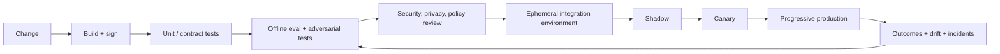

# AgentOps and LLMOps: lifecycle, CI/CD and promotion

> _Last reviewed: 2026-07-16 — see the [freshness policy](../appendix/maintenance.md)._

## Learning objectives

After this chapter you will be able to:

- version the complete AI behavior and control surface;
- build evaluation, security, policy, and operability gates into delivery;
- promote immutable releases through shadow, canary, and rollback;
- observe sessions, trajectories, tools, outcomes, and cost safely;
- operate incidents and turn failures into durable regression cases.

## Decision in one sentence

> **Promote a tested system manifest—not a prompt or model in isolation—and make every production outcome traceable to that manifest.**

LLMOps extends software and MLOps to instructions, models, retrieval, and semantic evaluation. AgentOps adds tools, delegated identities, orchestration, memory, approvals, sandboxes, and long-running task state.

## The releasable unit

```yaml
release: northstar-support/2026.07.16.3
code: git-sha
model_routes: route-manifest-sha
instructions: prompt-bundle-sha
tools: schemas-and-server-versions
retrieval: corpus-index-parser-embedding-reranker versions
memory: schema-extractor-policy versions
workflow: graph-and-state-schema version
policy: authorization-safety-approval versions
runtime: image-infrastructure-sandbox profile
evaluations: dataset-rubric-judge-gate versions
telemetry: schema-redaction-retention versions
approvals: change record and owners
```

Store secrets and raw sensitive data outside the manifest. Sign artifacts and preserve provenance from source through build, evaluation, approval, deployment, and retirement.

## Delivery pipeline



| Step | Diagram stage | Detailed description |
| ---: | --- | --- |
| 1 | Change | Declare the modified prompts, models, code, tools, policies, data/indexes, infrastructure, or evaluators and the expected behavior/risk impact. |
| 2 | Build + sign | Reproduce artifacts from pinned inputs, scan dependencies, generate provenance/SBOM evidence, and sign immutable versions. |
| 3 | Unit / contract tests | Verify deterministic code, schemas, adapters, policy decisions, migrations, idempotency, and compatibility before stochastic evaluation. |
| 4 | Offline eval + adversarial tests | Run versioned task suites, critical slices, regressions, prompt-injection and abuse scenarios, repeated trials, and calibrated graders. |
| 5 | Security, privacy, policy review | Block releases that violate authorization, isolation, retention, data-use, safety, or required human-approval invariants. |
| 6 | Ephemeral integration environment | Deploy the complete change with isolated identities and governed fixtures; test cross-component behavior, failure, rollback, and capacity. |
| 7 | Shadow | Process representative traffic without affecting users or systems of record; compare behavior, latency, cost, and traces with the incumbent. |
| 8 | Canary | Expose a bounded cohort with limited authority, rapid rollback, explicit outcome monitoring, and hard safety stop conditions. |
| 9 | Progressive production | Expand by workload, cohort, region, and authority only as evidence remains within release thresholds. |
| 10 | Outcomes + drift + incidents | Join technical telemetry to authoritative outcomes, detect regressions and drift, respond to incidents, and feed new cases back into offline evaluation. |

Changes declare affected components and expected behavior. The pipeline selects relevant suites but always runs cross-component smoke tests. A tool schema change can break a model route; a new embedding can alter access-filter behavior; a policy change can invalidate an approval flow.

## Gates that block promotion

- artifact integrity, dependency and infrastructure checks;
- schema, contract, idempotency, migration, and rollback tests;
- critical quality slices and non-regression against the incumbent;
- zero-tolerance authorization, isolation, privacy, and unsafe-action invariants;
- prompt-injection and adversarial tests for changed trust boundaries;
- judge calibration when semantic graders change;
- latency, capacity, cost, cancellation, and graceful-degradation tests;
- human review for policy, high-impact, or material data-use changes.

Flaky stochastic cases need repeated trials and statistical thresholds, not ignored failures. Quarantine only with an owner, expiry, risk acceptance, and replacement evidence.

## Environments and data

Separate development, evaluation, staging, and production identities, networks, keys, data, indexes, and memory. Use synthetic or governed de-identified fixtures by default. Production replay requires approved minimization, access, retention, and purpose controls.

Create ephemeral environments from infrastructure and policy as code. Seed versioned fixtures, run evaluations, then destroy environment and temporary credentials. Never let evaluation agents acquire production write tools.

## Promotion and rollback

Shadow compares candidates without user-visible effects. Canary exposes a small eligible population with automatic rollback on SLO burn, critical invariant, quality slice, cost, or dependency thresholds. Increase exposure deliberately; preserve an incumbent route until delayed outcomes arrive.

Rollback must cover coupled assets: code, prompts, routes, tools, policy, index aliases, state migrations, and sandbox image. For long-running agents, define whether in-flight tasks finish on the old manifest, migrate through a tested state transformation, or stop safely.

## Observe the trajectory and outcome

Use a portable trace model: session → task/trace → spans for retrieval, model calls, tools, agents, policy, approvals, memory, and validation. The [OpenTelemetry GenAI semantic conventions](https://opentelemetry.io/docs/specs/semconv/registry/attributes/gen-ai/) define shared attributes for operations, providers, messages, retrieval, tools, and token usage, while warning that content attributes can contain sensitive information.

Record IDs and derived measures by default. Gate prompt, output, and tool-payload capture behind purpose, consent/legal basis, redaction, access, retention, and regional controls. Sampling must retain rare errors and high-impact actions without becoming a shadow data lake.

Operational dashboards should connect:

| Plane | Signals |
| --- | --- |
| Service | availability, queue, TTFT, latency, capacity, errors |
| Model | route/version, tokens, schema/refusal/validation, fallback |
| Agent | steps, depth, fan-out, loop/stop, tool and delegation failures |
| Quality | task success, groundedness, critical-slice and harmful outcomes |
| Policy | allow/deny, approval, secret/egress, sandbox violations |
| Economics | cost/task, cost/success, retry and idle-task waste |

Current product examples include [AWS AgentCore Observability](https://docs.aws.amazon.com/bedrock-agentcore/latest/devguide/observability.html), which emits OpenTelemetry-compatible agent telemetry, and [Microsoft Foundry agent tracing](https://learn.microsoft.com/en-us/azure/foundry/observability/how-to/trace-agent-setup), which uses OpenTelemetry and Application Insights. Feature status can differ by agent type; check current documentation during implementation.

## Long-running tasks and memory migrations

Persist task leases, checkpoints, step attempts, approvals, budgets, manifest version, and confirmed side effects. Make workers idempotent and resume from durable state. Version state and memory schemas; use dual-read/write or backfill strategies where needed; verify deletion and tenant isolation after migration.

An updated skill, tool, or prompt must not silently alter an already approved action. Bind approval to material parameters and policy version; re-approve after relevant changes.

## Incident loop

1. detect user SLO, harmful outcome, policy violation, or cost anomaly;
2. contain with route/tool/tenant kill switch, credential revocation, or fallback;
3. identify affected manifests, tasks, principals, artifacts, and side effects;
4. reconcile or compensate business state;
5. preserve minimized governed evidence;
6. correct and validate the controllable cause;
7. add representative and adversarial regression cases;
8. communicate and complete required reporting;
9. verify effectiveness after redeployment.

Do not “fix” every incident with another prompt sentence. Triage data, retrieval, policy, tool, orchestration, interface, infrastructure, and measurement causes.

## Northstar worked decision

Northstar promotes one signed support-system manifest. A new model alias is captured as a new route version and evaluated before canary. Refund tools cannot run in shadow. Canaries begin with read-only cases; write cases require separate approval. Any cross-tenant result or unapproved write halts the release. In-flight refund tasks remain on their original manifest unless a security kill switch stops them.

## Practical artifact: promotion contract

Include manifest schema, ownership/RACI, change-impact rules, gates and thresholds, environment/data policy, supply-chain evidence, rollout segments, rollback and state migration, telemetry/redaction, incident controls, model/provider change handling, and retention/retirement.

## Lab

Create two Northstar manifests differing in model, prompt, and one tool schema. Build a pipeline that signs the manifest, runs deterministic tests and repeated evaluations, rejects an authorization regression, deploys an effect-free shadow, canaries the safe candidate, triggers rollback on a simulated harmful-outcome threshold, and correlates one trace to every artifact version.

## Check yourself

1. Why is a prompt not the releasable unit?
2. Which changes require cross-component evaluation?
3. How are in-flight tasks handled during rollback?
4. Which telemetry fields are sensitive by design?
5. How does an incident improve future release gates?

## Further reading

- [OpenTelemetry GenAI attributes](https://opentelemetry.io/docs/specs/semconv/registry/attributes/gen-ai/).
- [Evaluation-driven development](../06-evaluation/00-quality-strategy.md).
- [Observability for AI systems](03-observability.md).
- [Incident response and graceful degradation](04-incidents-degradation.md).
