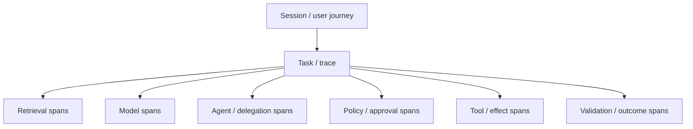

# AI observability, SRE and incident response

> _Last reviewed: 2026-07-16 — see the [freshness policy](../appendix/maintenance.md)._

## Learning objectives

After this chapter you will be able to:

- connect service, model, agent, policy, quality and business telemetry;
- define sessions, tasks, traces and spans for agentic systems;
- design privacy-safe content capture and outcome labeling;
- operate SLOs, anomaly detection, kill switches and incident response;
- turn production failures into evaluation and architecture improvements.

## Decision in one sentence

> **Instrument every decision and effect needed to explain, contain and improve an outcome—while collecting the minimum sensitive content necessary.**

Traditional monitoring answers whether the service responded. AI observability must also answer which evidence, model, tools, authority and policy produced the outcome and whether it helped or harmed the user.

## Telemetry model

Use stable session, task, trace and parent-child IDs across queues, agents and tools. A task can span multiple HTTP requests and model calls. Preserve system-manifest version so behavior is reproducible.

The [OpenTelemetry semantic conventions](https://opentelemetry.io/docs/specs/semconv/) provide portable naming across services; current GenAI conventions cover provider/operation, messages, retrieval documents, tools and token usage. Convention maturity can change, so pin the version used and extend it with documented organization-specific attributes.

## Six signal planes

| Plane | Signals |
| --- | --- |
| Service | availability, queue, TTFT, completion, saturation, errors |
| Model | route/version, tokens, schema, refusal, fallback, validation |
| Context | source/index, retrieval/rerank, freshness, citation, ACL denial |
| Agent | steps, depth, fan-out, loops, stop, delegation, memory |
| Control | identity, policy, approval, sandbox, egress, kill switch |
| Outcome | task success, harmful result, correction, appeal, benefit, cost |

Metrics tell where; traces tell how; logs/events provide detail; evaluations tell whether behavior meets a contract. None alone is observability.

## Trace contract

Capture IDs and versions for workload/tenant-safe class, model route, instructions, tools, corpus/index, policy, runtime and evaluation. Record stage latency, tokens, attempts, budgets, decision/result codes, selected evidence IDs, tool transaction IDs, approvals, task state and final outcome.

Avoid storing secrets, credentials or raw sensitive payloads. For messages and tool arguments use configurable capture modes: off, metadata only, redacted fields, governed sample or restricted incident capture. Enforce purpose, region, access, encryption, retention and deletion. Observability must not become shadow memory.

## SLOs and error budgets

Define user-centered objectives such as valid task success, harmful failure, unauthorized effect, p95 completion, freshness, cancellation, deletion and cost/success. Slice by workload, tenant tier, language, route and consequence. Use error-budget burn to regulate release velocity and trigger fallback or freeze.

Proxy signals—judge scores, sentiment, citation count—require calibration against delayed human or business outcomes. Monitor missing-label and feedback-selection bias.

## Agent-specific detection

Alert on abnormal loop length, fan-out, repeated tool denial, new destination, permission escalation, memory write burst, retrieval trust shift, approval bypass, unknown side-effect age, cost spike, cancellation failure and divergence between claimed and confirmed result.

Use thresholds plus baselines by workload; raw global averages hide rare dangerous paths. Correlate cost anomalies with traces before rate-limiting critical users.

## Incident taxonomy

| Incident | Example containment |
| --- | --- |
| Safety/quality | disable route or action; fall back to human/search |
| Security/identity | revoke credential, block tool/egress, isolate tenant |
| Privacy | stop processing/export, preserve governed evidence, assess scope |
| Data/retrieval | switch index/source version, invalidate cache |
| Model/provider | circuit break and use approved compatible route |
| Workflow/effect | cancel leases, reconcile transactions, compensate |
| Cost/capacity | admission control, budget cap, reduce noncritical fan-out |

Severity depends on consequence and affected people, not only request count.

## Response loop

1. detect and declare with named commander;
2. contain through model, tool, tenant, destination or global kill switch;
3. identify affected manifests, principals, tasks, data and effects;
4. reconcile/compensate state and support affected users;
5. preserve minimized evidence and satisfy reporting obligations;
6. fix the first controllable cause;
7. add regression and adversarial cases;
8. canary the correction and verify effectiveness.

Maintain runbooks and exercise them. A model outage, prompt injection, cross-tenant retrieval and unknown financial write require different evidence and recovery.

## Graceful degradation

Define a ladder before incidents: full system, compatible secondary, reduced context/tools, verified cache, search-only/deterministic workflow, queued human work, typed unavailability. Never bypass identity, policy, residency or approval to preserve availability.

## Northstar observability

A shipment task trace links authenticated subject, policy/index/model versions, evidence IDs, carrier tool call, approval receipt and refund transaction. Dashboards show successful resolutions and harmful/unauthorized action, not only tokens. If refund response is lost, an unknown-effect alert triggers reconciliation. Raw customer text is excluded from normal traces.

## Practical artifact: observability and incident contract

Include telemetry schema, correlation/manifest IDs, sensitive-content policy, SLI/SLO/error budgets, dashboards, outcome labels, alerts/anomalies, kill switches, incident taxonomy/RACI/runbooks, evidence retention, reconciliation, regression loop and exercises.

## Lab

Instrument a Northstar task end to end with OpenTelemetry-compatible spans. Inject slow model, stale retrieval, tool denial, injection, unknown refund outcome, loop and cancellation failure. Demonstrate alerts, containment, affected-task query, reconciliation, safe degradation and a new regression case.

## Check yourself

1. Which ID connects a user outcome to its manifest?
2. Which telemetry content is sensitive?
3. What is the SLO for a harmful outcome?
4. Which kill switch contains each boundary?
5. How does an incident change the evaluation suite?

## Further reading

- [OpenTelemetry semantic conventions](https://opentelemetry.io/docs/specs/semconv/).
- [AgentOps and LLMOps](02-llmops-cicd.md).
- [Production reliability](../04-llm-systems/02-reliability-latency.md).
- [Incident response and graceful degradation](04-incidents-degradation.md).
