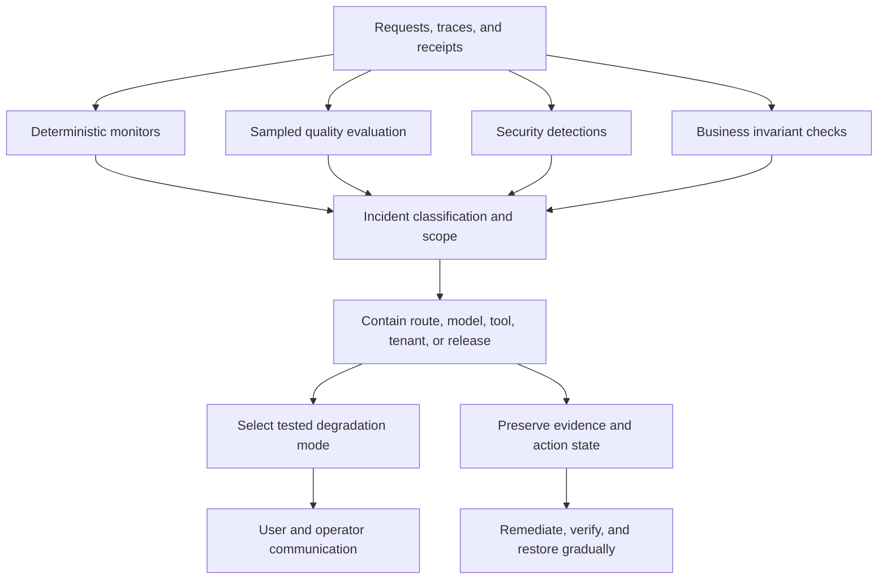
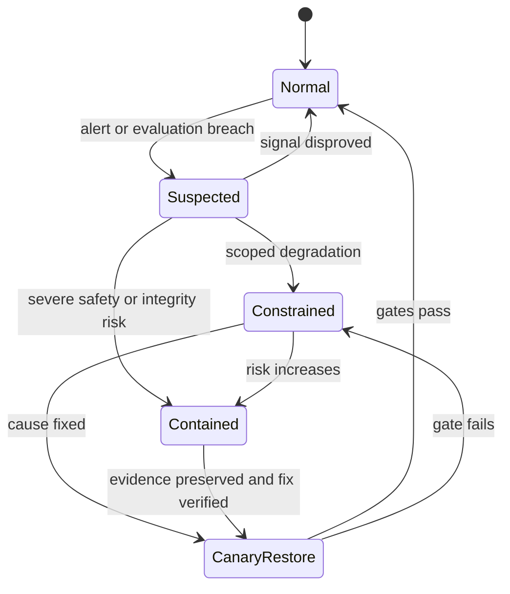

# Incident response & graceful degradation

> Last reviewed: 2026-07-16. See the [freshness policy](../appendix/maintenance.md).

## Learning objectives

After this chapter you will be able to:

- detect availability, quality, safety, security, and cost incidents;
- separate control-plane recovery from model-behavior containment;
- define tested degradation modes for each user journey;
- preserve evidence and recover without replaying unsafe actions.

## AI incidents are not only outages

A system can be healthy by infrastructure measures while producing systematically wrong citations after an embedding migration. It can meet answer-quality targets while leaking cross-tenant memory. It can be correct and safe while a routing loop multiplies cost by ten.

Incident response therefore needs several independent signals:

| Incident class | Examples | Leading signals |
|---|---|---|
| Availability | provider errors, accelerator loss, queue saturation | error rate, queue age, timeout, capacity |
| Performance | slow first token, stalled stream, tool latency | TTFT, inter-token latency, deadline misses |
| Quality | retrieval regression, model drift, citation mismatch | online sample evals, groundedness, user correction |
| Safety/security | prompt injection success, unsafe action, data exposure | policy denials, canary tokens, exfiltration alerts |
| Integrity | duplicated action, stale index, corrupted memory | reconciliation mismatch, freshness lag, invariant failure |
| Cost | token explosion, retry storm, cache collapse | cost/run, tokens/task, tool and replan counts |

Severity is based on consequence and blast radius, not only request count. One unauthorized wire transfer may outrank a broad read-only outage.

## Detection and response architecture

Do not use the affected model as the only detector or incident decision-maker. Deterministic policies and independent evaluators must be able to disable routes and tools.

## Graceful degradation is a product contract

Define the safest useful response for every journey before launch:

| Failed capability | Possible degraded mode | Never do |
|---|---|---|
| Primary model | Compatible fallback model or queued job | Silent switch if semantics or data terms differ |
| Retrieval | Exact search, curated FAQ, or “source unavailable” | Answer from model memory as if grounded |
| Reranker | Return conservative lexical/vector ranking | Expand context without token and trust limits |
| Tool/API | Read-only result, draft, or human handoff | Simulate a successful effect |
| Long-term memory | Session-only behavior | Guess saved preferences |
| Streaming | Complete non-streaming response or async delivery | Retry after a committed action without reconciliation |
| Safety/policy service | Fail closed for consequential actions | Treat policy timeout as approval |

Degradation has a quality label and an expiry. Log which guarantees changed, show the user material limitations, and stop the degraded mode once its assumptions are no longer true.

## A degradation state machine

Transitions should be executable through a tested control plane: route weights, model/version denylist, tool kill switch, memory write disable, index rollback, and tenant isolation. Avoid emergency changes that require editing prompts or deploying application code under pressure.

## Scope before you switch everything off

Correlate incident signals with model version, prompt version, retrieval index, tool schema, tenant, region, request class, release, and provider. Containment should match the smallest proven blast radius, except where security or safety uncertainty requires a wider stop.

Useful controls include:

- disable one tool or action tier while preserving read-only assistance;
- pin the last known-good model/prompt/index tuple;
- block memory writes while permitting reads from verified records;
- reduce maximum steps, context size, or concurrency;
- route a tenant or region away from a failing dependency;
- queue non-urgent work and reserve capacity for critical flows.

## Retry storms and cascading failure

Retries consume the same scarce resource that is already failing. Bound attempts, add jitter, honor global deadlines, and use circuit breakers per dependency. Admission control should reject excess work before expensive context building. Shed optional enrichment, long-context requests, and batch jobs before critical interactive traffic.

Fallbacks need independent capacity and failure modes. A secondary endpoint in the same region, quota pool, or model-serving cluster may not be a fallback. Test correlated failures.

## Quality and model-behavior incidents

When quality degrades:

1. freeze the model, prompt, tool, policy, and index versions in affected traces;
2. reproduce on a protected incident dataset;
3. identify whether planning, retrieval, generation, validation, or presentation failed;
4. compare against the last known-good tuple;
5. contain the failing slice and create a regression case;
6. restore through shadow and canary evaluation.

User feedback is evidence, not ground truth. High-volume automated feedback can itself be attacked. Weight it by provenance and corroborate it with source records or expert review.

## Security, privacy, and action incidents

For suspected data exposure, stop the relevant output and memory paths, preserve minimal forensic evidence, rotate compromised credentials, and invoke the organization’s privacy and legal process. Do not put sensitive incident samples into general evaluation sets.

For an unsafe or duplicate action, freeze new actions for the intent, reconcile target state using receipts and idempotency keys, then compensate or escalate. Replaying the agent transcript is not recovery.

## Incident command and communication

Assign an incident commander, technical lead, communications owner, and recorder. For high-consequence AI systems, include safety, security, privacy, legal, and domain owners according to the incident class.

Communications should state observed impact, affected scope and time, current limitations, containment, and next update. Do not claim that “the AI hallucinated” when the actual cause is unknown. External messages must not reveal exploit details that expand risk.

## Evidence bundle

Preserve:

- redacted request and response IDs, not unnecessary raw sensitive text;
- model, prompt, policy, tool schema, retrieval, and code versions;
- routing decision, deadlines, retries, token usage, and cache status;
- retrieved evidence IDs and source versions;
- tool calls, approvals, idempotency keys, and target receipts;
- evaluator versions and incident-control transitions.

Apply access control and retention to incident evidence. Forensic value does not suspend privacy obligations.

## Restore by evidence

Restoration gates should include the original failing cases, neighboring slices, adversarial regressions, load tests, and policy invariants. Shadow the fix, canary a small authorized cohort, monitor delayed outcomes, then increase traffic. Keep the rollback tuple and control available until the observation window closes.

Track mean time to detect, contain, reconcile, and recover separately. For safety and integrity incidents, time to containment may matter more than full restoration.

## Northstar runbook

Northstar defines four modes: normal; grounded read-only; curated search; and unavailable with human handoff. If citation verification breaches its gate, generation is disabled for that corpus and curated search remains. If the action policy service fails, all writes fail closed while read tools continue. A kill switch can disable a tool, model tuple, tenant, or memory write path without deployment.

## Architecture artifact

Produce an **AI incident and degradation runbook** containing incident taxonomy, severity model, ownership, independent signals, scope dimensions, control-plane actions, user-visible degraded modes, evidence checklist, restoration gates, communication templates, and quarterly game-day scenarios.

## Lab

Run three Northstar game days: a provider timeout causing retry pressure, a stale index causing wrong citations, and an ambiguous refund commit. Measure detection, containment, user impact, evidence completeness, and restoration-gate performance.

## Check yourself

1. Why can a quality incident exist while infrastructure SLOs are green?
2. Which failures should fail closed, and which can degrade usefully?
3. Why must fallback capacity be tested independently?
4. What evidence is needed before restoring a model/prompt/index tuple?

## Further reading

- [NIST SP 800-61 Rev. 3: Incident Response Recommendations and Considerations for Cybersecurity Risk Management](https://csrc.nist.gov/pubs/sp/800/61/r3/final)
- [NIST AI Risk Management Framework](https://www.nist.gov/itl/ai-risk-management-framework)
- [OpenTelemetry semantic conventions for generative AI systems](https://opentelemetry.io/docs/specs/semconv/gen-ai/)
- [Google SRE Book: Handling Overload](https://sre.google/sre-book/handling-overload/)
