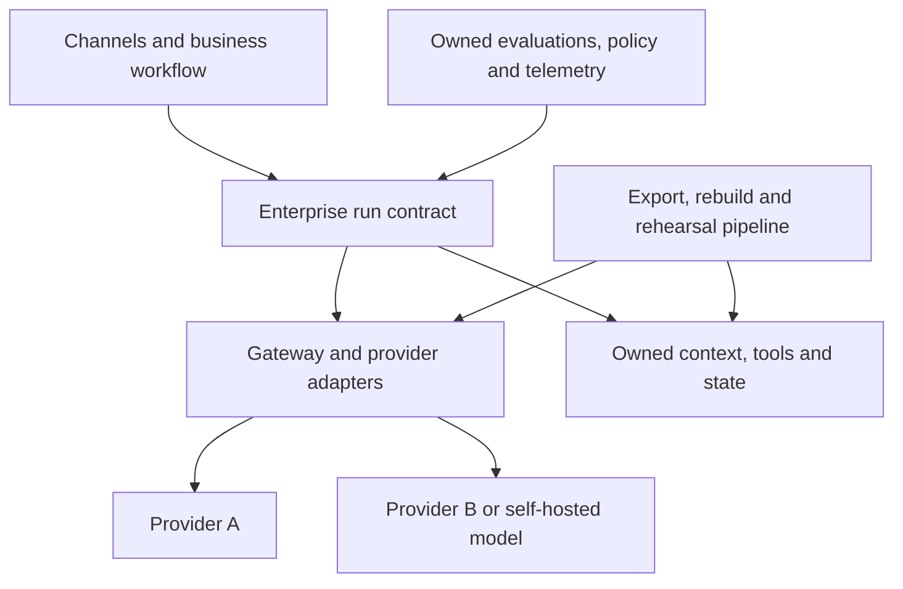

# Portability, lock-in, and exit plans

> _Resilience guide — last reviewed: 2026-07-25._

## Learning objectives

- distinguish beneficial dependency from unmanaged lock-in;
- choose portability boundaries by business consequence;
- design and rehearse an executable exit plan.

## The decision in one sentence

Make critical data, behavior, and evidence portable; accept provider-specific optimization only where its value exceeds tested switching cost.

## Lock-in is multidimensional

| Dimension | Example dependency | Mitigation |
|---|---|---|
| API/model | proprietary messages, tool or fine-tune format | internal request contract and conformance tests |
| Data | opaque vector/index or memory representation | source-of-truth export plus rebuild pipeline |
| Workflow | provider-specific state machine | portable business state and event schema |
| Identity/policy | cloud-only principal semantics | workload identity mapping and externalized policy |
| Evaluation | vendor dashboards and judges only | owned datasets, rubrics, raw results |
| Operations | unique telemetry and deployment tooling | OpenTelemetry and infrastructure definitions |
| Commercial | egress, minimum spend, support dependency | price scenarios and contractual exit terms |
| Skills | knowledge concentrated in supplier | paired ownership and runbooks |

Portability is not identical deployments everywhere. It is the ability to preserve an outcome within a stated recovery time, cost, and quality loss after a dependency changes.

## Portability boundary

| Element | What remains stable | What may vary |
|---|---|---|
| Run contract | task, identity, events, artifacts, errors | provider streaming details |
| Context | document IDs, provenance, permissions | index implementation |
| Tools | typed intent and idempotency | SDK and transport |
| Evaluation | cases, rubrics, thresholds | judge model |
| Telemetry | trace/run correlation and cost fields | backend |
| Adapter | normalized capability and error mapping | provider feature use |

## Choose a portability tier

- **Tier 0 — documented dependency:** noncritical experiment; export is sufficient.
- **Tier 1 — rebuildable:** infrastructure, data, prompts, and tests recreate the service within weeks.
- **Tier 2 — warm alternative:** a second compatible route is regression-tested and can take selected traffic.
- **Tier 3 — continuous portability:** critical service runs across providers or regions with routine failover.

Higher tiers cost more and can suppress useful provider features. Assign the tier from business impact, supplier concentration, regulatory needs, and recovery objective—not ideology.

## Design the exit before signing

Inventory every artifact required to leave: source data, normalized chunks, graph schema, embeddings rebuild process, prompts, tool schemas, policies, fine-tuning datasets and weights where licensed, evaluation results, audit events, user feedback, configuration, and infrastructure. Specify export format, frequency, deletion evidence, transition support, egress fees, keys, and retained rights in the contract.

Adapters do not create portability if semantics differ. Run conformance tests for tool arguments, structured output, token/context behavior, safety filters, citations, streaming, errors, and rate limits. Maintain a capability-degradation matrix so failover can disable unsupported features safely.

## Northstar exit rehearsal

Quarterly, Northstar rebuilds a small retrieval index from authoritative documents, routes the golden evaluation set through an alternate model, verifies policy decisions, and restores recent workflow state. The test records elapsed time, quality delta, manual steps, missing artifacts, and cost. A failed rehearsal creates platform backlog before a supplier incident forces the migration.

## Practical artifact: exit runbook

Include trigger and authority, dependency inventory, target architecture, data export and verification, secrets/identity changes, quality acceptance, cutover/canary plan, customer communications, rollback, supplier deletion evidence, and a rehearsal schedule.

## Further reading

- [OpenTelemetry](https://opentelemetry.io/docs/)
- [CloudEvents specification](https://github.com/cloudevents/spec)
- [SPDX specifications](https://spdx.dev/use/specifications/)
