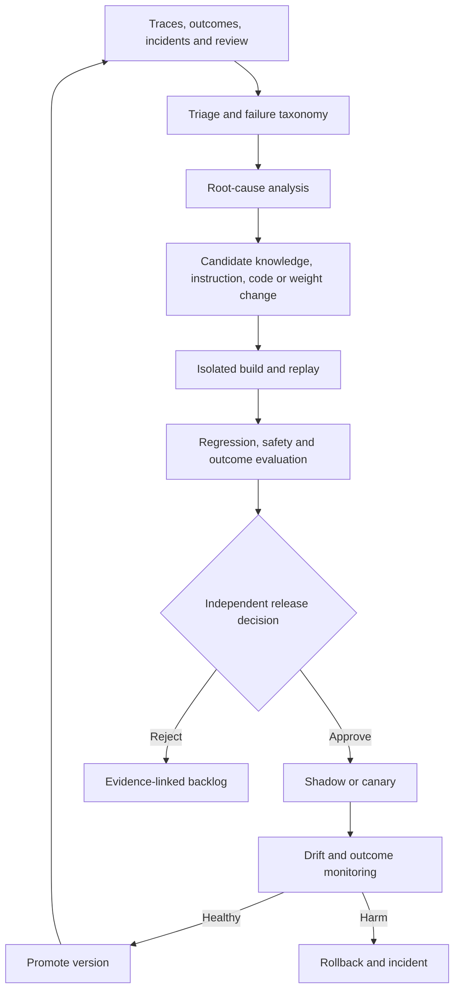

# Continual agent evolution without self-corruption

> _Last reviewed: 2026-07-25 — see the [freshness policy](../appendix/maintenance.md). “Self-improving agent” is not a standard assurance category; treat every update as a governed software, data or model release._

## Learning objectives

After this chapter you will be able to:

- convert production trajectories into candidate improvements without online self-modification;
- separate updates to knowledge, instructions, programs and model parameters;
- design diagnosis, validation, promotion, rollback and forgetting controls;
- prevent feedback poisoning, metric gaming and capability regression;
- define an operating model for continual improvement.

## Decision in one sentence

**Let agents propose improvements, but let independent evidence and accountable release controls decide what changes production.**

## Four different update planes

| Plane | Example | Release mechanism | Dominant risk |
|---|---|---|---|
| Knowledge | corrected policy fact or new procedure | reviewed index/graph version | poisoned or stale truth |
| Instructions | prompt, rubric or skill guidance | prompt/skill registry | hidden conflicts and context growth |
| Program | tool adapter, validator or workflow edge | normal SDLC and CI/CD | code and supply-chain defects |
| Parameters | adapter or model weights | model registry and staged serving | broad behavioral regression |

Do not collapse all four into “memory.” A conversation correction can affect the current run immediately, but promotion into durable organizational knowledge requires provenance, review and expiry.

## Closed-loop architecture



| Step | Required evidence |
|---:|---|
| 1 | Versioned traces linked to real outcomes and use profiles. |
| 2 | Failure label, severity, slice and confidence—not a free-form agent opinion. |
| 3 | Root cause at the correct plane: data, context, tool, workflow, model, human or environment. |
| 4 | Minimal proposed change with provenance and expected mechanism. |
| 5 | Replay against historical failures plus untouched controls. |
| 6 | Predeclared regression, safety, cost and latency gates. |
| 7 | Human accountability for consequential changes. |
| 8 | Staged exposure, automatic stop conditions and tested rollback. |

## Evidence intake

Production traces are selected observations, not objective truth. A successful-looking outcome may have been repaired manually; a user thumbs-up may reward pleasing language; a reviewer correction may be wrong. Record outcome receipts, reviewer identity/role, rubric, timestamps, source versions and whether the case was sampled or user-reported.

Protect the intake path against:

- users planting instructions that later become durable prompts;
- compromised tools manufacturing “successful” receipts;
- repeated users dominating optimization;
- sensitive data entering reusable examples;
- selection bias toward easy or visible cases;
- evaluation cases leaking into training.

## Diagnosis before optimization

Require a causal hypothesis. “The model failed” is rarely sufficient. Ask whether the failure came from missing authority, unavailable data, poor retrieval, ambiguous tool descriptions, a stale workflow, overload, inaccessible UX or model capability. Replaying the case with controlled substitutions helps locate the responsible component.

An update proposal should state:

```yaml
failure_cluster: carrier-unknown-outcome
evidence_count: 37
affected_slice: international-delivery
root_cause: missing reconciliation branch
change_plane: program
proposal: add carrier-status reconciliation state
expected_effect: reduce duplicate inquiry and false resolution
non_goals: improve carrier API availability
rollback: workflow-v18
```

## Validation and rollback

Every candidate is tested against:

- the failure cluster it should fix;
- matched cases it must not change;
- critical security, privacy and safety suites;
- long-horizon and repeated-run cases;
- cost, latency and reviewer burden;
- slice-level regressions and capability retention.

Version the compatible bundle and retain the evidence needed to reproduce it. Database, memory and context migrations need backward-read or explicit cutover strategies. A rollback that restores code but leaves rewritten memory or an incompatible index is incomplete.

## Forgetting and maintenance

Continual systems also need removal. Expire temporary instructions, delete superseded knowledge, propagate privacy deletion, retire unused skills and test that new specialization did not erase important general capability. Schedule periodic clean-room rebuilds and re-baselining; never assume an endlessly accumulated prompt or memory store improves monotonically.

## Northstar decision

Northstar clusters false “delivered” conclusions. Replay shows the model is reading ambiguous carrier codes correctly, but the workflow treats an unknown response as success. The approved improvement is a program update adding reconciliation and escalation—not fine-tuning. An agent proposes the patch and tests, while engineering owns the change and the release board approves its canary.

## Practical artifact: continual-improvement control plan

Include evidence sources, taxonomy, data minimization, root-cause method, update planes, proposal schema, independence rules, test suites, release tuple, canary policy, rollback, deletion/forgetting, roles and audit retention.

## Lab

Take ten Northstar failure traces. Cluster them, identify the responsible plane, propose one minimal change per cluster and build a promotion matrix. Include one poisoned feedback item and show where the pipeline rejects it.

## Further reading

- [Microsoft Agent Lightning](https://github.com/microsoft/agent-lightning)
- [Agent post-training and trajectory learning](../02-ai-landscape/07-agent-post-training.md)
- [Regression gates and release decisions](../06-evaluation/05-regression-gates.md)
- [Production memory](../03-data-context/07-production-memory.md)

