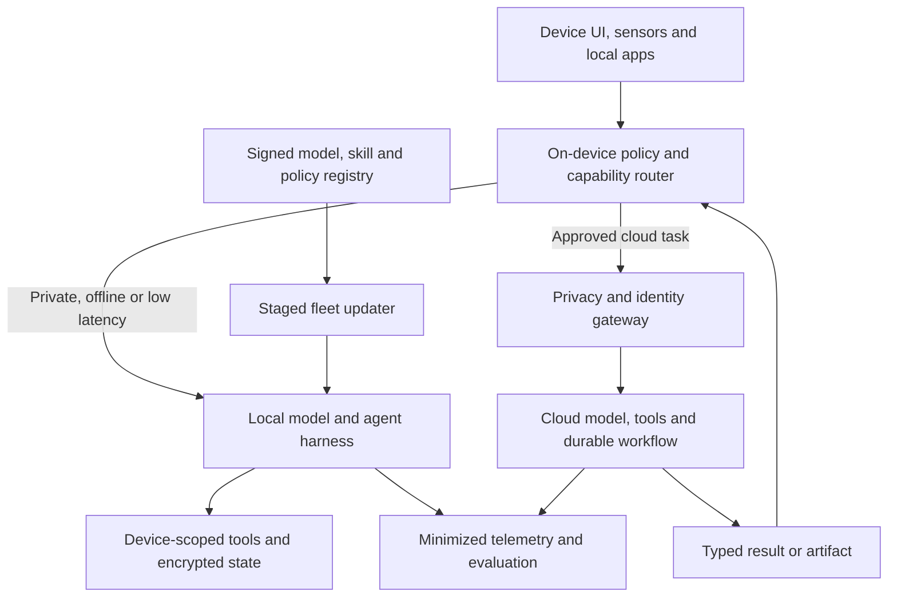

# Local, edge and hybrid agents

> _Last reviewed: 2026-07-25 — see the [freshness policy](../appendix/maintenance.md). Device runtimes, supported models and hardware requirements change quickly; test the exact device and OS fleet._

## Learning objectives

After this chapter you will be able to:

- choose local, cloud or hybrid placement by data, latency and capability;
- design device identity, model packaging, tool access and offline state;
- route privacy-sensitive subtasks without sending them to the cloud;
- operate updates, telemetry, revocation and fleet compatibility;
- evaluate real devices under resource and connectivity constraints.

## Decision in one sentence

**Run locally when privacy, offline continuity or interaction latency justifies device complexity; use explicit hybrid routing rather than assuming every task belongs on one side.**

## Placement matrix

| Dimension | Local/edge advantage | Cloud advantage |
|---|---|---|
| Sensitive raw data | can remain on device | centralized policy and auditing |
| Latency | avoids network round trip | stronger shared acceleration |
| Offline operation | continues without connectivity | current shared services/data |
| Model capability | constrained by device | larger models and tools |
| Cost | no per-call network inference | centralized utilization |
| Updates | fleet fragmentation | one managed deployment |
| Telemetry | privacy-preserving but incomplete | richer operational visibility |

“Local” does not automatically mean private: device logs, backups, crash reports, other apps and synchronization can expose data.

## Hybrid reference architecture

| Step | Description |
|---:|---|
| 1 | Capture device, user and application context with consent. |
| 2 | Route using data class, connectivity, latency, capability and policy. |
| 3 | Execute sensitive or offline tasks in a sandboxed local harness. |
| 4 | Minimize/redact approved cloud requests and bind delegated identity. |
| 5 | Cloud side performs capabilities unavailable locally. |
| 6 | Return typed results, not hidden executable instructions. |
| 7 | Distribute signed compatible artifacts through staged updates. |
| 8 | Collect minimum useful telemetry across both paths. |

## Device contract

Inventory CPU/GPU/NPU, RAM, storage, battery, thermal limits, OS/app versions and secure hardware. Define model precision, maximum context, latency target, concurrency and minimum supported device. Measure cold start and sustained use; a model that fits once may thermal-throttle or evict other applications.

Local tools need OS permissions and user-visible purpose. Use platform APIs and least privilege rather than automating other applications through unrestricted accessibility controls. Keep device and user identity distinct; revoke local agent credentials when a device is lost or unmanaged.

## Hybrid routing

Classify each subtask:

- must remain local;
- may leave after minimization;
- requires cloud capability;
- forbidden on this device or network;
- requires user confirmation.

Avoid silent fallback that uploads private input when the local model fails. Explain capability differences and preserve a local-only or defer option. Cloud results are untrusted inputs to the local executor and pass the same policy checks.

Google’s [ADK for Android](https://developer.android.com/ai/adk) illustrates a current hybrid option: an on-device model can handle privacy-sensitive subtasks while a cloud model orchestrates. Treat that as one implementation, not a general guarantee across devices.

## State, updates and rollback

Encrypt local task/memory state with OS-backed keys and tenant/user separation. Define synchronization conflicts, deletion propagation, backup exclusion and offline expiry. Sign models, prompts, skills and native libraries; verify before activation. Use compatibility manifests and staged rollout by device cohort. Retain a known-good artifact and remote kill/revocation path.

## Telemetry and evaluation

Prefer aggregated counters, sampled redacted traces and on-device evaluation where raw data must stay local. Make telemetry opt-in/notice appropriate to context. Evaluate task success, route correctness, privacy violations, offline completion, cold/warm latency, energy, thermal throttling, crash-free rate, update success and performance across device cohorts.

Test no network, captive portal, low battery, clock skew, revoked device, full storage, interrupted update, corrupted model, cloud timeout and local/cloud disagreement.

## Northstar decision

Northstar’s mobile agent performs speech endpointing and redaction locally. Shipment lookup goes to the cloud because it needs enterprise identity and current carrier data. If offline, the app can explain cached case status but cannot promise freshness or queue a refund without explicit user confirmation.

## Practical artifact: edge placement and fleet record

Include task/data placement, device matrix, local sandbox/tools, routing, identity, encryption, offline behavior, synchronization, update supply chain, telemetry, evaluation, support and cloud/local exit paths.

## Lab

Design three Northstar subtasks for local, cloud and hybrid execution. Simulate offline mode and failed local inference; prove that sensitive audio is not silently uploaded.

## Further reading

- [Android ADK agents](https://developer.android.com/ai/adk)
- [Hosting options and edge architecture](01-hosting-options.md)
- [Multimodal systems](../02-ai-landscape/05-multimodal.md)
- [Privacy and residency](../07-security-governance/03-privacy-residency.md)

