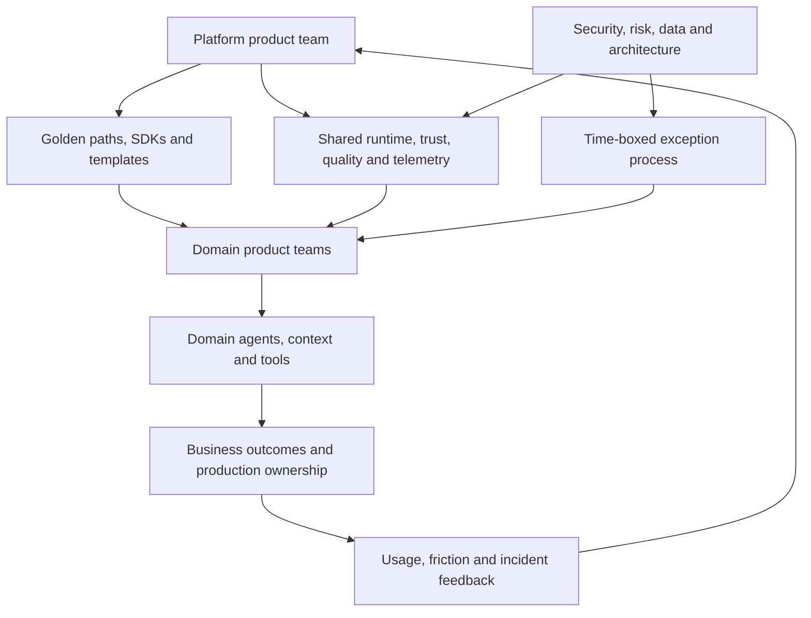

# Agent platform engineering and paved roads

> _Operating-model guide — last reviewed: 2026-07-25._

## Learning objectives

- design an internal agent platform as a product;
- balance standardization, team autonomy, and governed exceptions;
- measure whether paved roads improve delivery and control.

## The decision in one sentence

Centralize reusable control and operational primitives; federate domain outcomes, context, tools, and accountability.

## Platform as a product

An agent platform is not merely a framework or portal. It is a supported set of contracts, runtime services, templates, evidence pipelines, and operating practices that helps product teams reach production safely.

| Layer | Platform owns | Domain owns |
|---|---|---|
| Contracts | run, event, artifact, tool, identity schemas | domain extensions |
| Runtime | gateway, workflow, sandbox, budgets | task graph and prompts |
| Context | ingestion/ACL primitives | authoritative sources and retrieval policy |
| Quality | evaluation runner, registry, gates | cases, rubrics, thresholds |
| Operations | trace schema, dashboards, incident integration | SLO and on-call outcome |
| Governance | inventory workflow and evidence collection | system card and risk acceptance |

## Three paths, not one

The **golden path** provides a CLI/template, secure defaults, sample evaluations, deployment, dashboards, and runbooks. **Extension points** allow alternate models, retrievers, tools, or UIs behind conformance tests. The **exception path** records the unmet requirement, compensating controls, owner, expiry, and plan to converge or intentionally remain separate.

Use policy checks in CI and runtime, but give developers local or ephemeral environments with synthetic data and the same contracts. Provide a service catalog with ownership, SLO, cost model, version policy, data classes, supported regions, and deprecation dates.

## Product metrics

Measure median time from repository creation to safe pilot, adoption and retention, successful deployments, change-failure rate, evaluation-gate coverage, identity/policy coverage, incident detection time, unit cost, support tickets, exception age, unsupported forks, and developer satisfaction. High adoption with poor outcomes is not success; perfect compliance with widespread bypass is also failure.

## Northstar example

Northstar’s platform ships a read-only assistant template with workload identity, a durable run API, citation artifact, tool authorization, trace correlation, and a release gate. The benefits team supplies policy data and cases. A robotics team uses different runtime components through an exception because real-time constraints are incompatible; it still publishes inventory, identity, evidence, and incident contracts.

## Practical artifact: paved-road scorecard

For each road capture target users, jobs to be done, supported architecture, mandatory controls, extension points, SLO, support tier, adoption, lead time, failure rate, cost, satisfaction, known gaps, and retirement plan.

Use the [platform capability map](00-capability-map.md) to set scope and the [production starter architecture](../10-reference-architectures/11-production-starter-architecture.md) as the first golden path.

## Further reading

- [Team Topologies](https://teamtopologies.com/key-concepts)
- [CNCF Platforms White Paper](https://tag-app-delivery.cncf.io/whitepapers/platforms/)
