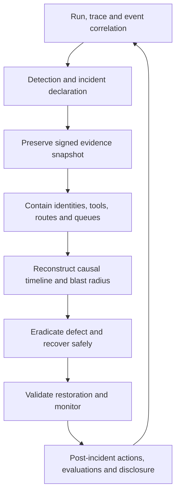

# Agent incident forensics

> _Operations guide — last reviewed: 2026-07-25._

## Learning objectives

- preserve investigation-ready evidence across models, context, tools, and humans;
- reconstruct causal timelines without storing unnecessary sensitive reasoning;
- contain, recover, and learn from agent-induced incidents.

## The decision in one sentence

Design the evidence graph before the incident: every consequential outcome must be reconstructable from trusted identities, versions, inputs, decisions, actions, and results.

## Forensic evidence graph

An agent incident may arise from malicious content, unsafe planning, stale context, authorization defects, tool/API behavior, model/provider change, human approval error, or interactions among them. Ordinary application logs rarely capture enough.

| Evidence | Minimum fields | Purpose |
|---|---|---|
| Identity | user, workload/agent, delegation, tenant | attribution and scope |
| Configuration | model, prompt, policy, tool, workflow versions | reproducibility |
| Context | source IDs, versions, ACL decisions, hashes | provenance without unnecessary copying |
| Decision | policy result, verifier scores, approvals | control-path reconstruction |
| Action | typed request, idempotency, target, result | side-effect analysis |
| Operations | timestamps, region, retries, queues, cost | causal timeline |
| Artifact | hash, parent, publication/recipient | downstream impact |

## Prepare and respond

Use a consistent time source, immutable or tamper-evident audit storage, retention by risk, encryption, legal holds, and tightly controlled investigator access. Correlate every model call, retrieval, tool action, approval, artifact, and downstream event with run and trace IDs. Record necessary input/output and action summaries; do not rely on private chain-of-thought.

Prebuild containment controls: revoke agent credentials, disable an action or tool version, freeze a queue, route to a safer model/configuration, force human approval, switch read-only, quarantine artifacts, and stop new runs while preserving state. Test that containment does not destroy evidence.

Reconstruct both technical cause and control failure: why the action occurred, why a detector or approval did not prevent it, which other runs share the configuration or input, and whether published artifacts propagated. Recovery requires regression tests from the incident, rollback/correction of affected state, stakeholder notification, and heightened monitoring.

[NIST SP 800-61 Rev. 3](https://csrc.nist.gov/pubs/sp/800/61/r3/final) integrates incident response across risk management, while the [NIST Generative AI Profile](https://nvlpubs.nist.gov/nistpubs/ai/NIST.AI.600-1.pdf) calls for owned, rehearsed AI incident plans including third parties and fallback.

## Northstar example

A malicious attachment causes an agent to propose a beneficiary change through an overly broad tool. Policy denies most attempts, but one legacy route succeeds. Northstar freezes that route, revokes its workload identity, snapshots correlated runs, finds all affected cases, reverses the change through an approved workflow, notifies owners, and adds the attachment pattern and route invariant to regression tests.

## Practical artifact: forensic readiness checklist

Cover evidence schema, clock/correlation, retention, integrity, access, third-party evidence SLA, severity taxonomy, containment commands, state repair, communications, legal/privacy review, tabletop cadence, and post-incident evaluation ownership.

Integrate this checklist with the general [incident and degradation runbook](04-incidents-degradation.md) and [policy-as-code decisions](../07-security-governance/08-agent-policy-as-code.md).

## Further reading

- [OpenTelemetry tracing specification](https://opentelemetry.io/docs/specs/otel/trace/api/)
- [NIST AI Resource Center](https://airc.nist.gov/)
