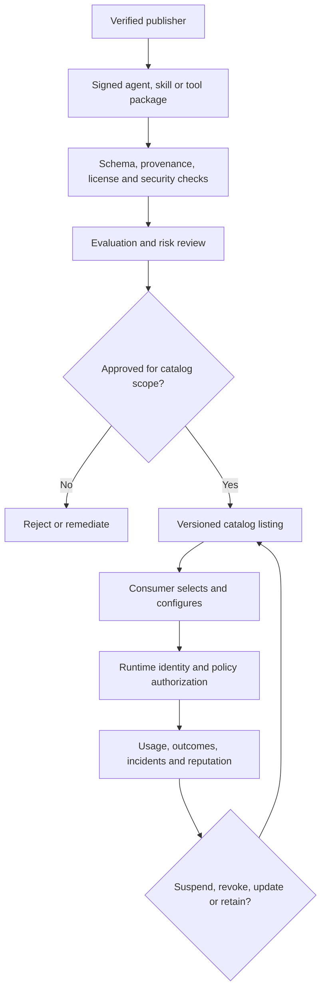

# Agent marketplaces and ecosystem governance

> _Platform-governance guide — last reviewed: 2026-07-25._

## Learning objectives

- distinguish discovery, registry, catalog, marketplace, and runtime trust;
- govern publishers, versions, permissions, reputation, and retirement;
- prevent installation popularity from becoming authorization.

## The decision in one sentence

Use a marketplace to discover signed, reviewed capabilities; issue runtime trust only from current identity, policy, evidence, and context.

## Ecosystem layers

A registry names and resolves artifacts. A catalog adds ownership and documentation. A marketplace adds distribution, commercial terms, ratings, and lifecycle. None proves that an agent or tool is safe for a specific user, tenant, or action.

| Layer | Establishes | Does not establish |
|---|---|---|
| Publisher verification | accountable source | package safety |
| Signature/provenance | artifact integrity and origin | trustworthy behavior |
| Review/evaluation | evidence for tested scope/version | universal fitness |
| Listing | discoverability and terms | runtime permission |
| Reputation | historical signals | future correctness |
| Runtime policy | current scoped authority | package quality |

## Package contract

Require identity and owner, semantic version, description and limitations, input/output and event schemas, model/runtime dependencies, tool permissions, data flows and retention, network destinations, secret requirements, risk tier, evaluations, supported locales, cost envelope, license, SBOM/model BOM, signature, support, deprecation, and incident contact.

Automated admission checks validate schemas, signatures, malware, dependencies, licenses, prohibited permissions, data egress, prompt-injection defenses, sandbox behavior, and baseline evaluations. Human review handles high-risk use, claims, UX, accountability, and exceptions. Install into a quarantine/sandbox first.

The [MCP Registry](https://modelcontextprotocol.io/registry/) and [A2A specification](https://a2a-protocol.org/latest/specification/) support discovery and interoperability, but enterprise governance must bind packages to workload identities, tenants, policy, secrets, and observation. Use short-lived credentials and least privilege; never inherit the installer’s broad authority.

## Reputation without gaming

Segment reputation by version, task, environment, and risk. Weight verified outcomes, incident history, maintenance responsiveness, provenance, and evaluator confidence more than stars or raw install counts. Detect self-dealing, Sybil ratings, survivorship bias, and silent package changes. A critical incident can override reputation immediately.

Support staged updates, pinning, compatibility tests, advisories, revocation, emergency disablement, consumer notification, migration, and evidence-preserving retirement. Identify every installed instance and affected artifact from the registry.

## Northstar example

Northstar’s internal marketplace lists a policy-retrieval skill and a case-note tool. Both are signed and evaluated, but the tool is discoverable to more teams than may execute it. Runtime policy grants read to case workers and write only to an approved workflow with human confirmation. A vulnerable version is revoked centrally and all installations are located through deployment attestations.

## Practical artifact: marketplace admission dossier

Include publisher verification, package manifest, provenance/signature, SBOM/model BOM, permissions and egress, threat model, evaluations, risk decision, commercial/license terms, support SLO, update policy, telemetry, reputation inputs, revocation plan, consumers, and expiry.

Use the [agent identity and registry model](../05-agents/13-agent-identity-registry.md) for discovery, and the [rights register](../07-security-governance/09-legal-licensing-ip.md) for admission evidence.

## Further reading

- [Sigstore documentation](https://docs.sigstore.dev/)
- [SLSA specification](https://slsa.dev/spec/)
- [MCP Registry](https://modelcontextprotocol.io/registry/)
