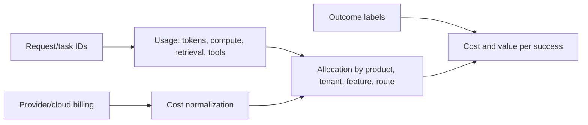

# AI unit economics, value and production delivery

> _Last reviewed: 2026-07-16 — see the [freshness policy](../appendix/maintenance.md)._

## Learning objectives

After this chapter you will be able to:

- connect AI consumption to successful user and business outcomes;
- model full lifecycle TCO, capacity, risk and human work;
- define value hypotheses, counterfactuals and benefit ownership;
- establish FinOps allocation, budgets and optimization loops;
- design evidence gates from discovery through scale or retirement.

## Decision in one sentence

> **Fund and scale an AI system only when measured incremental value exceeds its complete lifecycle cost and residual risk for an accountable population.**

Token price is neither cost nor value. A cheaper model can create expensive retries and corrections; an impressive agent can automate a task nobody needed.

## Value hypothesis

```text
For [population], changing [workflow/decision] with [AI system]
will improve [outcome] from [baseline] to [target] by [date],
without exceeding [harm, quality, latency, privacy, cost thresholds].
Compared with [counterfactual], net value will be [method].
Owner: [business owner]. Evidence: [experiment and data].
```

Distinguish activity (messages), output (drafts), outcome (resolved cases), impact (retention/revenue/risk) and financial value. Do not monetize weak proxy metrics without a causal argument.

## Full lifecycle cost

```text
TCO = discovery + data + integration + model/training/inference
    + retrieval/memory/tools + platform/network/storage
    + evaluation/security/governance + observability/incidents
    + human review/correction/support + vendor/contract
    + change/portability + retirement
```

Include failed attempts, retries, unused reserved capacity, accelerator engineering, labeling, red teams, approvals, manual exceptions and incident remediation. Separate fixed, variable and step costs.

## Unit of economics

Choose a unit aligned with value:

| Weak unit | Better unit |
| --- | --- |
| cost per token | cost per grounded answer |
| cost per agent call | cost per completed task |
| cost per document | cost per correctly processed document |
| cost per voice minute | cost per resolved call |
| developer seats | accepted change or cycle-time improvement |

```text
cost per success = total attributable lifecycle/operating cost
                   / verified successful outcomes

incremental value = outcome value with system - counterfactual outcome value
net value = incremental value - full incremental cost - risk provision
```

Report by workload and critical slice. A global average can hide a high-cost route or harmed population.

## Cost attribution architecture



Tag task, product, environment, tenant-safe cost center, model route, agent, feature and owner. Reconcile telemetry with invoices. The [FOCUS 1.2 specification](https://focus.finops.org/focus-specification/v1-2/) standardizes cost/usage data from technology providers, while AI-specific internal meters—tokens, tools and outcomes—still need correlation.

The current [FinOps for AI guidance](https://www.finops.org/framework/technology-categories/ai/) emphasizes allocation, forecasting, anomaly management and linking granular AI usage with business outputs.

## Capacity and pricing model

Model input/output/reasoning/cached tokens, concurrency, context distribution, retrieval, tool calls, retries, agent depth/fan-out, media duration, provisioned capacity and human queues. Simulate normal, burst, growth and failover traffic.

Compare on-demand, reserved/provisioned and self-hosted break-even under utilization uncertainty. Include data transfer, storage, idle accelerators, regional duplication and minimum commitments. Sensitivity-test price, volume, success rate and model mix.

## Optimization hierarchy

1. remove low-value or harmful tasks;
2. simplify workflow or use deterministic code/search;
3. reduce unnecessary context, output and agent steps;
4. cache only safe reusable work;
5. route simple tasks to smaller models;
6. batch or make noninteractive work asynchronous;
7. improve success to reduce retry/review;
8. tune serving/commitments after demand stabilizes.

Do not reduce cost by weakening isolation, evaluation, observability or fallback below the risk requirement.

## Benefit measurement

Use experiments or credible quasi-experimental designs where possible: randomized rollout, stepped wedge, matched comparison, difference-in-differences or interrupted time series. Define population, period, exclusions, interference, seasonality and delayed effects. Measure quality and harm alongside speed.

For productivity, displaced minutes are not automatically savings. Determine whether time is actually redeployed, capacity increases, backlog falls or staffing changes. Track new review and correction work.

## Delivery stages and evidence gates

| Stage | Key evidence | Decision |
| --- | --- | --- |
| Discover | workflow, baseline, owner, constraints | investigate or stop |
| Feasibility | hardest assumption, data/authority, simple baseline | prototype or abstain |
| Pilot | representative users, quality/risk, usability, unit estimate | controlled production |
| Production | SLOs, security/privacy, operations, rollback, dossier | release |
| Scale | stable outcome, capacity, cost/success, support model | expand/optimize |
| Review | drift, incidents, vendor and opportunity cost | continue/change/retire |

Pilots with real users, data or effects need production-grade controls proportional to consequence. Time-box every experiment with success, stop and learning criteria.

## Portfolio governance

Maintain an AI investment inventory with owner, hypothesis, stage, spend, value, risk tier, route/provider concentration, last evidence and next decision. Fund shared platform capabilities only when their consumers and avoided duplication are explicit. Apply budgets and anomaly alerts at task/tenant/product levels and hard caps to runaway agents.

## Northstar economics

Northstar measures cost per correctly resolved shipment case, not per chat. The counterfactual is the existing support workflow. Costs include model/retrieval/tools, carrier calls, human approvals, corrections and incidents. Benefits include reduced handling time, repeat contacts and avoidable concessions, but only verified changes count. High-value exceptions route to people even when unit cost rises because risk dominates.

## Practical artifact: AI business and unit-economics case

Include hypothesis/counterfactual, population, outcome and guardrails, baseline, architecture/workload model, TCO, allocation schema, cost/success, benefit method, sensitivity/scenarios, risk provision, delivery gates, budget/anomaly controls, owner and scale/stop/retirement criteria.

## Lab

Build a Northstar monthly model for three routes: deterministic, small-model copilot and agent. Vary volume, token distributions, success, retries, human review and provider outage. Calculate cost/success, break-even and sensitivity; design a controlled rollout that can distinguish real benefit from seasonality.

## Check yourself

1. What verified outcome earns value?
2. Which costs are absent from the provider invoice?
3. What is the counterfactual?
4. How is usage joined to outcome without excessive personal data?
5. Which evidence causes scale, pause or retirement?

## Further reading

- [FinOps Framework](https://www.finops.org/framework/).
- [FinOps for AI](https://www.finops.org/framework/technology-categories/ai/).
- [FOCUS 1.2](https://focus.finops.org/focus-specification/v1-2/).
- [Value hypotheses and KPIs](02-value-kpis.md).
- [From prototype to production](05-prototype-production.md).
