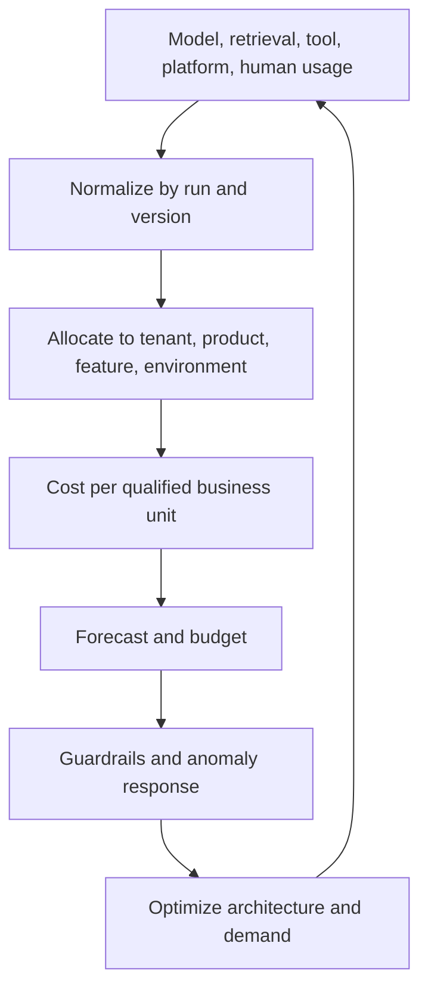

# FinOps for tokens, retrieval & tools

> Last reviewed: 2026-07-16. See the [freshness policy](../appendix/maintenance.md).

## Learning objectives

After this chapter you will be able to allocate full AI cost, forecast from workload drivers, control spend without bypassing quality, and investigate anomalies at run level.

## Cost follows the whole task

Tokens are only one meter. A qualified task may use routing, embeddings, search, reranking, model calls, safety evaluation, tool APIs, durable state, human review, observability, and failed retries. Optimize **cost per successful qualified outcome**, not the cheapest call.

```text
task_cost = model + retrieval + tools + platform + network
          + evaluation + human_review + allocated_operations
qualified_unit_cost = total_cost / successful_tasks_meeting_quality_and_policy
```

## Cost telemetry and allocation



Every request/run should carry product, feature, tenant, environment, use profile, route, model, prompt, index, and owner identifiers. Allocate shared gateways, GPU pools, observability, evaluation, and platform labor by a documented driver. Keep unallocated cost visible rather than hiding it in overhead.

## Cost model by workload driver

| Component | Useful driver |
|---|---|
| Managed model | input/output/cached/reasoning tokens or media units |
| Self-hosted model | accelerator time, reserved idle, power, support |
| Retrieval | queries, documents scanned, index size, reranking |
| Agent tools | calls, external fees, retries, duration |
| Memory | writes, retained bytes, reads, compaction/deletion |
| Human work | review minutes, escalation, incident and eval effort |

Forecast from task volume × route mix × length/tool distributions × retry/failure assumptions. Model optimistic, expected, peak, and provider-price/change scenarios. Reconcile forecast to actual by variance driver, not only total dollars.

## Budgets and guardrails

Use nested budgets: portfolio, product, tenant, feature, and run. A run envelope can cap model calls, tokens, tool calls, wall time, and spend. An agent cannot expand its own budget.

Soft controls warn or route optional work; hard controls stop or queue it. Protect critical journeys with reserved budgets. Do not respond to an overrun by removing authorization, safety, or evaluation controls. Prefer smaller models where qualified, context reduction, caching with correct scope, asynchronous work, and no-progress termination.

## Anomaly detection

Alert on changes in cost per qualified task, output/input ratio, cache miss, retries, replans, tool fan-out, long-context share, evaluation traffic, idle accelerator capacity, and unallocated spend. Correlate with release tuple and traffic mix before declaring waste.

The response path is: contain runaway routes, preserve representative traces, classify demand/price/architecture/defect causes, remediate, and verify quality and policy. A cost spike caused by successful new adoption differs from a retry loop.

## Optimization portfolio

Rank changes by expected savings, quality/risk impact, engineering cost, and confidence. Track verified savings against a baseline and account for rebound demand. Unit cost improvement without total business value can still be the wrong optimization.

## Northstar decision and artifact

Northstar attributes each support case’s model, retrieval, tool, and review usage to a case outcome. Budgets stop repeated replanning, while critical cases retain a protected route. The monthly review compares cost per resolved qualified case, not raw token spend.

Produce a **FinOps model** with allocation taxonomy, usage schema, unit definition, forecast, budgets, guardrails, anomaly runbook, optimization backlog, and benefit verification.

## Lab and checks

Cost 1,000 Northstar cases across short, long, escalated, failed, and retried paths. Find the top variance, propose two controls, and show their effect on quality-adjusted cost.

1. Which shared costs are currently unallocated?
2. Can a budget limit degrade safety or access controls?
3. What distinguishes useful demand growth from waste?
4. Why is cost per token an incomplete unit metric?

## Further reading

- [FinOps Foundation: Unit Economics](https://www.finops.org/framework/capabilities/unit-economics/)
- [FinOps Framework](https://www.finops.org/framework/)
- [MLPerf Inference](https://docs.mlcommons.org/inference/index_gh/)
