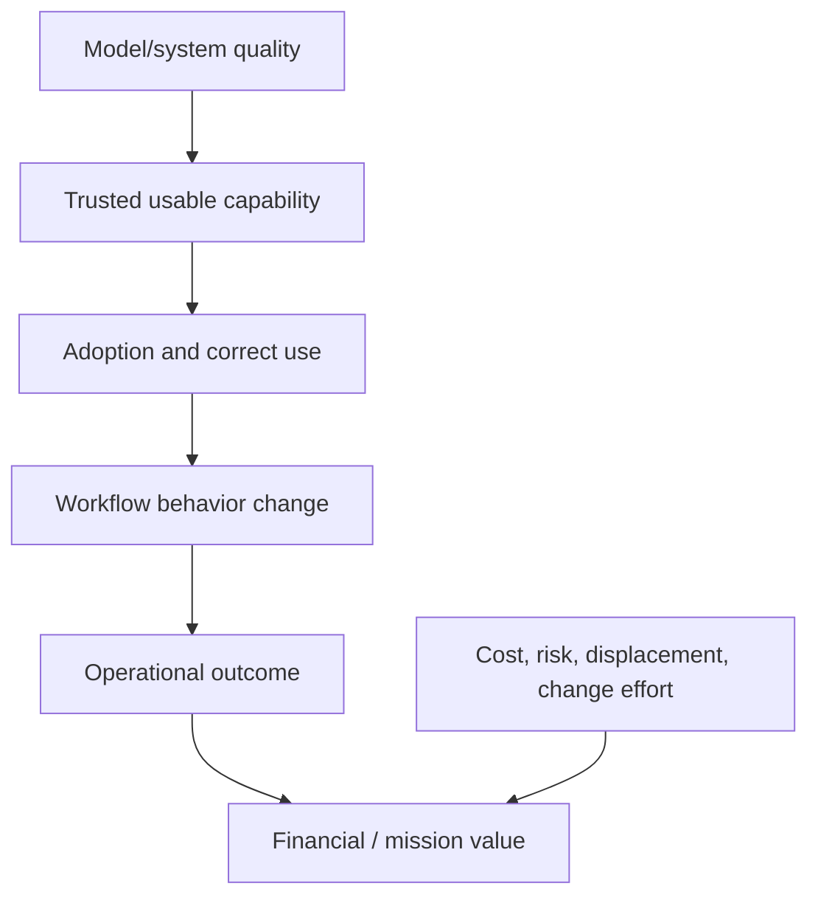

# Value hypotheses, KPIs & benefits realization

> Last reviewed: 2026-07-16. See the [freshness policy](../appendix/maintenance.md).

## Learning objectives

After this chapter you will be able to connect system quality to workflow outcomes, define a credible counterfactual, prevent metric gaming, and verify realized value after adoption and risk.

## Start with a falsifiable value hypothesis

“Deploy an AI assistant” is an output. A useful hypothesis is:

> For trained support agents handling shipment cases, grounded suggestions will reduce median resolution effort by 20% within 12 weeks, without worsening repeat contact, customer harm, employee experience, or policy violations.

It names population, intervention, mechanism, outcome, time, and guardrails.

## Benefits chain



If a link is unmeasured, the benefits claim is an assumption.

## Metric hierarchy

| Layer | Example | Role |
|---|---|---|
| Quality | grounded task success, action validity | Can it work? |
| Reliability/risk | availability, harmful outcome, leakage | Is it safe enough? |
| Adoption | eligible users, retained use, override | Is it actually used well? |
| Workflow | touch time, wait, rework, escalation | Did work change? |
| Outcome | resolution, conversion, loss avoided | Did the mission improve? |
| Value | margin, capacity, risk-adjusted benefit | Was value realized? |

Use one primary outcome, diagnostic leading indicators, and non-negotiable guardrails. Avoid a dashboard with dozens of equal KPIs.

## Counterfactual and attribution

Compare against what would have happened without the intervention. Randomized trials are strong when feasible; otherwise use staggered rollout, matched cohorts, interrupted time series, or explicit baseline assumptions. Account for seasonality, staffing, policy changes, case mix, and concurrent automation.

Measure at the unit where interference is limited—user, team, case, customer, or site. Track delayed effects such as repeat contact, corrections, complaints, and churn. Document uncertainty rather than converting a correlation into ROI.

## Productivity is not automatically savings

Time saved becomes value only if it changes capacity, service level, cost, revenue, or risk. Validate where the released time went. Include training, review, correction, integration, platform, governance, and change-management effort. Track benefit displacement: faster first response may create more rework downstream.

```text
realized_value = attributable_gross_benefit
               - run_cost - change_cost - control_cost
               - expected_harm_and_remediation
```

## Adoption and human impact

Segment eligibility, activation, sustained use, appropriate non-use, overrides, and workarounds. Low use may signal poor UX or lack of trust; high use may signal pressure or automation bias. Pair telemetry with interviews and task observation. Measure accessibility, workload, skill, autonomy, and distribution of benefit and burden.

## Anti-gaming controls

Every target can distort behavior. Resolution time needs repeat-contact and quality guardrails. Deflection needs successful self-service and complaint guardrails. Code volume needs defects and maintainability. Review metrics as a set, audit samples, and avoid using immature product metrics for individual performance management.

## Benefits register

For each hypothesis record owner, population, baseline, intervention, mechanism, primary metric, guardrails, data source, counterfactual, review date, expected range, realized result, confidence, and decision. Stop, redesign, or narrow systems that do not produce value within a defined evidence window.

## Northstar decision and artifact

Northstar’s primary outcome is correctly resolved shipment cases per paid hour. Guardrails cover repeat contacts, unsupported advice, complaints, policy breaches, and worker experience. It uses a staggered team rollout and audits time saved before treating it as capacity value.

Produce a **benefits map and register** linking quality to use, workflow, outcome, and value; include counterfactual, data definitions, guardrails, uncertainty, owner, review cadence, and stop decision.

## Lab and checks

Rewrite three Northstar “AI goals” as falsifiable hypotheses. Design a staggered rollout, calculate an expected benefit range, and identify two plausible confounders and two gaming risks.

1. What counterfactual supports the benefit claim?
2. Where can time saved disappear?
3. Which guardrail prevents the primary KPI from being gamed?
4. Who owns the stop decision if value is not realized?

## Further reading

- [FinOps Foundation: Unit Economics](https://www.finops.org/framework/capabilities/unit-economics/)
- [OECD Employment Outlook 2023: AI, job quality and inclusiveness](https://www.oecd.org/en/publications/2023/07/oecd-employment-outlook-2023_904b6c08-en.html)
- [NIST AI RMF: Measure](https://airc.nist.gov/airmf-resources/airmf/5-sec-core/)
