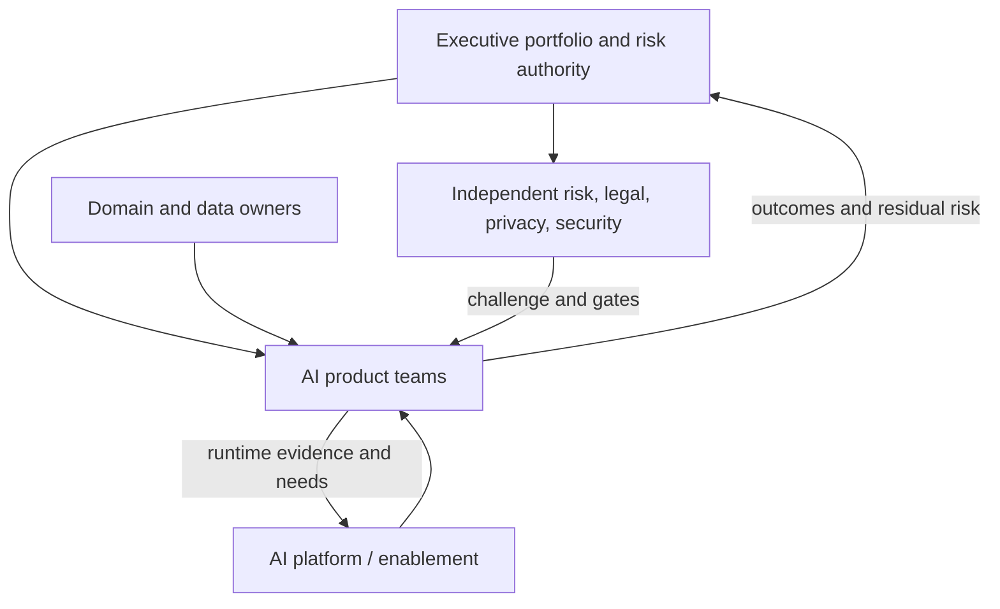

# Operating model & organizational readiness

> Last reviewed: 2026-07-16. See the [freshness policy](../appendix/maintenance.md).

## Learning objectives

After this chapter you will be able to assign lifecycle decision rights, choose platform/team boundaries, assess readiness from evidence, and create a staged capability roadmap.

## Organize around products, platforms, and independent challenge

AI is not owned by one center of excellence. Product teams own outcomes and operation; a platform team supplies paved roads; data and domain owners govern sources and semantics; security/privacy/legal/risk provide controls and challenge; finance validates economics; executive leadership owns risk tolerance and portfolio capital.

Centralize scarce platform capabilities and policy patterns; federate domain decisions and product accountability. A central team that owns every prototype becomes a queue. Fully decentralized teams duplicate unsafe infrastructure.

## Decision-right matrix

| Decision | Accountable role | Required contributors |
|---|---|---|
| Purpose and value hypothesis | Product/business owner | users, domain, finance |
| Architecture and NFRs | Solution/technical owner | platform, data, security, operations |
| Data authority and semantics | Data/domain owner | privacy, legal, product |
| Risk classification and controls | Risk owner | product, security, privacy, affected stakeholders |
| Release | Product/service owner | independent gate owners for high risk |
| Residual-risk acceptance | Named business/risk authority | independent challenge |
| Incident containment | On-call/incident commander | security, safety, privacy, domain as needed |
| Retirement | Product owner | platform, data, records, vendor management |

Avoid a RACI in which everyone is consulted and no one can stop a release. Define emergency disablement and exception authority explicitly.

## Paved-road platform

Offer self-service identity, approved model gateway, data connectors, evaluation harness, prompt/release registry, observability, policy enforcement, secrets, sandboxed tools, cost attribution, and templates. Paved roads should make the compliant path faster and expose extension points for real domain needs.

Measure platform adoption, lead time, reliability, policy coverage, support burden, and avoided duplication. Do not measure success by number of tools launched.

## Lifecycle forums, not one review board

Use lightweight intake and risk triage, architecture review for material design decisions, evidence review before release, operational review after launch, incident review, and periodic portfolio review. Low-risk changes flow through automated gates; consequential profiles receive independent human challenge.

Exceptions name owner, scope, compensating controls, evidence gap, expiry, and removal plan. Permanent exceptions indicate a platform or policy design problem.

## Readiness assessment

Assess demonstrable capability across:

- strategy and portfolio prioritization;
- product discovery and benefits measurement;
- architecture, data, evaluation, security, and governance;
- platform, delivery, reliability, incident, and FinOps;
- domain/user participation, training, and change management;
- vendor, supply-chain, legal, and records management.

Use evidence levels: absent; ad hoc; repeatable; measured; continuously improved. Do not average maturity into a flattering score. A missing incident owner or data authority can block a high-risk release regardless of strengths elsewhere.

## Skills and staffing

Build cross-functional product teams with domain, product, architecture/engineering, data, evaluation, UX/human factors, security/privacy, and operations capability proportional to risk. Train operators and reviewers on failure recognition and authority, not generic “AI literacy” alone.

Create communities of practice for reusable learning, while keeping production ownership with teams that have service incentives and on-call access.

## Portfolio and funding

Fund discovery with short evidence windows, productization after value and feasibility gates, and shared platform capabilities as internal products. Track options: scale, continue experiment, constrain, or stop. Sunk prototype effort is not a reason to deploy.

Capacity planning includes evaluation experts, domain reviewers, security testing, legal/privacy review, change management, and on-call—not only software engineers and model budget.

## Northstar target model and artifact

Northstar establishes product teams for support and supply operations, one shared AI platform team, named data owners, and an independent risk forum for Tier 3 use profiles. Products own SLOs, outcomes, incidents, and retirement. The platform supplies gateway, evaluation, action broker, and evidence registry.

Produce a **target operating model** with team topology, decision rights, service catalog, lifecycle forums, readiness evidence, exception process, capability gaps, funding model, metrics, and 30/90/180-day roadmap.

## Lab and checks

Map Northstar’s current owners and find five orphan decisions. Design the target topology, define one paved-road service contract, and sequence the top three blocking capability gaps.

1. Which team owns production outcomes and on-call?
2. Who can accept residual risk and who challenges it?
3. Which capabilities should be centralized or federated?
4. What evidence distinguishes repeatable from ad hoc practice?

## Further reading

- [NIST AI RMF Core: Govern](https://airc.nist.gov/airmf-resources/airmf/5-sec-core/)
- [ISO/IEC 42001:2023 overview](https://www.iso.org/standard/42001)
- [DORA software delivery performance metrics](https://dora.dev/guides/dora-metrics/)
- [FinOps Framework](https://www.finops.org/framework/)
