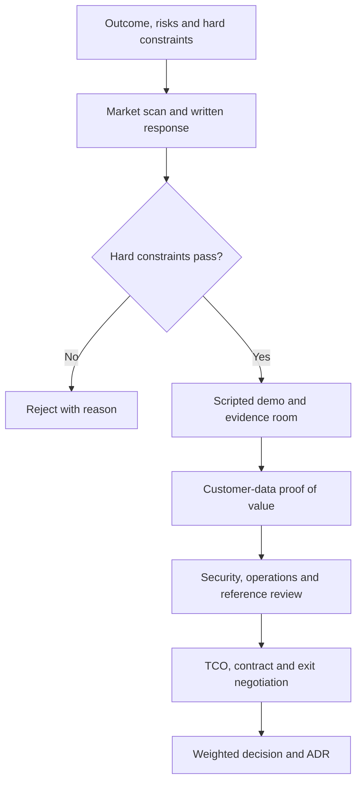

# Vendor and RFP evaluation

> _Procurement guide — last reviewed: 2026-07-25._

## Learning objectives

- turn business outcomes and risk into testable supplier requirements;
- run a fair proof of value using your workloads;
- contract for change, evidence, incidents, and exit.

## The decision in one sentence

Select the supplier whose evidenced lifecycle fit is strongest—not the one with the best curated demo or feature count.

## Build an evidence-based RFP

Organize requirements around scenarios and acceptance tests. Ask “demonstrate tenant isolation while processing this classified sample and provide the audit record,” not “do you support enterprise security?”

| Domain | Evidence to request |
|---|---|
| Outcome quality | results on customer-owned representative and adversarial cases |
| Architecture | data flow, regions, subprocessors, trust boundaries, dependencies |
| Security/privacy | threat model, isolation tests, key/identity options, retention and deletion |
| Operations | measured SLOs, quotas, change notices, incident process, support escalation |
| Governance | model/system cards, evaluation, content provenance, regulatory evidence |
| Commercial | metering units, price protections, support, egress and scenario TCO |
| Portability | exports, open formats, transition assistance, deletion certificate |

## Evaluation funnel

| Stage | Prevents | Deliverable |
|---|---|---|
| Hard constraints | wasted evaluation | compliance matrix |
| Scripted demo | demo theatre | scenario scorecard |
| Proof of value | benchmark mismatch | reproducible result pack |
| Due diligence | hidden operational risk | risk and remediation register |
| Commercial/exit | lifecycle surprise | negotiated schedule and exit plan |

## Run a defensible proof of value

Freeze cases, rubrics, success thresholds, traffic assumptions, and permitted tuning before suppliers see results. Include common, boundary, adversarial, multilingual, long-context, degraded dependency, and harmful-action cases. Measure end-to-end task success, not model eloquence. Capture latency distribution, cost per successful outcome, human review, trace completeness, and recovery behavior.

Require every supplier to use the same core cases, then allow a clearly separated optimization phase. Retain raw outputs and configuration. Score confidence and evidence quality alongside the numerical result. A small pilot should explicitly state what it cannot prove, such as peak capacity, long-term drift, or incident response.

## Contract for a changing AI service

Define what constitutes a material model or safety-policy change, notification period, regression support, and rollback. Cover customer-input and output ownership, training use, retention, subprocessors, residency, vulnerability disclosure, serious-incident notification, evidence access, audit rights, availability and support, rate limits, indemnity and liability allocation, export, termination assistance, and verified deletion.

Price scenarios should model input/output tokens, cached tokens, retrieval/storage, tool calls, evaluation traffic, provisioned capacity, network/egress, observability, support, and human review. Use normal, growth, abuse, and provider-degradation scenarios.

## Northstar example

Northstar shortlists a suite product and a composable cloud service. Both process the same 300 adjudicated cases. The suite wins on time to value but cannot export decision traces or meet the deletion evidence requirement. The composable service has slightly higher setup cost but passes citation, identity, audit, and exit tests. The ADR records the evidence, residual risk, and a 12-month re-evaluation trigger.

## Practical artifact: supplier scorecard

Give each criterion a weight, hard/soft classification, evidence link, score, confidence, risk owner, remediation, and expiry date. Keep evaluators’ written rationale and conflicts of interest. The scorecard becomes a living supplier assurance record after selection.

## Further reading

- [NIST Generative AI Profile](https://nvlpubs.nist.gov/nistpubs/ai/NIST.AI.600-1.pdf)
- [NIST Secure Software Development Framework](https://csrc.nist.gov/Projects/ssdf)
