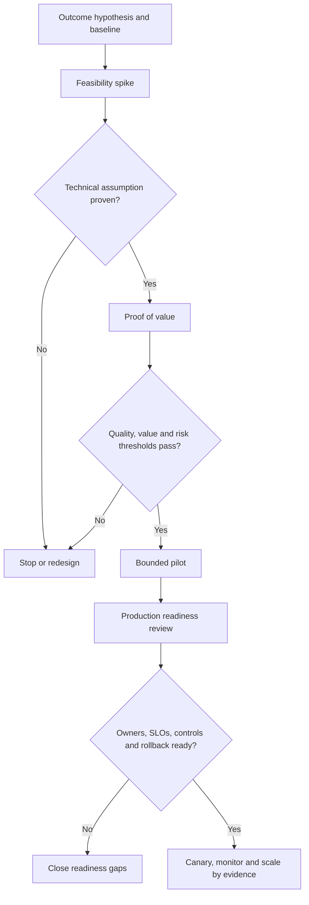

# From prototype to production

> _Delivery guide — last reviewed: 2026-07-25._

## Learning objectives

- distinguish a demo, feasibility spike, proof of value, pilot, and production service;
- plan evidence gates across quality, safety, reliability, cost, and adoption;
- prevent prototype shortcuts from silently becoming production architecture.

## The decision in one sentence

Promote only when the system—not merely the model—has evidence for its intended users, load, harms, operations, and fallback.

## Name the stage correctly

| Stage | Question | Exit evidence |
|---|---|---|
| Demo | Can stakeholders understand the idea? | shared concept; no production claim |
| Feasibility spike | Can the hardest technical assumption work? | reproducible result and limitations |
| Proof of value | Does it improve a business outcome? | baseline comparison on representative work |
| Pilot | Can a bounded population use it safely in workflow? | operational, adoption, and incident evidence |
| Production | Can accountable teams operate it at committed service levels? | release review, SLOs, controls, runbooks |
| Scale | Does it remain economical and governable across domains? | platform, capacity, portfolio and benefits evidence |

## Productionization flow

| Gate | Core evidence | Decision owner |
|---|---|---|
| Feasibility | hardest integration/capability test | architect and engineering |
| Value | task success, time, cost, user outcome | product/business owner |
| Risk | misuse, harmful error, privacy, security | risk and accountable owner |
| Pilot | real workflow, adoption, support, exception load | service owner |
| Production | SLO, capacity, observability, incident, rollback | production readiness board |

## Close the prototype gaps

Prototype code often uses shared credentials, copied data, synchronous calls, no durable state, one happy-path prompt, manual deployment, and notebook-only evaluation. Create a gap register across architecture, data, identity, threat model, evaluation, performance, resilience, cost, UX, accessibility, governance, support, and ownership. Decide whether to harden, replace, or discard each prototype component.

Build the production slice vertically: real identity, one governed data path, one tool with least privilege, durable state, versioned configuration, trace correlation, an evaluation gate, a fallback, and a runbook. This exposes systemic issues sooner than perfecting the prompt in isolation.

## Release by risk

Start read-only, narrow the eligible population and task, cap run duration and spend, and require approval for consequential actions. Shadow mode compares against the current process without affecting users. Then use internal, opt-in, limited, canary, and wider releases. Define automatic rollback for quality, safety, latency, cost, or dependency thresholds.

Production readiness must include: named service and model owners; data classification and retention; threat model; approved use and prohibited use; evaluation suite; capacity and quota; SLOs and dashboards; incident severity and on-call; graceful degradation; change management; support and user recourse; benefits tracking; and decommissioning.

## Northstar example

Northstar’s notebook showed credible recommendations on 20 clean cases. The proof of value adds 300 adjudicated cases and discovers missing-document failures. The pilot uses real identity, read-only evidence retrieval, citation validation, and human approval for one region. Production waits until trace retention, outage fallback, reviewer training, accessibility, cost limits, and provider-change regression are complete.

## Practical artifact: promotion dossier

Maintain one dossier containing the outcome contract, stage, architecture, risk tier, gap register, datasets and evaluation, operational readiness, pilot evidence, unresolved risks, approval record, rollback, and the date/criteria for the next gate.

## Check yourself

1. Classify: a notebook showing 20 clean cases; 300 adjudicated cases against a baseline; one region with human approval. Give each stage and its exit evidence.
2. Why build a thin vertical production slice instead of perfecting the prompt?
3. Name five prototype shortcuts that silently become production architecture.
4. How do you release by risk, and what should trigger automatic rollback?

What a strong answer covers

<ol>
<li>Demo or feasibility spike (a reproducible result with limitations, no production claim); proof of value (baseline comparison on representative work); pilot (operational, adoption, and incident evidence from a bounded population in a real workflow).</li>
<li>A slice with real identity, one governed data path, one least-privilege tool, durable state, versioned configuration, trace correlation, an evaluation gate, a fallback, and a runbook exposes systemic problems far sooner than prompt polish in isolation.</li>
<li>Shared credentials, copied data, synchronous calls, no durable state, a single happy-path prompt, manual deployment, and notebook-only evaluation. A gap register across architecture, data, identity, evaluation, resilience, cost, and ownership keeps them visible.</li>
<li>Start read-only, narrow the population and task, cap duration and spend, require approval for consequential actions, run in shadow mode, then widen through internal, opt-in, limited, canary, and broad stages. Define automatic rollback on quality, safety, latency, and cost signals.</li>
</ol>

## Further reading

- [NIST AI RMF Core](https://airc.nist.gov/airmf-resources/airmf/5-sec-core/)
- [Google SRE: Production Readiness Reviews](https://sre.google/sre-book/evolving-sre-engagement-model/)
