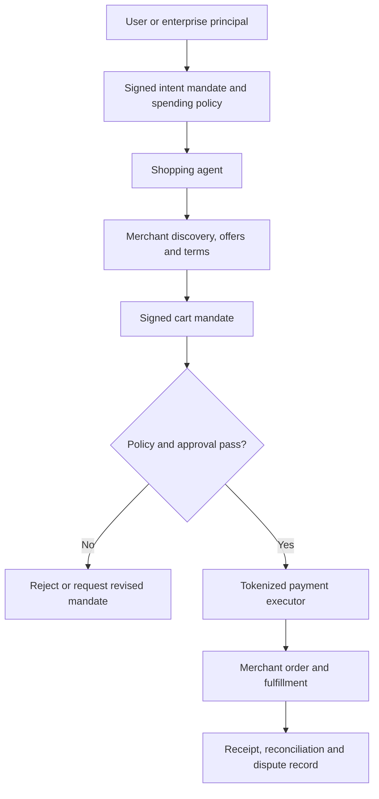

# Agentic commerce, mandates, and payments

> _Emerging architecture — last reviewed: 2026-07-25. Protocols and liability models are evolving; verify current specifications and applicable payment rules._

## Learning objectives

- separate product discovery, commercial intent, checkout, payment, fulfillment, and dispute handling;
- design verifiable delegated authority for agent-initiated transactions;
- constrain financial autonomy with deterministic limits and reconciliation.

## The decision in one sentence

Let an agent propose and negotiate within a signed mandate; let payment infrastructure, policy, and humans authorize value transfer.

## Why ordinary checkout assumptions break

Conventional checkout assumes a human sees the merchant, cart, price, and payment surface. An agent may discover products across merchants, act asynchronously, and optimize under ambiguous preferences. The architecture must answer: who is the principal, what did they authorize, which cart did they approve, did terms change, who executed payment, and how can the transaction be disputed?

[Universal Commerce Protocol (UCP)](https://ucp.dev/) standardizes discovery and commerce capabilities; Google’s [Agent Payments Protocol (AP2)](https://github.com/google-agentic-commerce/AP2) defines verifiable mandates for agent-led payment; [x402](https://www.x402.org/x402-whitepaper.pdf) explores HTTP-native machine payments. These are emerging, not substitutes for PCI DSS, strong customer authentication, consumer protection, sanctions, tax, refund, or card-network obligations.

## Trust architecture

| Step | Evidence | Control |
|---|---|---|
| Delegate | purpose, product constraints, ceiling, time, merchant class | signed, revocable mandate |
| Discover | offer source, timestamp, terms, ranking basis | disclosure and merchant allowlist |
| Bind cart | items, price, tax, delivery, substitutions | merchant signature and expiry |
| Authorize | principal, mandate, cart hash, payment token | deterministic policy and step-up approval |
| Execute | idempotency key and processor result | no raw credentials in model context |
| Reconcile | receipt, shipment, refund and dispute links | immutable audit trail |

## Autonomy tiers

- **Recommend:** agent compares; human checks out.
- **Prepare:** agent creates a bound cart; human signs payment.
- **Pre-authorized:** agent buys within product, merchant, time, and spend limits.
- **Machine-to-machine:** service pays for metered resources under organizational policy.

Begin with recommend or prepare. Higher tiers require revocation, velocity limits, per-transaction and cumulative budgets, merchant trust, fraud monitoring, approval escalation, replay protection, refunds, and legally valid evidence of consent.

Never expose primary payment credentials to the model. Use a wallet or payment service that issues purpose-bound tokens. Bind authorization to the exact cart, currency, total, delivery terms, and expiry; changing any material term invalidates approval. Treat merchant content as untrusted input because product descriptions can carry prompt injection.

## Northstar example

Northstar’s procurement agent may source approved accessibility equipment. The employee signs an intent with category, delivery date, approved vendors, and a CAD 500 ceiling. The agent ranks offers but cannot accept substitutions. A merchant-signed cart over CAD 200 requires human confirmation. The payment service validates both mandate and cart hash, then writes the receipt and cost-center allocation to the ledger.

## Practical artifact: transaction authority matrix

For each purchase class record principal, agent identity, allowed merchants/items, single and cumulative limits, approval rule, credential form, mandate expiry, prohibited substitutions, tax/refund owner, dispute evidence, reconciliation SLO, and kill switch.

Continue with [policy-as-code for agent actions](../07-security-governance/08-agent-policy-as-code.md) and [agent incident forensics](../08-platform-operations/12-agent-incident-forensics.md).

## Further reading

- [UCP architecture overview](https://ucp.dev/2026-01-23/specification/overview/)
- [Google AP2 announcement](https://cloud.google.com/blog/products/ai-machine-learning/announcing-agents-to-payments-ap2-protocol)
- [PCI Security Standards](https://www.pcisecuritystandards.org/)
