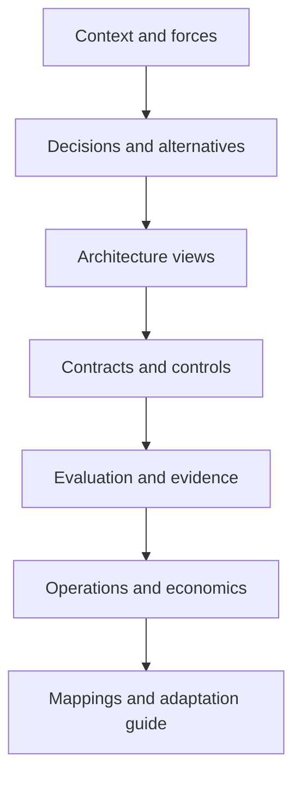

# Reference architecture method and review pack

> _Last reviewed: 2026-07-16 — see the [freshness policy](../appendix/maintenance.md)._

## Learning objectives

After this chapter you will be able to:

- turn a reusable pattern into a decision-ready reference architecture;
- separate logical capabilities from dated product mappings;
- document normal, failure, attack, approval and recovery paths;
- attach requirements, controls, evaluation, operations and economics;
- adapt a reference responsibly to a concrete organization.

## Decision in one sentence

> **A reference architecture is a reusable set of decisions, views, contracts, trade-offs and evidence—not a vendor diagram or mandatory target state.**

Every reference states its scope, assumptions, forces, alternatives and invalidating conditions. Teams adapt it through ADRs; they do not copy it unchanged.

## Reference package

## 1. Context and forces

Define user goal, workflow, affected people, system boundary, in/out of scope, workload distribution, data/authority, consequence, quality attributes, constraints, assumptions and baseline. State when the pattern should not be used.

Examples of forces: current evidence, low-latency voice, asynchronous tool work, strict residency, cross-tenant isolation, human accountability, burst traffic and provider portability.

## 2. Decisions and alternatives

Record why the reference uses RAG versus long context, workflow versus agent, one versus multiple agents, managed versus self-hosted model, pooled versus dedicated tenancy, synchronous versus durable execution and model versus human route. For each, show tradeoff and disconfirming evidence.

## 3. Architecture views

The [C4 model](https://c4model.com/) supplies hierarchical system context, container, component and code views plus dynamic and deployment diagrams. Use only the levels needed. An AI reference normally includes:

| View | Must expose |
| --- | --- |
| Context | people, external systems, ownership, trust boundaries |
| Container/component | gateway, model, context, policy, tools, state, telemetry |
| Sequence | normal, denial, approval, timeout, cancellation, partial effect |
| Data/provenance | source, transforms, serving, retention, deletion |
| Identity/authority | subject, actor, workload, delegation, resource checks |
| Deployment | accounts/projects, regions, network, keys, isolation, scaling |
| Operations | SLOs, traces, evaluation, rollout, kill switches, recovery |

Label protocols, direction, sync/async, data class and authority. Avoid unlabeled arrows and product-logo collages.

## 4. Capability contracts

Specify input/output/error schemas, evidence and citation, model route, tool effect and idempotency, task state, memory, authorization/delegation, approval, cancellation, privacy, retention/deletion, telemetry and fallback. These contracts form portability boundaries.

## 5. Threats, controls and governance

Map assets, trust boundaries, threats and controls. Include prompt injection, tenant leakage, supply chain, memory poisoning, tool misuse, unknown effects and economic denial. Connect every high-risk control to an owner, configuration/evidence and test.

Attach purpose, risk tier, roles, vendor/data assessments, responsible-human decisions, material-change triggers, incident/reporting and retirement. A reference does not determine legal applicability.

## 6. Evaluation and fitness functions

Provide representative task/slice definitions, component and end-to-end metrics, safety/security/privacy tests, repeated-trial policy, human/usability/accessibility tests, load/failure tests and release thresholds. Architecture fitness functions run continuously where possible: unauthorized action count, cross-tenant leakage, p95 deadline, deletion SLO, fallback compatibility and cost/success.

## 7. Reliability and operations

Document dependency/latency budgets, capacity, admission, retries, breakers, checkpoints, idempotency, degradation, rollback and state migration. Provide dashboards, alerts, runbooks and game-day scenarios. Identify the smallest safe mode that functions without each AI dependency.

## 8. Economics and sustainability

Model workload, token/media/tool/human demand, fixed and variable TCO, cost/success, benefit hypothesis and scaling sensitivity. Identify cost allocation and budgets. If energy or environmental impact is material to stakeholders, measure relevant compute/utilization rather than making unsupported generic claims.

## 9. Product mappings

Map logical capabilities to AWS, Google Cloud, Azure or other products in a dated appendix. State feature status, region, quota, identity/network integration and portability gap. The logical reference remains vendor-neutral; mappings are replaceable and reviewed for freshness.

## Adaptation process

1. validate context and constraints against the reference;
2. remove capabilities not needed;
3. select quality-attribute priorities;
4. choose product/runtime mappings;
5. record deviations and new risks in ADRs;
6. build evidence for local data, users and workload;
7. review with security, privacy, operations, domain and affected-user functions;
8. release through evaluation gates and revisit assumptions.

## Worked Northstar reference

Northstar's customer-service reference uses authenticated edge, policy gateway, versioned RAG, live order tools, durable task controller, bounded agent, approval service, idempotent refund resource, scoped memory, OpenTelemetry-compatible traces and outcome evaluation. Search-only and human workflows are fallbacks. Restricted tenants use an approved regional route. The reference excludes autonomous policy exceptions.

Its critical sequences are: grounded answer; inaccessible evidence; carrier timeout and resume; refund preview/approval/commit; lost write response and reconciliation; injected document; cancellation; provider outage; correction/deletion.

## Architecture review rubric

Score evidence—not document polish:

- outcome and scope are precise;
- simpler alternatives were compared;
- quality attributes drive choices;
- identity, tenant, data and authority are end-to-end;
- model uncertainty is contained;
- state/effects are recoverable;
- humans have meaningful control;
- evaluation represents real and adversarial slices;
- SLOs, telemetry, incidents and cost are operable;
- mappings, assumptions and exit plan are current.

Any unresolved critical authorization, privacy, safety or recovery gap blocks approval regardless of average model score.

## Practical artifact: reference architecture review pack

Include one-page decision summary, context/forces, option matrix, ADRs, views/sequences, contracts, data/threat/privacy models, control/evidence matrix, evaluation, SLO/capacity/recovery, human flow, TCO/value, product mappings, adaptation checklist and open risks.

## Lab

Adapt the Northstar reference to a regulated multilingual tenant. Add regional constraints and voice while removing persistent memory. Produce context, container, deployment and four failure sequences; three ADRs; control/test matrix; SLO/evaluation gates; TCO; and a ten-minute architecture defense.

## Check yourself

1. Which assumptions limit reuse?
2. Which diagrams answer which stakeholder concerns?
3. What contract forms the portability boundary?
4. Which fitness functions detect architectural drift?
5. What local evidence is still required?

## Further reading

- [C4 model](https://c4model.com/).
- [The AI solution architecture method](../01-ai-sa-foundations/00-probabilistic-architecture.md).
- [AI architecture review](../11-sa-craft/02-architecture-review.md).
- [Enterprise knowledge assistant](01-knowledge-assistant.md).
