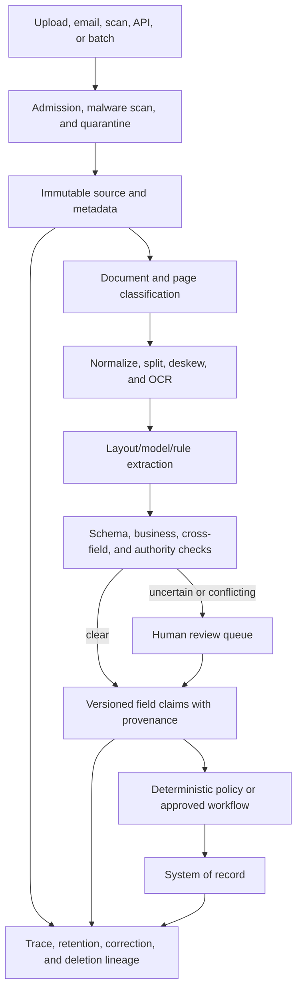

# Document intelligence pipeline

> _Last reviewed: 2026-07-16 — see the [freshness policy](../appendix/maintenance.md)._

## Learning objectives

After this chapter you will be able to design a secure event/batch document pipeline, combine deterministic and model extraction, route uncertainty to humans, preserve field-level provenance and operate correction/deletion.

## Decision in one sentence

> **Treat every extracted field as a versioned claim with source coordinates and validation—not as truth because OCR or a model emitted it.**

## 1. Use cases and boundaries

Use the pattern for invoices, claims, forms, contracts, shipping records and correspondence. Separate classification, extraction, validation, decision and action. High-volume extraction can be automated while policy decisions or financial writes remain deterministic or human-approved.

## 2. Reference architecture



## 3. Document envelope and idempotency

Assign an identity before asynchronous processing:

```json
{
  "documentId": "doc_01K1",
  "sourceRevision": "sha256:...",
  "tenantId": "northstar-ca",
  "receivedAt": "2026-07-16T20:15:00Z",
  "channel": "customer_upload",
  "declaredType": "damage_claim",
  "dataClass": "confidential",
  "retentionClass": "claims-7y",
  "processingVersion": "claim-pipeline-v12"
}
```

Use `documentId + sourceRevision + processingVersion` as an idempotency boundary. Retries should resume a stage or create a new processing attempt, not duplicate downstream records.

## 4. Admission and quarantine

- authenticate source/channel and cap file size, pages, recursion and decompression;
- scan malware and active content; disable macros/scripts and external fetches;
- validate declared versus detected format;
- encrypt and isolate source bytes with tenant/data-class policy;
- store a checksum and chain of custody;
- reject or manually isolate unsupported/corrupted content;
- prevent the model or parser from accessing credentials or unrestricted network.

Documents are untrusted even when uploaded by an authenticated user.

## 5. Classification and preparation

Classify at document and page level. One PDF may contain a claim form, receipt and unrelated correspondence. Preserve original order and parent-child relationships.

Preparation may include format conversion, deskew, rotation, denoise, language detection, page/region segmentation, table detection and OCR. Record every transformation and map normalized coordinates back to the original source.

## 6. Extraction strategy

| Method | Best fit | Control |
| --- | --- | --- |
| deterministic parser/barcode | stable machine-generated formats | schema and checksum validation |
| OCR/layout model | scans, handwriting, spatial forms | confidence plus visual coordinates |
| multimodal model | variable layout and semantic fields | constrained schema and source grounding |
| rules/regex | exact identifiers, dates, known patterns | locale and false-positive tests |
| external lookup | canonical entity/account/product | authorization and freshness |
| human extraction/review | ambiguous or high-consequence fields | double review or adjudication where required |

Use a cascade: deterministic extraction first, specialized models where needed and general models only for ambiguity they measurably solve.

## 7. Field-claim contract

```ts
interface ExtractedClaim<T> {
  field: string;
  value: T;
  normalizedValue?: T;
  source: {
    documentId: string;
    page: number;
    region: [number, number, number, number];
    excerpt?: string;
  };
  method: string;
  modelOrRuleVersion: string;
  confidence?: number;
  validation: Array<{ check: string; result: "pass" | "fail" | "unknown" }>;
  status: "candidate" | "reviewed" | "verified" | "rejected";
}
```

Model confidence is not probability of correctness unless calibrated for that field and distribution. Route by consequence and validation, not a universal confidence cutoff.

## 8. Validation and reconciliation

Combine:

- type/format/range and required-field schema checks;
- cross-field totals, dates, units and checksum rules;
- duplicate and source-revision detection;
- account/order/product lookups under authorization;
- policy/effective-date checks;
- comparison with independent source or prior record;
- sampled human quality review.

Conflicts remain visible. Do not silently choose the value that appears most often if sources are not equally authoritative.

## 9. Human review design

Review views should show original region, extracted value, normalization, failed checks, model/version and effect of acceptance. Minimize unrelated sensitive content. Support keyboard and screen readers.

Route by field consequence, uncertainty pattern, novelty, document quality and queue capacity. Measure reviewer agreement, correction categories, time and fatigue. Accepted corrections become governed evaluation data—not automatic fine-tuning input.

## 10. Events, state and recovery

Use durable stage events and explicit states: received, quarantined, classified, extracted, validation-failed, review-pending, reviewed, published, action-pending, completed, rejected and deleted.

Dead-letter queues require owner, reason, retry policy and visibility. A poison document must not block its partition. Reprocessing with a new parser/model creates new claims and preserves prior lineage.

## 11. Security and privacy

- isolate tenants and data classes in storage, queues, keys and review access;
- prevent prompt injection in document text from changing extraction/tool policy;
- restrict parser/model egress and external URLs;
- redact or tokenize unnecessary identifiers before model processing;
- enforce approved region/provider routes;
- avoid source content in logs and metric labels;
- propagate deletion to thumbnails, OCR, claims, embeddings, caches and eval samples;
- monitor bulk access, unusual downloads and reviewer misuse.

## 12. Evaluation and operations

Measure by document/field/layout/language/quality slice:

- classification accuracy and unknown-type rate;
- field precision/recall/exact match and normalized-value correctness;
- table/line-item structure accuracy;
- validation defect detection and false rejection;
- human correction/review rate and agreement;
- document-level straight-through processing with verified outcome;
- duplicate/incorrect system writes;
- stage latency, queue age, throughput, failure/reprocess rate;
- cost per correctly completed document and human minutes.

Keep a golden set plus fresh production samples, adversarial/active documents and incident regressions. Evaluate downstream decisions, not just extraction.

## 13. Degradation and SLOs

| Failure | Safe behavior |
| --- | --- |
| OCR/model unavailable | queue with expiry or use validated alternate parser |
| quality below threshold | human review; no downstream write |
| authoritative lookup unavailable | retain candidate and mark pending |
| queue overload | admission/backpressure and priority by expiry/consequence |
| action response lost | reconcile by document/action identity |
| deletion event | stop processing and propagate tombstone |

## Northstar worked example

Northstar processes damaged-shipment claims containing a form and photos. OCR extracts identifiers, a vision model proposes damage category and a rules service validates order, dates and totals. Low-quality IDs and high-value claims enter review. The claim system receives only reviewed/verified typed fields with source coordinates and an idempotency key. The model never approves payment.

## Practical artifact

Submit the ingestion/threat boundary, document and field-claim schemas, pipeline state machine, extraction/validation strategy, review policy, correction/deletion lineage, SLO/capacity plan, evaluation matrix, unit economics and recovery runbook.

## Lab

Process a mixed Northstar set containing clean PDFs, rotated scans, handwritten values, tables, prompt injection, duplicate revisions and a corrupt archive. Demonstrate quarantine, field provenance, validation, review, idempotent publish, reprocessing and deletion.

## Check yourself

1. Which value is authoritative: OCR text, model extraction or reviewed system record?
2. How is a normalized field traced to the original pixels?
3. When must low confidence block downstream action?
4. How does reprocessing preserve prior claim history?
5. Which derived artifacts receive a deletion tombstone?

## Further reading

- [AI data readiness, lineage and provenance](../03-data-context/00-data-readiness.md).
- [Multimodal architectures](../02-ai-landscape/05-multimodal.md).
- [Secure agent execution and sandboxing](../07-security-governance/06-secure-agent-execution.md).
