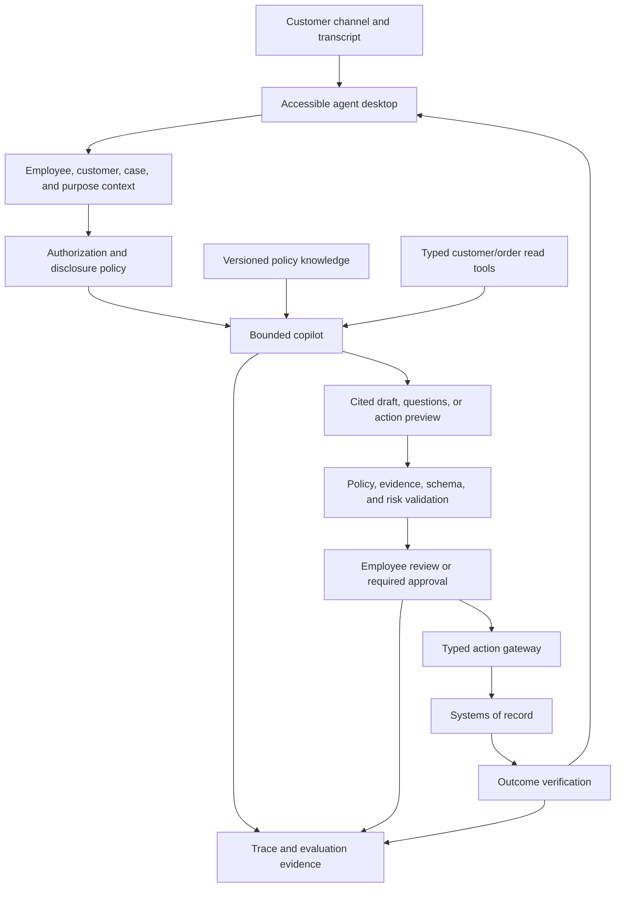
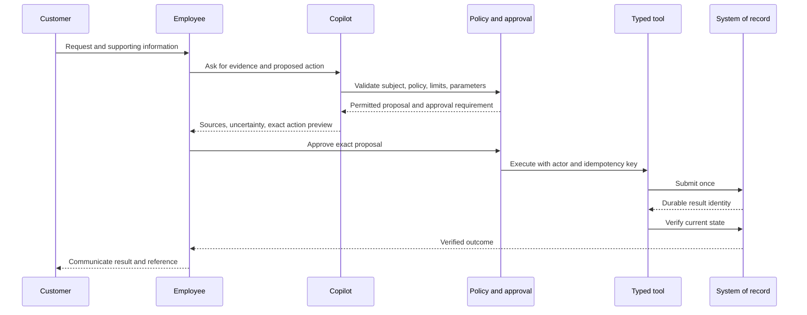

# Customer-service copilot

> _Last reviewed: 2026-07-16 — see the [freshness policy](../appendix/maintenance.md)._

## Learning objectives

After this chapter you will be able to design a copilot that supports—not impersonates—service staff, grounds recommendations, separates drafts from actions, protects customer data and evaluates the joint human-AI workflow.

## Decision in one sentence

> **Keep the service professional accountable and in control: AI proposes evidence-backed work; typed systems and authorized people commit consequential effects.**

## 1. Scope and authority ladder

Start with the least authority that creates value:

1. search and summarize customer/context information;
2. suggest next-best questions or procedures;
3. draft a response for review;
4. prefill a typed action preview;
5. execute a narrow reversible action after exact approval;
6. automate only well-evaluated low-risk work with monitoring and appeal.

Do not label stages 3–6 simply “copilot.” Record the actual authority and accountable actor.

## 2. Reference architecture

## 3. Session and case contract

The copilot receives server-established employee identity/role, authenticated or unverified customer state, case ID, channel, purpose, permitted data/actions, consent/recording status, locale/accessibility needs, task deadline and model/prompt/tool/policy versions.

The transcript is untrusted input and may be incomplete. Mark speaker, timestamps, corrections and confidence. Do not treat caller claims or a familiar voice as identity.

## 4. Knowledge and live data

Use governed RAG for policy/procedure and typed tools for current order, account, entitlement and transaction state. Never place broad CRM credentials or raw database access in the model.

Every suggestion should expose:

- source/policy and effective date;
- customer/order facts used and their authoritative origin;
- uncertainty, missing information and conflict;
- proposed next step and whether it is reversible;
- approval or step-up authentication required.

## 5. Human-control contract

| Copilot output | Human control |
| --- | --- |
| search result/summary | inspect sources; correct context |
| suggested question | choose/edit/ignore |
| response draft | edit and explicitly send |
| action preview | inspect exact target, parameters and consequence |
| low-risk action | approve if policy requires; visible cancellation/recovery |
| exception/high-risk action | specialist or dual control; copilot cannot override |

Avoid approval fatigue. Bundle only materially related parameters and require re-approval after a material change or expiry. Measure rubber-stamping and edits, not just acceptance.

## 6. Action protocol

The evidence must distinguish what the copilot suggested, what the employee edited/approved and what the system actually did.

## 7. Security and privacy

- enforce employee/customer/case scope before retrieval and tools;
- redact unnecessary payment, health and authentication secrets;
- protect against prompt injection in customer messages, email and attachments;
- prevent the model from selecting arbitrary recipients, accounts or URLs;
- require step-up verification for sensitive disclosure/actions;
- restrict copy/export and external model logging by data class;
- separate QA/coaching access from ordinary operations and monitor insider access;
- validate memory writes and provide correction/deletion controls.

## 8. Experience and accessibility

Do not hide sources behind a confidence score. Keep the customer conversation primary; suggestions should not force the employee to read long model prose while listening.

Provide keyboard navigation, screen-reader labels, concise evidence cards, visible AI/pending/action state, draft-versus-sent distinction, undo/compensation path and an easy way to dismiss or report a bad suggestion. Test cognitive load and disability access with real service staff.

## 9. Failure and degradation

| Failure | Safe workflow |
| --- | --- |
| knowledge unavailable/stale | direct source search or supervisor; no unsupported policy claim |
| CRM/order read unavailable | state unavailable; do not infer from transcript |
| model unavailable | ordinary agent desktop and deterministic macros |
| validation fails | withhold suggestion/action; show reason and alternate path |
| action unknown | lock retry and reconcile by durable ID |
| employee rejects repeatedly | capture reason; do not keep resurfacing identical suggestion |
| transfer/escalation | send structured brief with confirmed facts and attempted actions |

## 10. Evaluate the joint system

Measure:

- verified resolution and first-contact resolution;
- wrong disclosure/action, duplicate and unknown outcomes;
- policy/citation support and numerical/entity fidelity;
- employee edit, rejection, correction and override appropriateness;
- rubber-stamp rate and approval comprehension;
- customer repeat contact, complaint and appeal;
- accessibility/task success by employee and customer slice;
- handling time, after-call work and human cognitive load;
- latency, reliability and cost per verified resolution.

Use randomized or stepped rollout when feasible. Shorter handle time is not success if repeat contacts or wrong actions increase.

## 11. Rollout

Begin with offline cases and shadow suggestions, then employee search/read-only assistance, drafts, limited internal pilots and narrow approved actions. Expand by task and authority, not one global traffic percentage. Maintain a kill switch that leaves the ordinary service workflow usable.

## Northstar worked example

For damaged shipments, the copilot retrieves current policy and live order state, asks for missing evidence and drafts a response. It can prefill a refund proposal but not submit it. The employee sees amount, order, policy, uncertainty and whether customer step-up is required. Execution uses employee identity and idempotency; the copilot communicates success only after verification.

## Practical artifact

Submit authority ladder, session/data contract, reference and action diagrams, source/tool/approval matrix, UX control specification, threat model, failure/degradation plan, joint-system evaluation, rollout gates and unit economics.

## Lab

Prototype the Northstar desktop. Inject stale policy, wrong customer, malicious email, ambiguous amount, repeated suggestions, tool denial and a lost action response. Demonstrate evidence, edits, approval expiry, reconciliation, structured escalation and an ordinary-workflow fallback.

## Check yourself

1. Who is accountable for a sent message and committed refund?
2. Which facts come from RAG and which require live tools?
3. What evidence detects rubber-stamping?
4. How does the employee continue when the model is unavailable?
5. Which metric reveals that lower handle time caused more repeat contacts?

## Further reading

- [Human-agent interaction, control and oversight](../04-llm-systems/05-human-oversight.md).
- [Enterprise knowledge assistant](01-knowledge-assistant.md).
- [Approvals, compensating actions and recovery](../05-agents/04-approvals-recovery.md).
