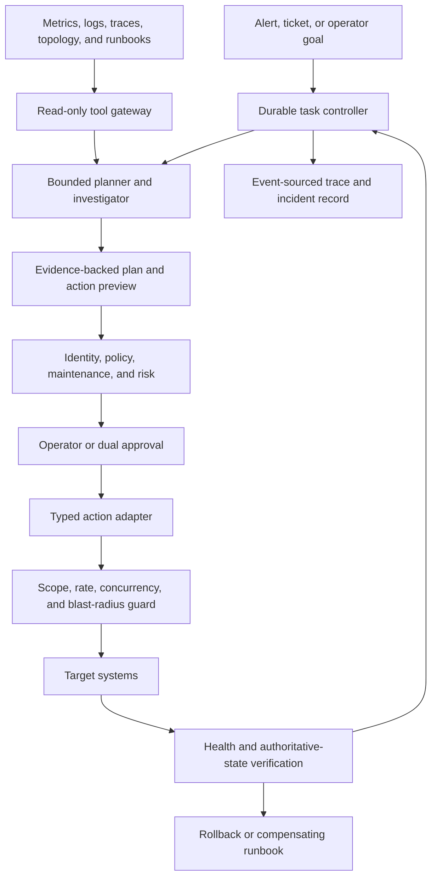
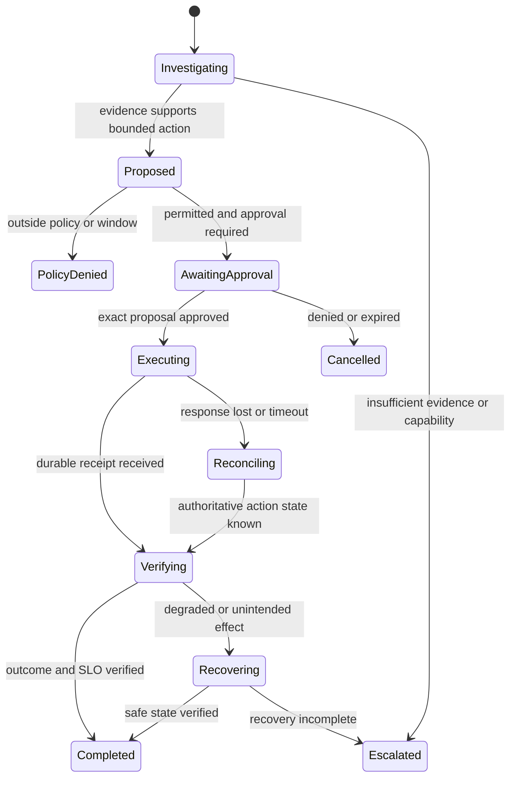

# Agentic operations assistant

> _Last reviewed: 2026-07-16 — see the [freshness policy](../appendix/maintenance.md)._

## Learning objectives

After this chapter you will be able to bound an operations agent's authority, design durable state and narrow tools, implement approval/recovery and evaluate actions against authoritative infrastructure state.

## Decision in one sentence

> **Let the agent investigate broadly but change systems narrowly, through typed runbook actions with explicit authority, blast-radius limits and recovery.**

## 1. Suitable tasks

Good initial tasks are evidence collection, log/metric correlation, incident summarization, runbook lookup, diagnostic commands in a sandbox and read-only recommendations. Postpone or tightly control production writes, security changes, data deletion, broad shell access and actions whose rollback is uncertain.

## 2. Reference architecture



The task controller—not the model context—owns state, leases, attempts, approvals and action identities.

## 3. Authority tiers

| Tier | Capabilities | Default control |
| --- | --- | --- |
| observe | query metrics/logs/config/inventory | automatic with scoped identity |
| diagnose | run predefined read-only diagnostics | sandbox, timeout and output limits |
| propose | produce plan, commands and impact preview | operator review |
| reversible action | restart one workload, scale within cap, toggle approved flag | exact approval and automatic verification |
| consequential action | firewall/IAM/data/schema/security changes | specialist or dual control; narrow window |
| prohibited | disable audit, reveal secrets, arbitrary prod shell, erase evidence | unavailable capability, not prompt rule |

## 4. Durable task state

```yaml
task_id: incident-2026-1842
goal: restore_checkout_latency_slo
status: awaiting_approval
scope:
  environment: production
  services: [checkout-api]
  regions: [ca-central]
budgets:
  deadline: 2026-07-16T21:00:00Z
  max_tool_calls: 30
  max_actions: 1
  max_affected_instances: 2
evidence_refs: [trace-query-91, deployment-772]
proposed_action:
  type: rollout.rollback
  target: checkout-api
  version: 2026.07.16.3
  idempotency_key: incident-2026-1842-action-1
approval: pending
```

Persist append-only events and derive current views. Use leases/heartbeats so two workers do not act concurrently after failover.

## 5. Tool design

Prefer resource-oriented typed operations over shell strings:

```text
deployment.read(namespace, name)
rollout.compare(namespace, name, candidate, incumbent)
rollout.rollback(namespace, name, target_revision, idempotency_key)
service.health(namespace, name, window)
```

Each tool validates caller/delegation, target allowlist, environment, maintenance window, parameters, policy, rate/blast limits and expected current state. It returns a durable receipt and normalized state—not only stdout.

Diagnostic code runs in an isolated environment with read-only mounted artifacts, no production credentials, restricted egress, resource/time limits and captured outputs.

## 6. Planning and evidence

Require the agent to distinguish observation, hypothesis, test, result and proposed action. Plans should state evidence, counterevidence, uncertainty, expected effect, blast radius, verification and rollback.

Do not let runbook or log content grant authority. Retrieved commands are untrusted suggestions and must resolve to approved typed capabilities.

## 7. Action protocol



Approval binds action type, target, parameters, version/current state, effect preview and expiry. Any material plan change requires a new approval.

## 8. Blast-radius controls

Enforce outside the model:

- environment/resource/region allowlists;
- maximum instances, percentage, amount and concurrent actions;
- maintenance windows and change freezes;
- one-action-at-a-time or separation of duties;
- preconditions from current configuration/version;
- rate limits and cumulative incident budget;
- circuit breaker on health degradation;
- global and per-capability kill switches.

## 9. Verification and recovery

An API 200 does not prove recovery. Verify the desired SLO and target state over a defined window, plus adjacent guardrails such as error rate, saturation and customer outcomes.

Use rollback only when semantics are known and safe. Otherwise execute a versioned compensating runbook or escalate. If response is lost after action submission, query by action/idempotency ID before any retry.

## 10. Security and evidence

- use workload identity and constrained delegation with actor lineage;
- broker credentials per tool/target and keep them out of model context;
- isolate tools by environment and consequence;
- validate all model-authored parameters and outbound destinations;
- protect against log/runbook/ticket prompt injection;
- sign/version runbooks, tools, policies and agent configuration;
- preserve who proposed, approved, executed and verified;
- redact secrets from observations before model/log storage.

## 11. Evaluation and operations

Create seeded incident environments and replayable snapshots. Measure diagnosis correctness, evidence sufficiency, forbidden action rate, approval correctness, verified remediation, recovery/escalation, duplicate/unknown action, steps/tool calls, time-to-diagnose/restore, operator workload and cost.

Test stale topology, misleading logs, injected ticket/runbook text, denied credentials, partial outage, tool timeout, lost response, concurrent incident, failed rollback and context compaction.

## 12. Rollout

Progress from offline/sandbox to read-only production, proposed actions, internal low-risk reversible actions and narrowly scoped production actions. Expand by capability and environment, not autonomous-agent traffic. Keep ordinary runbooks and on-call access usable.

## Northstar worked example

After checkout latency rises following deployment `2026.07.16.3`, the agent correlates traces and deployment events, compares the prior revision and proposes rolling back two instances. Policy confirms the window and scope; the on-call approves exact parameters. The adapter submits once, verifies deployment and latency/error SLOs, and records the receipt. If health worsens, a predefined recovery runbook pauses the rollout and escalates.

## Practical artifact

Submit authority tiers, reference diagram, durable state/event schema, typed tool catalog, approval contract, blast-radius policy, verification/recovery runbook, threat model, evaluation environment, SLOs and progressive rollout plan.

## Lab

Build a simulated service/deployment environment. Inject latency, stale logs, malicious runbook text, denied action, lost rollback response and worsening health. Demonstrate evidence-backed proposal, exact approval, durable reconciliation, blast containment, verification and escalation.

## Check yourself

1. Which state survives model/context loss?
2. Why is arbitrary production shell access not a reasonable first tool?
3. What binds an approval to one exact action?
4. Which evidence proves remediation rather than command success?
5. What happens when rollback makes health worse?

## Further reading

- [Durable agent orchestration, state and recovery](../05-agents/02-orchestration-state.md).
- [Secure agent execution and sandboxing](../07-security-governance/06-secure-agent-execution.md).
- [Incident response and graceful degradation](../08-platform-operations/04-incidents-degradation.md).
