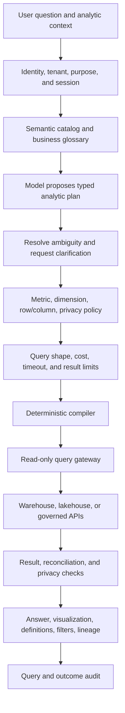

# Natural-language analytics

> _Last reviewed: 2026-07-16 — see the [freshness policy](../appendix/maintenance.md)._

## Learning objectives

After this chapter you will be able to design governed text-to-query analytics, use a semantic layer, constrain execution, validate results and explain definitions, filters and uncertainty.

## Decision in one sentence

> **Let the model plan against an approved semantic interface; let deterministic services authorize, compile, execute and verify the query.**

Natural language makes analytics accessible but hides ambiguity. “Revenue,” “active customer,” “last quarter” and “Canada” may each have several definitions. The system must make those decisions visible instead of generating plausible SQL against raw schemas.

## 1. Reference architecture



## 2. Semantic layer before SQL

Expose approved metrics, dimensions, joins, time grains and policies:

```yaml
metric: net_revenue
description: recognized shipment revenue net of refunds and tax
owner: finance-analytics
expression_ref: metric://finance/net_revenue/v7
time_dimension: recognized_at
allowed_grains: [day, week, month, quarter]
dimensions: [product, region, customer_segment]
required_filters:
  - tenant_scope
freshness_slo: 4h
privacy:
  minimum_group_size: 10
  prohibited_dimensions: [customer_name]
```

The model sees names, definitions, examples and constraints—not warehouse credentials or every physical table. A compiler owned by the data platform maps the typed plan to SQL or another query language.

## 3. Analytic plan contract

```json
{
  "question": "Why did Canadian net revenue fall last quarter?",
  "metrics": ["net_revenue"],
  "dimensions": ["product", "week"],
  "filters": [{"field": "country", "operator": "eq", "value": "CA"}],
  "timeRange": {"kind": "previous_fiscal_quarter"},
  "comparisons": ["previous_quarter", "same_quarter_previous_year"],
  "requestedAnalysis": "contribution_change",
  "ambiguities": [],
  "limit": 500
}
```

Validate identifiers against the catalog. Reject free-form SQL fragments, table names and operators outside the plan schema.

## 4. Clarify material ambiguity

Ask a focused question when different interpretations change the answer:

- calendar versus fiscal quarter;
- booked, billed, recognized or collected revenue;
- customer billing address versus shipment destination;
- gross versus net of refunds/tax;
- current segmentation versus historical-at-event segmentation;
- point-in-time versus latest corrected data.

Do not ask for clarification when an organization-wide default is explicit and displayed. Record the selected definition and make it editable.

## 5. Authorization and privacy

Enforce:

- workload/user identity and tenant;
- metric/dimension permission;
- row- and column-level policy at the data system;
- purpose and approved data product;
- aggregation and minimum-group rules;
- query/result export and retention limits;
- regional/residency route;
- differential privacy or disclosure controls where required.

The model must never author the security predicate. Use database/semantic-layer policy as the final enforcement boundary.

## 6. Query safety and resource governance

Compile only read-only statements through a restricted service account. Apply allowlisted functions, bounded joins/subqueries, partitions/time filters, scanned-byte or compute estimates, timeout, concurrency, result rows/cells and cancellation.

Use `EXPLAIN`/dry-run estimates before expensive execution. Reject Cartesian joins, unbounded raw-detail queries and repeated query-rewrite loops. Cache only when policy, semantic version, filters, freshness and user scope match.

## 7. Validation

Before presenting a result:

- confirm query executed against intended semantic/warehouse version;
- reconcile totals with an approved baseline/dashboard when available;
- check units, currency, timezone and null/denominator handling;
- enforce aggregation/privacy thresholds on the result;
- detect empty, partial, truncated or stale data;
- validate chart encodings and labels;
- distinguish observed association from causal explanation;
- ensure narrative numbers match returned data.

Models can generate hypotheses about “why,” but causal claims require experimental or credible causal analysis. Contribution analysis shows what segments account for a change, not necessarily what caused it.

## 8. Explanation contract

Return:

1. direct answer with units and time period;
2. metric/term definitions and selected interpretation;
3. filters, comparison and data freshness;
4. compact table/visualization with accessible text alternative;
5. query/plan reference and lineage;
6. uncertainty, exclusions and limitations;
7. a way to refine, inspect or export under policy.

Never invent rows or smooth inconvenient results. If the query fails, state failure and preserve the plan for retry rather than narrating a likely answer.

## 9. Multi-turn state

Store a typed analytic session: active metrics, dimensions, filters, time, comparison, semantic version and result references. Resolve “now break that down by product” against this state, not a summarized transcript. Display active filters and allow reset.

## 10. Threats and controls

| Threat/failure | Control |
| --- | --- |
| schema reconnaissance | semantic catalog and permission-scoped discovery |
| prompt injection in catalog/data | treat descriptions/results as data; fixed policy hierarchy |
| sensitive differencing | aggregation, query history and disclosure controls |
| expensive query denial | estimates, budgets, admission and cancellation |
| metric-definition drift | versioned semantic layer and owner approval |
| plausible wrong narrative | result-to-claim validation and source display |
| write/destructive SQL | typed plan, deterministic compiler, read-only identity |
| cross-tenant cache | authorization/tenant/version in cache key |

## 11. Evaluation

Create question sets by metric, ambiguity, join, filter, time, comparison, conversational follow-up and privacy condition. Measure semantic resolution, clarification correctness, plan and executable query accuracy, result-set equivalence, policy violations, numerical/narrative fidelity, chart correctness, abstention, p95 latency, scanned data/compute, cost and verified decision/task outcome.

Exact SQL string match is weak because equivalent queries differ. Compare typed plans, execution results and invariants on frozen fixtures, plus authoritative production reconciliation.

## 12. Reliability and degradation

If the model is unavailable, preserve ordinary dashboards, catalog search and query builder. If the warehouse is unavailable, show cached governed results with age only when permitted. If validation/reconciliation fails, return the plan/error rather than an analysis. Long queries become cancellable asynchronous tasks with durable identity.

## Northstar worked example

An executive asks why Canadian net revenue fell last quarter. The assistant resolves fiscal quarter and the Finance-owned `net_revenue` metric, then proposes product/week contribution analysis. Policy prevents customer-level detail, cost controls apply partitions, execution returns data and validation reconciles the total to the certified finance dashboard. The explanation identifies contribution changes but explicitly avoids claiming causes.

## Practical artifact

Submit semantic metric contract, typed plan schema, authorization/query policy, reference diagram, ambiguity rules, validation/reconciliation matrix, explanation contract, evaluation set, SLO/cost controls and degradation plan.

## Lab

Build a small semantic catalog and compiler over a Northstar dataset. Test ambiguous metrics, fiscal time, multi-turn refinement, prohibited dimensions, expensive joins, malicious catalog text, empty/truncated results and a false causal prompt. Demonstrate safe clarification, read-only execution and reproducible result evidence.

## Check yourself

1. Why is raw schema-to-SQL unsafe as the primary architecture?
2. Which layer supplies security predicates?
3. What makes two different SQL queries equivalent for evaluation?
4. When does contribution analysis not establish causality?
5. How does a user inspect the definition behind the answer?

## Further reading

- [Knowledge graphs, SQL and hybrid retrieval](../03-data-context/03-hybrid-retrieval.md).
- [Multi-tenant AI, privacy and confidential data](../04-llm-systems/04-state-tenancy.md).
- [Evaluation datasets and rubrics](../06-evaluation/01-datasets-rubrics.md).
