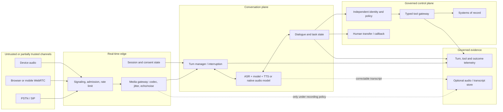
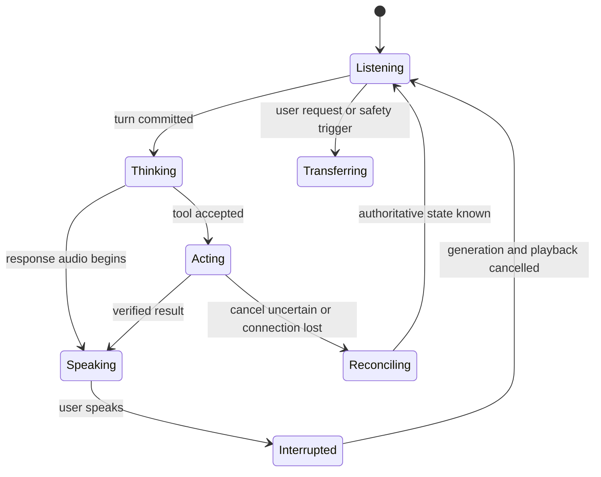

# Designing production voice AI agents

> _Last reviewed: 2026-07-16 — see the [freshness policy](../appendix/maintenance.md). Product mappings are dated; recheck availability, limits, regions and lifecycle before implementation._

## Learning objectives

After this chapter you will be able to:

- decide whether voice is the right interaction mode;
- compare cascaded, native speech-to-speech and hybrid designs;
- design transport, session state, turn-taking and interruption;
- separate conversation from identity, authorization and business actions;
- budget latency, capacity, reliability, privacy and cost;
- define voice-specific evaluation and a safe human handoff.

## Decision in one sentence

> **Treat voice as a real-time, fallible interaction layer around a governed agent—not as identity, authority or the system of record.**

A fluent demo can hide the errors that matter: the agent cuts off a hesitant speaker, reads an incorrect refund amount, continues a tool call after interruption, loses the result during reconnect or treats a familiar-sounding voice as authorization. The architecture must make those states explicit.

## 1. Decide whether voice earns its complexity

Voice is valuable when users are hands-busy, eyes-busy, mobile, unable to use a screen, calling through the telephone network or coordinating in real time. It can reduce interface navigation and make support more accessible.

Voice is a poor primary channel for dense comparisons, exact identifiers, long procedures, private public-space use or actions requiring a durable reviewable record. Offer text or visual confirmation when exactness matters, and never make voice the only path to essential service.

Write the task contract before selecting a model:

| Question | Example answer |
| --- | --- |
| User and environment | customer on a noisy mobile call |
| Outcome | correctly answer order status or complete an approved refund |
| Consequence | wrong disclosure or duplicate financial action |
| Required channels | telephone plus optional app/SMS handoff |
| Turn target | responsive without cutting off ordinary hesitation |
| Identity source | authenticated app session or independent verification |
| Action authority | policy service and typed refund API |
| Safe fallback | queue/callback, text or human agent |

## 2. Choose the conversation architecture

| Pattern | Best fit | Main trade-off |
| --- | --- | --- |
| Cascaded ASR → text agent → TTS | component choice, inspectable transcript, deterministic text controls | compounded latency and transcription/synthesis error |
| Native speech-to-speech | expressive, low-latency conversation and multilingual switching | less component isolation and harder diagnosis |
| Hybrid audio plus text control shadow | natural interaction with typed tools, audit state and independent checks | more state synchronization |
| Push-to-talk or explicit turns | safety-critical, noisy or constrained settings | less conversational flow |
| Full-duplex streaming | coaching, assistance and fluid dialogue | overlap, cancellation, cost and evaluation complexity |

The hybrid pattern is a strong enterprise default: the audio model handles conversation, while a typed control plane owns identity, policy, tool schemas, action state and evidence. A transcript is useful evidence but is not a perfect record of what the audio model perceived; preserve corrections and model/tool state separately.

## 3. Reference architecture and trust boundaries



Trust the authenticated session, not caller ID or vocal resemblance. Treat ambient speech, hold music, other speakers and media played near the microphone as untrusted input. Keep credentials and raw system responses away from the speech prompt unless the task requires them.

## 4. Select channel and transport deliberately

The [W3C WebRTC Recommendation](https://www.w3.org/TR/webrtc/) supplies browser APIs for real-time media and data. It does not provide the application session, authorization, consent or business workflow.

| Channel | Use it for | Design concerns |
| --- | --- | --- |
| WebRTC | low-latency browser/mobile media | signaling, short-lived credentials, device permission, NAT traversal, jitter, reconnection |
| WebSocket audio | server-to-server model streaming | audio framing, backpressure, heartbeats, cancellation, credential isolation |
| SIP/PSTN | inbound/outbound telephone calls | carrier rules, DTMF, caller-ID spoofing, transfer, recording law, 8 kHz audio, codecs, toll fraud |
| On-device | privacy, offline or edge response | model size, battery, hardware variance, update and telemetry limits |

Avoid unnecessary transcodes. Record the negotiated codec, sample rate, packet loss, jitter and audio path because they influence recognition and turn behavior. Test the production telephone path; studio microphones conceal the failures users experience.

## 5. Make the session contract explicit

A reconnectable voice session should carry at least:

- session, conversation, task and turn identifiers;
- authenticated subject and assurance source, or an explicit anonymous state;
- channel, locale, codec and accessibility preferences;
- AI disclosure, recording consent, retention class and recording indicator;
- listening, thinking, tool-running, speaking, interrupted, transferring and disconnected states;
- audio offsets, accepted transcript revisions and conversation-item version;
- model, prompt, agent, tool and policy versions;
- allowed tools, limits, time/cost budgets and approval requirements;
- in-flight action ID, idempotency key and known/unknown outcome;
- human-transfer context and reconnection token.

Expire model-session credentials independently from the user session. Do not restore a stale conversation merely because a media connection reconnects.

## 6. Budget perceived latency, not model latency

```text
capture and packetization
+ network and jitter buffer
+ endpoint / end-of-turn decision
+ speech or native-audio input processing
+ model reasoning and tool time
+ synthesis startup
+ network and playback buffer
= perceived response onset
```

Set task-specific p50, p95 and timeout targets for each term. There is no universal “human” latency threshold: a short acknowledgment, a factual answer and a transaction have different expectations. Acknowledgment can mask tool time only when it accurately states that work is still pending; it must not imply completion.

Measure interruption stop time from detected user speech to silence at the speaker, not to a server cancellation event. Also measure the time until the agent correctly resumes or asks for clarification.

## 7. Engineer turn-taking, not just voice activity detection

Voice activity detection (VAD) estimates whether speech is present; it does not know whether the speaker has completed a thought. Fixed silence thresholds often cut off hesitation or create long gaps. Research on live turn prediction shows why acoustic and incremental linguistic cues can improve the latency/cut-in trade-off ([Maier, Hough and Schlangen, Interspeech 2017](https://www.isca-archive.org/interspeech_2017/maier17_interspeech.html); [Chang et al., Interspeech 2022](https://www.isca-archive.org/interspeech_2022/chang22_interspeech.html)).

Design and evaluate:

- acoustic VAD plus semantic endpointing;
- mid-turn pauses, fillers, self-correction and code-switching;
- short backchannels such as “uh-huh” that should not seize the floor;
- overlapping speakers, crosstalk, hold music and speaker changes;
- adaptive thresholds by task, language, channel and user preference;
- manual commit or push-to-talk as an accessible, predictable fallback;
- multi-party floor ownership rather than assuming one user.

If camera input is permitted and useful, visual cues can contribute to end-of-utterance prediction, but they add consent, accessibility and bias concerns. A published Interspeech study found improvement on its online-interview dataset when visual cues were combined with acoustic and verbal features; validate the effect in the target setting rather than generalizing it ([Kurata et al., 2023](https://www.isca-archive.org/interspeech_2023/kurata23_interspeech.html)).

## 8. Define barge-in as a cancellation protocol

When the user interrupts, these are separate operations:

1. stop local playback immediately and discard queued audio;
2. tell the model to stop generating and truncate unplayed assistant content;
3. cancel pending function calls when the provider and tool semantics permit it;
4. do **not** assume a submitted business action was cancelled;
5. reconcile any unknown outcome before retrying;
6. preserve what the user actually heard, then resume or clarify.



The media pipeline can be cancelled; an external side effect may already have committed. Give every consequential action a durable state and idempotency key.

## 9. Write for the ear

Spoken output disappears. A user cannot scan a paragraph or inspect a table while listening.

- Put the answer and next decision early.
- Use short sentences and small choice sets.
- Replace visual references such as “the third item above.”
- Chunk long procedures and ask before continuing.
- Read critical names, dates, amounts and identifiers back in a controlled form.
- Support pronunciation dictionaries or SSML where the speech stack permits it.
- Do not speak access tokens, full payment data or unnecessary sensitive fields.
- Treat tone and persona as product behavior; do not imitate a real person without rights and explicit approval.

Keep operational instructions separate from persona. A friendly voice must still say when it is uncertain, when a tool is pending and when a human has taken over.

## 10. Put consequential actions behind typed controls

Use a propose → confirm → execute → verify protocol:

1. The conversation plane collects intent and parameters.
2. A typed tool validates schema, subject, policy, limits and current state.
3. The agent presents the exact action and important parameters.
4. The user confirms through an appropriate channel; higher-risk actions may require an authenticated app, keypad or human.
5. The tool executes with idempotency and returns a durable transaction identity.
6. The agent verifies the system of record before announcing completion.

“Yes” is not sufficient when the confirmation question was ambiguous or interrupted. Never infer approval from silence, a positive tone or continued conversation.

## 11. Separate vocal likeness from identity

A cloned, replayed or similar voice can sound convincing. NIST's current digital-identity guidance prohibits voice-based biometric comparison in the authenticator requirements it covers ([NIST SP 800-63B change log](https://pages.nist.gov/800-63-4/sp800-63b/changelog/)). Even outside that scope, voice likeness should not grant authority.

Prefer an authenticated app/session, possession factor, one-time challenge, independently sourced account data or transfer to a trained human. Build defenses for:

- replay, synthetic speech and social-engineering attacks;
- background or media-borne prompt injection;
- SIP/caller-ID spoofing, robocall abuse and toll fraud;
- unauthorized custom voices and impersonation;
- harassment, crisis content and vulnerable users;
- data exfiltration through spoken output;
- tool escalation caused by misheard parameters.

The [ASVspoof 2021 challenge paper](https://arxiv.org/abs/2109.00537) illustrates that logical-access, physical-access and deepfake speech are distinct attack conditions. Spoof detectors can be defense-in-depth signals, not proof of identity.

## 12. Design privacy, consent and retention into the call path

Before capture or recording, define:

- when and how the system discloses that it is AI;
- whether audio is processed transiently, recorded or used for improvement;
- the lawful notice/consent flow for every operating jurisdiction;
- treatment of bystanders and multiple speakers;
- separate retention for raw audio, transcripts, summaries, embeddings and tool evidence;
- redaction, human access, region, encryption, deletion and legal hold;
- rights and consent for custom or cloned voices.

Do not equate “not recorded” with “not processed.” Keep the recording control and indicator outside the model so a prompt cannot disable them. Regulatory requirements change by jurisdiction and date; obtain legal review rather than copying a generic disclosure.

## 13. Build an equivalent accessible path

The W3C accessibility guidance for audio and video calls for appropriate alternatives such as transcripts and captions and accessible media controls ([W3C WAI](https://www.w3.org/WAI/media/av/)). A production voice experience should offer:

- live, correctable transcript and a text alternative;
- keyboard, touch, switch or push-to-talk controls;
- visible listening, processing, speaking, muted, recording and disconnected state;
- adjustable playback volume/rate and a replay control;
- screen-reader-compatible status announcements;
- language selection and a way to slow or simplify responses;
- human transfer without requiring repeated failed speech attempts.

Evaluate with disabled users and assistive technologies. Accent testing is not a substitute for accessibility research.

## 14. Design degradation and human transfer first

| Failure | Safe behavior |
| --- | --- |
| noisy or low-confidence input | ask one focused clarification; offer keypad/text |
| repeated false endpoint | increase pause tolerance or offer push-to-talk |
| model or speech dependency unavailable | use deterministic menu, callback or human |
| tool is slow | state that it is pending; do not claim success |
| disconnect before an action response | reconcile by action ID before retry |
| transcript and user correction conflict | retain both; use corrected value only after validation |
| suspected spoofing or abuse | limit disclosure/actions and transfer to risk flow |
| transfer fails | preserve place in queue and offer a callback |

Transfer a structured brief containing authenticated identity state, consent state, user goal, confirmed facts, attempted actions, tool results and unresolved risks. Do not force the user to repeat sensitive information solely because the AI and human systems use different session models.

## 15. Observe without recording everything

Raw audio is not a prerequisite for useful telemetry. Trace:

- session, turn, conversation-item and action identifiers;
- VAD/end-of-turn events, speech start/stop and interruption cause;
- audio quality, codec, packet loss and reconnect events;
- accepted transcript plus correction lineage where permitted;
- model/prompt/tool/policy versions and tool outcome;
- consent, authentication, approval and transfer events;
- stage-level latency, token/audio usage and cost;
- task outcome, correction burden and escalation.

Treat call recording as a separately justified data product with access, retention and deletion controls. Sample only when the purpose and permissions allow it; prefer derived operational metrics for routine monitoring.

## 16. Evaluate the conversation and the action

| Dimension | Measures and tests |
| --- | --- |
| Input understanding | word error rate plus entity, number, date, negation and intent accuracy |
| Turn-taking | false cut-in, late endpoint, overlap, backchannel handling, floor errors |
| Interruption | playback stop time, cancelled-generation accuracy, action reconciliation |
| Speech output | intelligibility, pronunciation, numerical fidelity, speaker consistency |
| Task | verified success, wrong action, duplicate action, recovery and transfer quality |
| Safety/privacy | prohibited disclosure/action, consent behavior, injection, spoof/replay handling |
| Accessibility | success with text/control alternatives and assistive technologies |
| Reliability | reconnect, dependency failure, long call, packet loss and unknown outcome |
| Economics | cost per successfully resolved task, concurrency and human minutes displaced/added |

Slice results by language, accent/dialect, speaking rate, disability, device, microphone, channel, network, noise, age range where lawful, and new versus returning users. Use repeated trials: a single successful conversation does not establish reliability. Include human review and authoritative tool state, not only a model judge.

Recent work proposes richer evaluation of timing, overlap, interruption and backchannels instead of scoring only transcription or response content ([Talking Turns, 2025](https://arxiv.org/abs/2503.01174)). Treat new benchmarks as evidence to evaluate, not universal production acceptance criteria.

## 17. Plan capacity and unit economics

Voice holds resources for the duration of a live session. Model:

- concurrent sessions and admission control;
- ingress/egress audio minutes or audio-token use;
- ASR, model, TTS and telephony charges;
- WebRTC/SIP/media infrastructure and regional egress;
- idle silence, hold time and long-running tool calls;
- optional recording/transcript storage and review;
- fraud, abandoned calls, retries and human-transfer minutes.

Use per-success economics, not cost per call. Enforce call/session limits with a graceful continuation or callback path, and load-test reconnection and synchronized cancellation—not merely requests per second.

## 18. Dated platform mapping

The durable architecture above should survive provider changes. As of **2026-07-16**, representative managed options include:

| Platform | Current official capability to evaluate | Architecture questions |
| --- | --- | --- |
| [OpenAI Realtime API](https://platform.openai.com/docs/api-reference/realtime) | real-time audio over WebRTC, WebSocket or SIP; native audio, VAD and tool calling | ephemeral/client credentials, transcript semantics, cancellation and SIP integration |
| [Google Gemini Live API](https://ai.google.dev/gemini-api/docs/live-api) | preview real-time audio/video/text over stateful WebSocket; barge-in, tools and transcriptions | preview status, session limits, ephemeral tokens and reconnection |
| [Amazon Nova 2 Sonic](https://docs.aws.amazon.com/nova/latest/nova2-userguide/using-conversational-speech.html) | bidirectional streaming speech-to-speech, multilingual conversation and tool use | Bedrock/Connect integration, region, telephony path and model lifecycle |
| [Azure Voice Live](https://learn.microsoft.com/en-us/azure/ai-services/speech-service/voice-live) | bidirectional WebSocket voice agents with speech processing and end-of-turn controls | model/region choice, event protocol, identity and Foundry integration |

Do not let a feature checklist choose the architecture. Run the same task, network, accent/language, interruption, safety and recovery suite against every candidate. Keep provider events behind an internal session/action contract so model replacement does not rewrite business controls.

## Northstar worked example

Northstar's customer calls about a damaged order and requests a refund.

```mermaid
sequenceDiagram
    participant U as Customer
    participant V as Voice channel
    participant A as Conversation agent
    participant P as Identity and policy
    participant R as Refund workflow
    participant H as Human agent

    V->>U: Disclose AI and recording status
    U->>V: Describe damaged order
    V->>A: Audio plus session/turn events
    A->>P: Resolve independently authenticated customer
    P-->>A: Permitted orders and assurance level
    A->>U: Confirm selected order and proposed amount
    U->>A: Interrupt and correct the amount
    A->>A: Cancel playback; update proposed action only
    A->>U: Read exact corrected action; request confirmation
    U->>P: Confirm through authenticated app or approved channel
    P->>R: Execute typed action with idempotency key
    R-->>P: Durable refund ID and verified state
    P-->>A: Confirmed result
    A->>U: State completion and reference
    alt uncertainty, failed verification or user request
        A->>H: Structured transfer brief
    end
```

The voice model never receives refund authority. If the call drops after submission, Northstar queries the refund ID/idempotency key before retrying. The customer can use the app or a human path at every consequential step.

## Practical artifact: voice-agent design pack

Submit:

1. task/user/environment and why voice is appropriate;
2. cascade/native/hybrid decision and rejected alternatives;
3. channel, transport, media path and trust boundaries;
4. session schema and turn/interruption state machine;
5. p50/p95 stage-level latency and concurrency budget;
6. identity, consent, recording, retention and threat model;
7. tool authority, confirmation and unknown-outcome protocol;
8. accessibility, degradation and human-transfer design;
9. evaluation matrix, slices, baselines and release thresholds;
10. unit economics and dated provider evidence.

## Lab

Build or simulate the Northstar flow. Inject noisy speech, long hesitation, a backchannel, overlapping speakers, a wrong amount transcript, code-switching, packet loss, repeated interruption, disconnect before tool response, replayed synthetic voice and model outage. Demonstrate:

- correction without silently rewriting history;
- playback and generation cancellation;
- reconciliation of an uncertain refund;
- no authorization from voice likeness;
- accessible text/keypad fallback;
- structured human transfer;
- trace evidence for each final outcome.

## Check yourself

1. Why can VAD not determine semantic end-of-turn by itself?
2. What exactly must happen when a user interrupts during a tool call?
3. Which state proves identity and which state proves action approval?
4. What evidence distinguishes “the agent said it succeeded” from success?
5. How does the experience continue when audio or the model fails?
6. Which metrics reveal that low latency was achieved by cutting users off?

## Further reading

- [W3C WebRTC Recommendation](https://www.w3.org/TR/webrtc/).
- [W3C WAI: audio and video media accessibility](https://www.w3.org/WAI/media/av/).
- [NIST SP 800-63B: authentication and authenticator management](https://pages.nist.gov/800-63-4/sp800-63b.html).
- [Maier, Hough and Schlangen: deep end-of-turn prediction, Interspeech 2017](https://www.isca-archive.org/interspeech_2017/maier17_interspeech.html).
- [Chang et al.: turn-taking prediction for natural conversational speech, Interspeech 2022](https://www.isca-archive.org/interspeech_2022/chang22_interspeech.html).
- [Kurata et al.: multimodal end-of-utterance prediction, Interspeech 2023](https://www.isca-archive.org/interspeech_2023/kurata23_interspeech.html).
- [Talking Turns: benchmarking audio foundation models on turn-taking dynamics, 2025](https://arxiv.org/abs/2503.01174).
- [ASVspoof 2021: accelerating progress in spoofed and deepfake speech detection](https://arxiv.org/abs/2109.00537).
- [Multimodal, real-time voice and computer-use architectures](../02-ai-landscape/05-multimodal.md).
- [Tools, authorization and identity](../05-agents/01-tools-authorization.md).
- [Reliability, latency and resilience](../04-llm-systems/02-reliability-latency.md).
