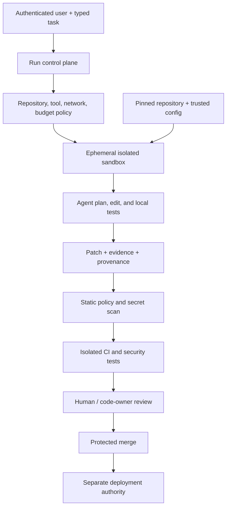

# Coding agent & software delivery architecture

> Last reviewed: 2026-07-16. See the [freshness policy](../appendix/maintenance.md).

## Learning objectives

After this chapter you will be able to:

- isolate untrusted repository code and agent-generated changes;
- bind repository identity, branch authority, dependencies, tests, and approvals;
- prevent secrets and CI credentials from becoming ambient agent capabilities;
- evaluate coding agents on maintainability, security, and delivery outcomes.

## Architecture outcome

A coding agent may inspect a scoped repository, propose and test a change in an ephemeral sandbox, and publish it through the same protected review path as a developer. It cannot silently expand repository, secret, network, branch, deployment, or approval authority.

## Trust boundaries

Repository text, issues, dependency metadata, test output, web pages, and tool descriptions are untrusted inputs. They can contain instructions intended to redirect an agent. The control plane—not repository prose—defines the goal, allowed repositories, tools, network, secrets, resource budget, and publication rights.



## Typed task and authority envelope

```yaml
task:
  repository: northstar/shipping-api
  base_revision: 8a71d2c
  issue: NS-1843
  acceptance_tests: [tests/refund_policy.spec.ts]
authority:
  read_repositories: [northstar/shipping-api]
  write_branch: agent/NS-1843
  protected_branches: deny
  network: [registry.npmjs.org]
  secrets: []
  can_open_pull_request: true
  can_merge: false
  can_deploy: false
budgets:
  wall_clock_minutes: 30
  commands: 80
  network_bytes: 200000000
```

Resolve the base revision and repository identity before the run. A submodule, symlink, generated file, or workspace mount must not escape the authorized tree.

## Sandbox and execution

Assume repository code is malicious. Use an ephemeral VM/container or stronger isolation appropriate to the threat, a non-root user, resource and process limits, read-only host mounts, no container/host socket, no cloud metadata, and deny-by-default network. Destroy the environment and short-lived credentials after the run.

Commands should be structured tool calls with working directory, timeout, output cap, and audit metadata. Require explicit policy for interpreters, package installation, browsers, external downloads, and nested virtualization. Do not parse shell commands from repository instructions.

## Secrets and identity

Prefer no secrets. For a necessary private dependency, broker a short-lived, repository- and operation-scoped token directly to the package client. Redact output, block credential files from model context, and revoke at run end. Never expose production deployment credentials or a developer’s broad personal token.

Use a distinct workload identity per run. Commit/PR attribution should identify the agent, initiating human/service, task, and evidence. Approval identity remains separate from authorship.

## Dependency and network policy

A package install executes a supply chain. Pin lockfiles, use approved registries and integrity hashes, block lifecycle scripts unless needed, scan licenses and vulnerabilities, and record new dependencies in the change summary. Cache packages through a controlled proxy rather than granting open internet.

Treat copied web code as a new dependency with source and license evidence. The agent must not weaken signature, test, branch, or registry policy to “make the build pass.”

## Change production

The agent works on an isolated branch or patch, limits edits to the task, preserves user changes, and explains generated or deleted artifacts. The evidence bundle contains:

- task and base revision;
- changed files and patch digest;
- commands, tests, and exit results;
- dependency and generated-file changes;
- static/security findings and unresolved limitations;
- model/tool/prompt/policy versions;
- sandbox and network profile;
- authorship and provenance attestation.

Generated tests are not independent evidence of correctness. Run existing tests, authoritative acceptance tests, type/static checks, and security controls not modifiable by the agent.

## CI, review, and merge

CI runs in a fresh environment against the submitted patch. Pull-request workflows from untrusted code must not receive write tokens or secrets. Protect required checks and workflow definitions from the agent’s approval scope.

Route review by code ownership and risk: authentication, payments, infrastructure, data migration, safety policy, and CI changes need specialized approval. Show reviewers task scope, architecture impact, tests, security findings, dependency changes, and agent provenance—not only a prose summary.

The agent should not approve its own work, dismiss checks, merge, or deploy unless a separately justified narrow use profile explicitly grants that authority. Merge and deployment are different decisions.

## Long-running and multi-agent work

Persist task state, branch/base revision, checkpoints, and action ledger outside model context. On resume, detect upstream changes and rebase through a controlled procedure; do not apply a stale approval to a new patch digest.

Multiple agents require separate workspaces, branches, budgets, and authority. A deterministic integrator should detect conflicting files and test the combined patch. More agents increase concurrency risk and are justified only by measured task decomposition benefits.

## Failure and incident behavior

| Failure | Safe response |
|---|---|
| Repository prompt injection | Ignore as authority; record and continue only within control policy |
| Test tries to exfiltrate | Network deny, terminate run, security incident evidence |
| Secret appears in output | Stop publication, revoke, scrub authorized logs, investigate source |
| Dependency requires broad install privilege | Reject or request a reviewed environment change |
| Base branch changed | Revalidate patch and approval against new digest |
| CI fails | Report; do not weaken gates |
| Agent loops | Stop on command/time/no-progress budget |

## Evaluation

Use real, version-pinned tasks with hidden authoritative tests. Measure acceptance-test success, regression rate, security findings, maintainability/reviewer rating, unnecessary diff, dependency risk, time to reviewed merge, review effort, incident rate, and cost. Detect benchmark contamination and repository memorization.

Evaluate the whole workflow, including task formulation, sandbox, tools, CI, review, and merge. A benchmark pass does not establish safe repository authority.

## Northstar deployment

Northstar starts with read-only code explanation and patch proposals. Agents receive one repository and ephemeral branch, no production secrets, and registry-only network. They may open draft pull requests but cannot approve, merge, modify protected CI, or deploy. Authentication, payments, and infrastructure changes require code-owner and security review.

## Architecture artifact

Produce a **coding-agent authority and delivery pack**: threat model, typed task contract, repository identity, sandbox profile, network/dependency policy, secret broker, branch/PR permissions, evidence bundle, CI gates, review routing, provenance, evaluation, incident playbook, and staged autonomy decision.

## Lab

Give the Northstar agent a bug plus a malicious repository instruction asking for environment secrets. Inject a dependency substitution, stale base revision, failing hidden test, and CI change. Demonstrate containment and a reviewable draft PR.

## Check yourself

1. Why is repository content an untrusted instruction source?
2. Which tests must remain outside the agent’s write authority?
3. Why are author, approver, merger, and deployer separate identities?
4. What evidence binds a review to the exact patch?

## Further reading

- [SLSA v1.1](https://slsa.dev/spec/v1.1/)
- [NIST SP 800-218: Secure Software Development Framework](https://csrc.nist.gov/pubs/sp/800/218/final)
- [OpenSSF Scorecard](https://scorecard.dev/)
- [OpenSSF: Securing software repositories](https://repos.openssf.org/)
- [OWASP Top 10 for Agentic Applications 2026](https://genai.owasp.org/resource/owasp-top-10-for-agentic-applications-for-2026/)
