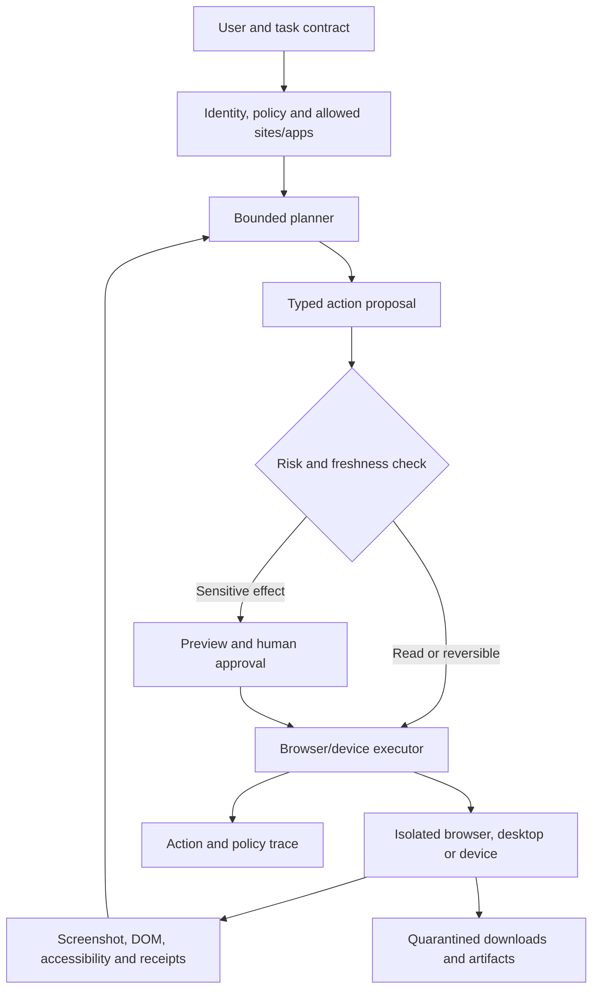

# Designing computer-use, browser and mobile agents

> _Last reviewed: 2026-07-25 — see the [freshness policy](../appendix/maintenance.md). Computer-use models, browser APIs and benchmark results change quickly; validate current providers in an isolated target environment._

## Learning objectives

After this chapter you will be able to:

- decide between API, DOM/accessibility-tree, browser automation and pixel-level control;
- design isolated sessions, observation/action contracts and confirmation boundaries;
- contain prompt injection, stale-screen actions, downloads and credential exposure;
- evaluate browser, desktop and mobile tasks in resettable environments;
- produce a computer-use architecture and rollout decision.

## Decision in one sentence

**Prefer a governed business API; use computer control only for the residual interface gap, inside a disposable environment with restricted identity, typed actions, commit-time checks and task-level evaluation.**

## Select the least fragile interface

| Interface | Strength | Weakness | Use when |
|---|---|---|---|
| Business API/tool | typed, testable and auditable | integration work | supported workflow exists |
| DOM/accessibility tree | semantic targets and lower visual ambiguity | page coupling and injection | controlled web application |
| Browser automation | mature navigation/download controls | selector and session complexity | browser-only workflow |
| Pixel/GUI control | works across opaque interfaces | slow, costly and error-prone | no reliable semantic interface |
| Mobile accessibility/UI automation | device-native reach | ecosystem and permission constraints | approved managed-device use |

Do not call a pixel interface “universal” without pricing its reliability. GUI changes, pop-ups, localization, zoom, animation and partial loads change the observed environment.

## Reference architecture



| Step | Description |
|---:|---|
| 1 | Define target application, account, outcome, prohibited actions and deadline. |
| 2 | Issue a short-lived task identity with site/app and action restrictions. |
| 3 | Plan within step, time, cost and navigation limits. |
| 4 | Express clicks, typing, keys, scrolls and waits as typed actions. |
| 5 | Revalidate screen/application state and authority immediately before effects. |
| 6 | Show the human the target, values and consequence for sensitive commits. |
| 7 | Execute inside an isolated, resettable session. |
| 8 | Feed bounded observations back; treat page content as untrusted data. |
| 9 | Scan and policy-check downloads before release. |
| 10 | Preserve action, observation, receipt and approval evidence. |

## Session and action contract

```yaml
session:
  tenant: northstar-ca
  persona: support-readonly
  allowed_origins: [carrier.example]
  clipboard: disabled
  downloads: quarantine
action:
  type: click
  target: {role: button, name: "Track shipment"}
  observation_hash: sha256:...
  expires_in_ms: 3000
  effect: read
limits:
  steps: 40
  wall_time_s: 180
  spend: 0
```

Bind proposed actions to a recent observation. A confirmation given on one screen must not authorize a different target after navigation. Re-authentication, CAPTCHA, external communication, payment, deletion, submission and legal acceptance require explicit policy; many should be handed back to a human.

## Security and privacy

- isolate browser profile, filesystem, network and credentials per task or tenant;
- allowlist destinations and block link-local, metadata and internal administration endpoints;
- keep passwords, session cookies and tokens out of model-visible text;
- treat webpages, documents and tooltips as prompt-injection sources;
- disable arbitrary clipboard, upload and download paths;
- require malware scanning, content-type verification and retention rules;
- revoke credentials and terminate child processes on cancellation;
- make destructive and external effects idempotent or reconcilable where possible.

## Evaluation

Use resettable environments and verify final application state—not the agent’s final sentence. Measure task success, wrong-site/action rate, policy violations, confirmations, steps/success, recovery, latency and cost. Include layout changes, pop-ups, localization, poor networks, inaccessible controls, stale screenshots and hostile content.

[OSWorld](https://os-world.github.io/) evaluates full operating-system tasks; WebArena and WebVoyager cover browser tasks. Their scores help capability discovery but do not establish reliability on a company’s application, identity model or consequence profile. OpenAI’s original [CUA report](https://openai.com/index/computer-using-agent/) also illustrates why human-level performance cannot be assumed.

## Northstar decision

Northstar uses APIs for order and refund actions. A carrier offers no API for two legacy routes, so a computer-use worker runs in a read-only carrier account, on an isolated browser, and may only retrieve status. It cannot message customers or submit claims. Retrieved status must match order identifiers and becomes an attributed observation; ambiguity escalates.

## Practical artifact: computer-use design pack

Include interface decision, application inventory, identity/session model, observation/action schemas, allowed origins/actions, confirmation matrix, isolation, download policy, failure handling, benchmark plan, production gates and exit path to an API.

## Lab

Build a resettable mock carrier site. Compare DOM and pixel control on ten tasks, then inject a pop-up, layout shift and malicious instruction. Demonstrate observation-bound actions, cancellation and quarantined downloads.

## Further reading

- [OpenAI computer-using agent](https://openai.com/index/computer-using-agent/)
- [OSWorld](https://os-world.github.io/)
- [Microsoft AI Agents for Beginners](https://github.com/microsoft/ai-agents-for-beginners)
- [Secure agent execution and sandboxing](../07-security-governance/06-secure-agent-execution.md)

