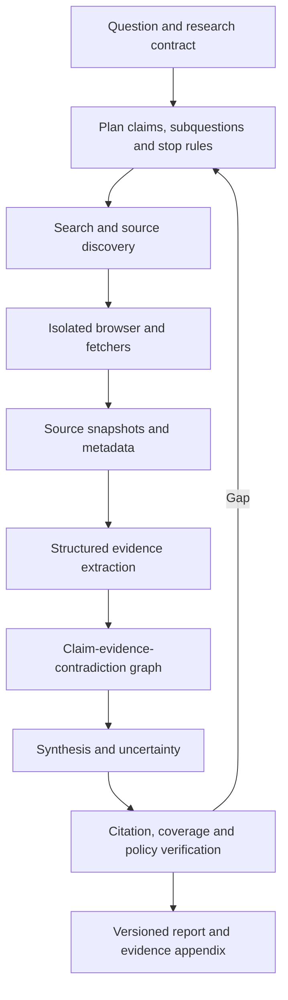

# Designing deep-research and web agents

> _Last reviewed: 2026-07-25 — see the [freshness policy](../appendix/maintenance.md). Search products, site policies and browsing capabilities change; verify terms, robots policies, licenses and current system cards._

## Learning objectives

After this chapter you will be able to:

- turn a research question into a bounded, reviewable research plan;
- design search, browsing, extraction, analysis, citation and artifact stages;
- manage freshness, source quality, contradictions and hostile web content;
- separate finding evidence from synthesized claims;
- evaluate research quality beyond answer fluency.

## Decision in one sentence

**A research agent is credible only when each material claim is traceable to captured evidence, conflicting evidence is handled explicitly, and the search can stop by policy rather than confidence theater.**

## Use profile

Deep research is appropriate for multi-source questions where the output is a decision input, not an authoritative decision. Do not use unrestricted browsing for privileged legal advice, live trading, covert personal-data collection or automatic high-consequence action.

Define question, audience, jurisdictions, date range, acceptable sources, excluded sources, budget, deadline, required artifact and human review. Clarify whether recency, completeness, authority or breadth dominates.

## Reference architecture

| Step | Description |
|---:|---|
| 1 | Record the user question, decision, scope, exclusions and freshness date. |
| 2 | Decompose into answerable claims and define stopping conditions. |
| 3 | Generate diverse search paths; do not equate ranking with authority. |
| 4 | Browse in isolation with domain, network and download controls. |
| 5 | Capture URL, title, author/publisher, published/retrieved dates and content hash. |
| 6 | Extract bounded evidence with exact source locations and interpretation notes. |
| 7 | Connect claims to support, contradiction and missing evidence. |
| 8 | Synthesize with calibrated uncertainty and scope limits. |
| 9 | Verify every citation and material-claim coverage before release. |

## Source and evidence policy

Prefer primary sources for specifications, laws, product behavior and research. Use reputable secondary sources for synthesis and disagreement. Treat SEO pages, generated content, social posts and anonymous claims as leads unless the research contract permits them as evidence.

Distinguish:

- **source existence:** the page was retrieved;
- **source quality:** it is appropriate evidence for this claim;
- **entailment:** the cited passage supports the claim;
- **freshness:** the claim remains current for the decision date;
- **coverage:** material claims have adequate evidence;
- **independence:** apparently different sources are not copying one origin.

## Hostile and changing web

Web content can instruct the agent, redirect it, fingerprint it or deliver malicious files. Separate data from instructions, restrict navigation and downloads, block internal addresses and credentials, and scan artifacts. Respect access controls, terms, copyright and rate limits. Store only what the research and retention policy permit.

Dynamic pages can change after citation. Preserve a governed snapshot or excerpt/hash where lawful, while linking the canonical source. Mark inference explicitly and record unresolved conflict rather than forcing false consensus.

## Planning and stopping

Stop when the claim set reaches required coverage and marginal search value falls below cost/risk, or when deadline/budget is reached. Also stop for blocked access, unsafe collection, excessive uncertainty or a question requiring an accountable expert. Prevent loops with query similarity, domain saturation and no-new-evidence counters.

## Evaluation

Measure citation correctness, material-claim coverage, source authority/diversity, freshness, contradiction handling, factual accuracy, task usefulness, latency and cost. Include adversarial pages, copied sources, stale official pages, paywalls, PDFs, images and ambiguous entity names.

[BrowseComp](https://openai.com/index/browsecomp/) tests hard browsing questions and explicitly warns about contamination; it is a capability benchmark, not a complete enterprise research evaluation. The [Deep Research system card](https://openai.com/index/deep-research-system-card/) documents browsing-specific risks and mitigations.

## Northstar decision

Northstar uses a research agent to compare carrier claims processes across regions. The contract requires official carrier and regulator sources as primary evidence, a retrieval date, contradiction table and a human logistics owner. Findings may update a proposal, but cannot directly modify refund policy.

## Practical artifact: research assurance pack

Include research contract, plan, source policy, browser controls, snapshot/evidence schema, claim graph, stop rules, evaluation, report template, retention and reviewer role.

## Lab

Research one changing cloud-agent capability across AWS, Azure and Google Cloud. Require primary sources, retrieval dates and a contradiction section. Seed one stale page and one copied secondary claim.

## Further reading

- [BrowseComp](https://openai.com/index/browsecomp/)
- [OpenAI Deep Research system card](https://openai.com/index/deep-research-system-card/)
- [Computer-use agents](08-computer-use-agent.md)
- [AI data lineage and provenance](../03-data-context/00-data-readiness.md)

