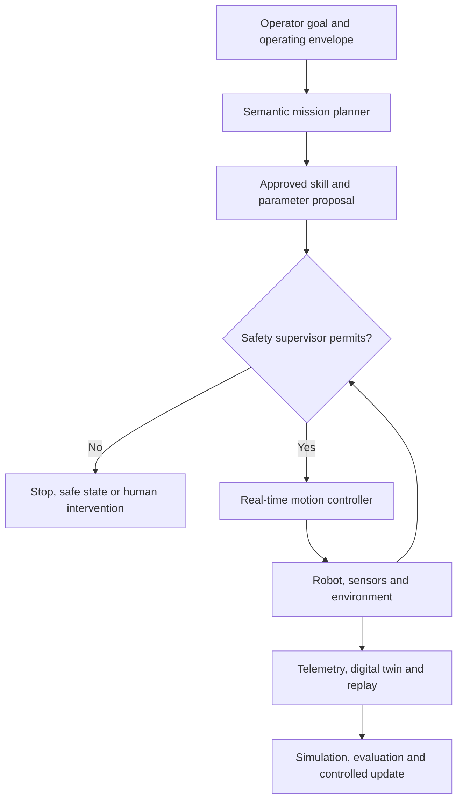

# Embodied agents, robotics, and digital twins

> _Emerging reference architecture — last reviewed: 2026-07-25. Physical safety requires domain-specific engineering, standards, and certification beyond this chapter._

## Learning objectives

- separate semantic planning from real-time safety control;
- use simulation and digital twins for evidence, not as proof of real-world safety;
- design deployment, telemetry, and recovery for physical agents.

## The decision in one sentence

Keep probabilistic models above a certified real-time safety boundary; no language-model output should directly bypass motion, force, zone, or emergency controls.

## Layered physical-agent architecture

Vision-language-action (VLA) models map perception and language to actions, but physical systems add dynamics, sensor error, wear, people, and irreversible harm. [OpenVLA](https://proceedings.mlr.press/v270/kim25c.html) demonstrates the potential of generalist robot policies; it does not eliminate embodiment-specific validation.

| Layer | Timescale | Responsibility |
|---|---:|---|
| Mission planner | seconds/minutes | interpret goal and select approved skill |
| Safety supervisor | milliseconds/seconds | envelope, interlocks, zones, confidence |
| Controller | deterministic real time | trajectories, force and actuator control |
| Physical safety | immediate | emergency stop and independent limits |
| Twin/evidence | offline/near-real time | replay, simulation, maintenance, evaluation |

## Design controls

Define an operational design domain: environment, lighting, floor, payload, people, network, temperature, sensors, and allowed tasks. Every skill has preconditions, postconditions, parameter limits, timeout, recovery, and safe state. The supervisor rejects unknown objects, stale localization, unsafe force, prohibited zones, or degraded sensors.

Use [ROS 2 interfaces](https://docs.ros.org/en/rolling/Concepts/Basic/Interfaces-Topics-Services-Actions.html) or equivalent typed middleware for commands and telemetry. Authenticate deployments, sign model/skill artifacts, separate development and fleet credentials, and support rapid rollback. Record synchronized observations, proposed actions, supervisor decisions, controller state, and operator interventions.

A digital twin is useful for scenario generation, regression, capacity, and operator rehearsal, but simulation-to-real gaps include friction, calibration, latency, lighting, object diversity, and human behavior. Promotion should move through simulation, hardware-in-loop, controlled cell, supervised shadow, limited operation, and only then broader use.

## Northstar example

Northstar’s warehouse assistant may identify a requested aid and propose a certified pick-and-place skill. It cannot synthesize arbitrary joint commands. Human detection slows or stops motion; uncertain perception requests another view; loss of connectivity enters a safe state. A twin replays near misses and generates variations, while real-world acceptance requires hardware-in-loop and supervised trials.

## Practical artifact: embodied safety case

Include operational domain, hazard analysis, skill catalogue, safety boundary, independent interlocks, sensing assumptions, degraded modes, verification stages, cybersecurity, fleet rollout, maintenance/calibration, incident evidence, accountable engineer, and applicable machinery/robotics standards.

Start implementation from the [production starter architecture](11-production-starter-architecture.md), then specialize its runtime and incident controls for physical safety.

## Check yourself

1. Why must no language-model output bypass the safety boundary, and what does each layer own?
2. What is an operational design domain, and what must every skill define?
3. A digital twin passes thousands of simulated near-misses. Why is that not proof of safety, and how should promotion proceed?
4. Northstar's warehouse assistant loses connectivity mid-task. What should happen, and why?

What a strong answer covers

<ol>
<li>Physical actions add dynamics, sensor error, and irreversible harm. The mission planner selects an approved skill; the safety supervisor owns envelopes, interlocks, and zones; the controller runs deterministic real-time control; independent physical safety owns emergency stop and limits; the twin supports evidence offline.</li>
<li>The environment, lighting, floor, payload, people, network, temperature, sensors, and allowed tasks the system is designed for. Each skill needs preconditions, postconditions, parameter limits, a timeout, recovery, and a safe state.</li>
<li>Simulation-to-real gaps include friction, calibration, latency, lighting, object diversity, and human behaviour. Promote through simulation, hardware-in-the-loop, a controlled cell, and supervised shadow operation before limited live operation.</li>
<li>It enters a safe state. It can only propose certified skills, never arbitrary joint commands; human detection slows or stops motion, and uncertain perception requests another view.</li>
</ol>

## Further reading

- [ROS 2 concepts](https://docs.ros.org/en/rolling/Concepts/)
- [OpenVLA paper](https://proceedings.mlr.press/v270/kim25c.html)
