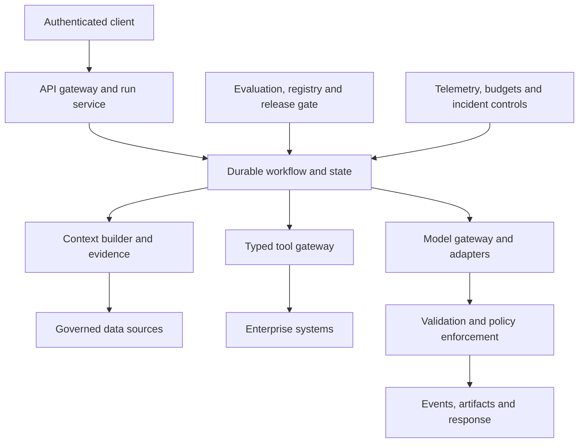

# Production starter architecture

> _Reference baseline — last reviewed: 2026-07-25._

## Learning objectives

- start with a production-shaped vertical slice;
- assign explicit contracts for identity, runs, tools, evidence, evaluation, and operations;
- know which shortcuts are prohibited even in the first increment.

## The decision in one sentence

Begin with one bounded use case on a thin but complete production path, then extend behind stable contracts.

## Baseline architecture

| Component | Minimum contract | Production property |
|---|---|---|
| Run service | task, principal, tenant, idempotency, event cursor | resumable and cancellable |
| Workflow | versioned state and terminal outcomes | retry and compensation |
| Context | evidence IDs, provenance, ACL, freshness | least-data access |
| Model gateway | normalized request, route, version, usage | fallback and quota |
| Tool gateway | typed intent, auth context, idempotency | policy before execution |
| Artifact store | type, hash, parent, retention | reviewable and exportable |
| Quality plane | dataset, evaluator, threshold, release | regression gate |
| Telemetry | run/trace correlation, cost, outcome | investigation-ready |

## First vertical slice

Choose one user, one task, one authoritative data source, one read-only tool, one model route, one artifact, and one approval path. Implement workload identity and tenant propagation end to end. Use structured outputs at component boundaries. Put secrets in a managed store, not prompts or code. Make every side effect idempotent and keep it outside the model call.

Define the run lifecycle: accepted, running, waiting for approval/input, succeeded, failed, cancelled, and expired. Stream typed events; store large outputs as artifacts. Apply time, token, cost, tool, and recursion budgets. Add a deterministic fallback or a clear unavailable state.

## Minimum release evidence

Before the first user: architecture and data-flow review; threat model; representative and adversarial evaluations; latency/capacity test; cost scenario; dashboard and alerts; provider-outage exercise; prompt/model/config versioning; support and incident owner; user disclosure and feedback; rollback and kill switch.

Do not ship shared API keys, unrestricted tools, copied production data, transcript-only audit, notebook deployment, evaluation by anecdotes, or an LLM-controlled authorization check.

## Cloud mapping

The contracts map to AWS, Azure, or Google Cloud services without changing the logical design. Use the platform chapters for current service choices. Preserve a provider adapter boundary, owned evaluation assets, portable source data, OpenTelemetry-compatible traces, and an exportable run/artifact schema.

## Northstar increment plan

Increment one is a read-only policy assistant returning a cited decision brief for human approval. Increment two adds durable missing-information requests. Increment three adds a narrowly scoped case update tool behind policy and approval. Each increment expands the threat model, evaluation set, and incident runbook before expanding authority.

## Practical artifact

This chapter supplies the architecture checklist and minimum component contracts. A copyable run-contract and release-gate blueprint is available in the repository at `examples/agent-starter/README.md`. Fork the artifact; replace the example domain; keep the control points.

## Check yourself

1. Can a run resume after process failure?
2. Which service—not the model—authorizes a tool?
3. Can every answer be tied to evidence and versions?
4. What happens when the model provider is unavailable?
