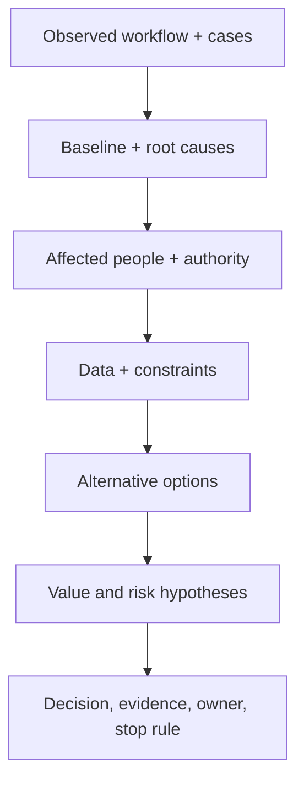

# Discovery workshop playbook

> Last reviewed: 2026-07-16. See the [freshness policy](../appendix/maintenance.md).

## Outcome

A workshop succeeds when it produces a scoped decision and evidence backlog—not enthusiasm, a vendor shortlist, or a wall of ideas. Bring the workflow owner, frontline user, affected-person perspective, domain/data owner, product, architecture/engineering, security/privacy/risk, operations, and finance as consequence requires.

## Before the workshop

Send a one-page brief with the decision, current metrics, a real case sample, known constraints, and explicit non-goals. Ask participants for data and counterexamples. Interview groups with power differences separately when a shared session would suppress concerns.

## 120-minute agenda

| Time | Activity | Output |
|---|---|---|
| 0–10 | Decision, purpose, and working rules | scope and decision owner |
| 10–30 | Map current workflow and one real case | trigger, steps, outcome, handoffs |
| 30–45 | Baseline and root causes | measures, missing evidence |
| 45–60 | Users, affected people, harms, authority | use/prohibited profiles |
| 60–75 | Data, systems, constraints, operations | authoritative sources and blockers |
| 75–95 | Alternatives: process, rules, search, ML, GenAI, agent, abstain | comparison |
| 95–110 | Value/risk hypotheses and critical assumptions | experiment backlog |
| 110–120 | Decisions, owners, dates, stop criteria | signed action log |

## Facilitation moves

Ask “show us the last case” when claims are abstract. Separate facts, assumptions, and preferences. Ask who benefits and who bears each error. Use silent writing before group discussion. Invite a pre-mortem: “It is six months later and this harmed customers—how?” Park product demos until the problem and constraints are stable.

## Required outputs

Produce the opportunity canvas, current workflow, stakeholder/affected-person map, baseline gaps, use and prohibited profiles, authority ladder, option comparison, assumption register, evidence plan, decision log, owners, and follow-up date. Record disagreements and unresolved risk rather than manufacturing consensus.

## Northstar lab

Run the agenda for shipment support. Include ten anonymized cases and a frontline agent. Compare unified search, grounded copilot, and bounded action agent. End with one 30-day experiment and an explicit exclusion of autonomous refunds.

## Check yourself

1. Who is affected but absent?
2. Which statement is still an assumption?
3. Which non-AI option remains viable?
4. Who owns the next decision and when?

## Further reading

- [NIST AI RMF: Map](https://airc.nist.gov/airmf-resources/airmf/5-sec-core/)
- [AI discovery & problem framing](../01-ai-sa-foundations/01-discovery-framing.md)
