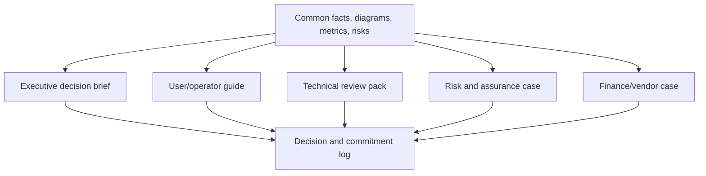

# Stakeholder communication & executive narratives

> Last reviewed: 2026-07-16. See the [freshness policy](../appendix/maintenance.md).

## One architecture, several decisions

Communication is not simplifying until risk disappears. It connects the same evidence to the decision each audience owns.

| Audience | Decision | Evidence they need |
|---|---|---|
| Executive | fund, constrain, scale, or stop | outcome, exposure, options, economics, accountable owner |
| User/operator | when to use and challenge it | capability, limits, evidence, fallback, remedy |
| Engineering/operations | build and run it | contracts, SLOs, dependencies, state, failure, on-call |
| Security/privacy/risk | accept or require controls | data/authority flow, threats, tests, residual risk |
| Finance/procurement | commit and manage supplier | demand, unit economics, terms, exit, concentration |

## Executive narrative

Use this order:

```text
decision required → current problem and baseline → scoped use profile
→ options and recommendation → measurable benefit → principal risks and controls
→ cost/capacity → evidence confidence → owner and next gate
```

Lead with the requested decision. State ranges and uncertainty. Name what is excluded. Avoid anthropomorphic claims such as “the agent understands”; describe observable capability and controls.



## Show trade-offs

Replace “secure and scalable” with evidence: “write actions require delegated identity and matching approval; the design sustains 30 qualified tasks/s at p95 TTFT 2.7s in the tested distribution.” Present at least one viable alternative and why the dominant quality attribute wins.

Separate fact, estimate, assumption, recommendation, and decision. Mark dates and source versions. A red/amber/green status without thresholds hides judgment.

## Difficult messages

For incidents: observed impact, scope/time, containment, current limitations, next update—without premature root cause. For a stop recommendation: failed hypothesis, evidence, remaining uncertainty, sunk cost, and safer alternative. For residual risk: credible failure, controls, remaining exposure, owner, expiry, and what would invalidate acceptance.

## Five-audience pack

Produce a one-page executive decision, user/operator capability card, technical diagrams/NFRs, risk assurance summary, and economics/vendor appendix. Keep a common glossary, version, assumptions, and decision log so the narratives cannot contradict one another.

## Northstar lab and checks

Present the shipment assistant to each audience in two minutes. The executive must decide whether to fund a trial; the operator must know when to escalate; security must locate identity and data boundaries; finance must see the unit and exit case.

1. What decision does this audience own?
2. Which uncertainty is material to that decision?
3. Are limitations and exclusions visible?
4. Can every quantitative claim be traced?
