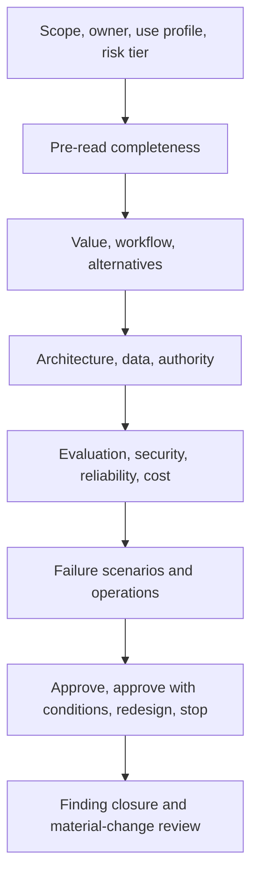

# AI architecture review

> Last reviewed: 2026-07-16. See the [freshness policy](../appendix/maintenance.md).

## Review the decision, evidence, and operability

The review is an independent challenge to a scoped release—not a diagram style meeting. Reviewers receive the pack early and record findings with owner, severity, evidence, due date, and release consequence.

## Review sequence

## Review domains

| Domain | Critical questions |
|---|---|
| Purpose/value | Is the baseline real, profile scoped, alternative compared, stop rule named? |
| Requirements | Are populations, thresholds, slices, conflicts, and degraded behavior explicit? |
| Data/context | Are authority, quality, lineage, freshness, deletion, and poisoning handled? |
| Model/system | Why this model/pattern; how routed, bounded, validated, and changed? |
| Agent/action | Who authorizes; are tools typed, least privilege, durable, idempotent, recoverable? |
| Security/privacy | Trust boundaries, threats, secrets, isolation, residency, logging, incident? |
| Evaluation | Representative cases, leakage, judges, uncertainty, adversarial and online gates? |
| Reliability/operations | SLOs, capacity, fallback, observability, on-call, game days, rollback? |
| Governance/human | Risk card, disclosure, oversight, contestability, dossier, residual owner? |
| Economics/vendor | Qualified unit cost, demand, concentration, terms, portability, exit? |

## Challenge scenarios

Walk through cross-tenant retrieval, prompt injection, provider outage, stale source, model change, tool timeout after commit, expired approval, deletion request, cost/retry storm, and human appeal. Require the team to point to executable controls and evidence—not future intentions.

## Findings and decision

Classify findings by consequence and likelihood in context. A release blocker threatens a non-negotiable requirement or lacks required evidence. Conditions need owner and expiry. Advisory improvements do not block. The decision states approved use profile, release tuple/scope, evidence reviewed, open findings, residual risk owner, expiry, and material-change triggers.

Review quality matters: track recurring findings, escaped architecture defects, time to decision, expired conditions, and whether the process finds issues before production. Avoid approval theater caused by oversized meetings and late documents.

## Artifact, lab, and checks

Produce a **review checklist, finding log, and signed decision record**. Conduct a 45-minute Northstar review using the ten challenge scenarios; reviewers must issue one of approve, conditional, redesign, or stop.

1. Which claim lacks evidence?
2. Which failure crosses a trust boundary?
3. Who owns residual risk and incident containment?
4. What material change reopens the review?

## Further reading

- [NIST AI RMF Core](https://airc.nist.gov/airmf-resources/airmf/5-sec-core/)
- [C4 model](https://c4model.com/)
- [Architecture Decision Records](https://adr.github.io/)
