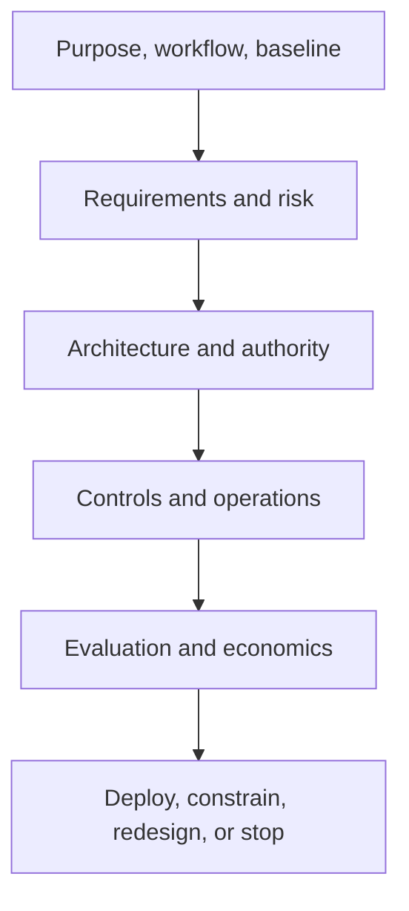

# Capstone brief

> Last reviewed: 2026-07-16. See the [freshness policy](../appendix/maintenance.md).

## Challenge

Design a production-ready Northstar AI use profile and defend whether to deploy it. Choose one: enterprise knowledge assistant, document intelligence, support copilot, agentic operations, natural-language analytics, voice agent, or coding agent. Narrow it to one population, purpose, authority level, and measurable outcome.

## Required dossier

1. executive decision and opportunity canvas;
2. current/target workflow, affected people, prohibited uses, alternatives;
3. NFR scorecard and dominant quality attribute;
4. context/container, critical sequence/state, data lineage, and deployment views;
5. data/retrieval/memory design and provenance;
6. model, gateway, tool, identity, and human-control contracts;
7. threat model, privacy/residency, supply chain, and action recovery;
8. evaluation datasets/rubrics, adversarial/online plan, regression gates;
9. SLOs, capacity, observability, incidents, degradation, and rollback;
10. risk card, assurance case, governance evidence, accessibility/remedy;
11. unit economics, value hypothesis, operating ownership, vendor/exit plan;
12. three ADRs, assumption register, roadmap, and stop decision.

## Evidence rules

Use dated primary sources for current technology and regulation. Distinguish measured result, estimate, and assumption. Provide reproducible evaluation manifests or honest synthetic results labeled as such. Every diagram must support a decision; every control must name evidence; every residual risk must have an owner.

## Submission and lab

Submit a concise decision brief plus linked technical dossier. Include one failure injection and one architecture-changing assumption test. The expected answer may be “do not deploy”; quality is judged on reasoning and evidence, not autonomy or cloud complexity.

## Check yourself

1. Can a reviewer reconstruct the use profile and release decision in five minutes?
2. Are authority, data, and failure boundaries explicit?
3. Which evidence is weakest and could reverse the recommendation?
4. Is the system operable by named owners after the project ends?
