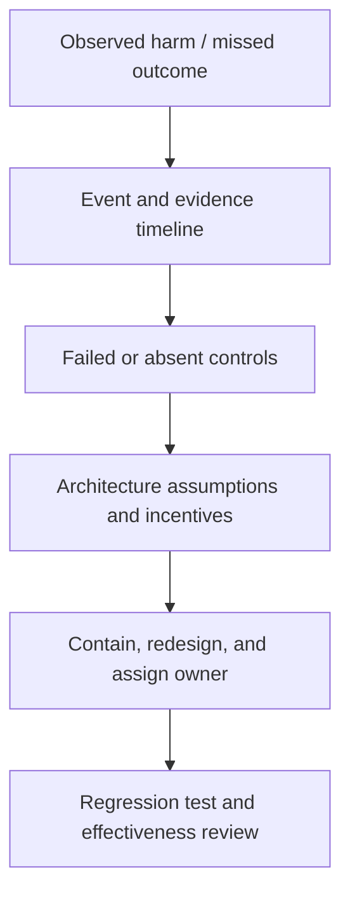

# Failure-mode case studies

> Last reviewed: 2026-07-16. See the [freshness policy](../appendix/maintenance.md).

## Diagnose systems, not “bad AI”

Use this causal chain:

## Case patterns

| Failure | Proximate symptom | Deeper cause | Redesign |
|---|---|---|---|
| Demo became product | impressive examples, poor real quality | no population, baseline, or eval gate | scoped profile and representative evaluation |
| Vector-only enterprise RAG | plausible wrong joins | source semantics ignored | hybrid typed planning and evidence lineage |
| “Human in loop” theater | reviewers approve everything | no time, evidence, authority, or accountability | decision-bound approval UX and sampling |
| Autonomous action duplicate | double refund after timeout | transcript state and non-idempotent tool | durable action ledger and reconciliation |
| Prompt patch security | injection succeeds through document | model asked to enforce trust boundary | capability isolation, authorization, output validation |
| Multi-agent sprawl | slow, costly, inconsistent runs | roles added without distinct authority/value | workflow or one bounded orchestrator |
| Cheapest-model routing | quality and complaints worsen | cost/token optimized instead of outcome | qualified-task economics and critical-slice gates |
| Silent provider drift | behavior changes without release | mutable aliases and weak contract | manifest, canaries, change detection, fallback |
| Shadow AI adoption | sensitive data sent externally | approved path too slow or absent | usable paved road, inventory, training, enforcement |
| Pilot never scales | no owner, SLO, funding, or integration | project model instead of product lifecycle | operating ownership and production gates |

## Pre-mortem

Before approval, assume the system caused harm or failed to deliver value six months later. Generate causes across purpose, people, data, model, retrieval, tools, identity, security, operations, vendor, cost, adoption, and governance. Rank by consequence, plausibility, detectability, and current control strength. Convert the top items into architecture changes, tests, monitors, or explicit accepted risk.

## Corrective-action quality

“Improve the prompt” or “train users” is weak unless it addresses a demonstrated mechanism. Strong actions change authority, isolation, data quality, state, evaluation, or decision rights and include an owner, deadline, verification method, and rollback. Verify effectiveness after deployment and watch for risk transfer.

## Northstar lab

Choose three patterns and write a causal timeline, five-whys/control analysis, containment, redesign, regression case, and organizational change. Include one case where stopping or narrowing is the correct action.

## Check yourself

1. Which enabling condition made the incident possible?
2. Did the correction change an enforceable control?
3. What regression evidence proves effectiveness?
4. Did the redesign transfer harm to another group?

## Further reading

- [NIST AI 600-1: Generative AI Profile](https://doi.org/10.6028/NIST.AI.600-1)
- [NIST SP 800-61 Rev. 3](https://csrc.nist.gov/pubs/sp/800/61/r3/final)
