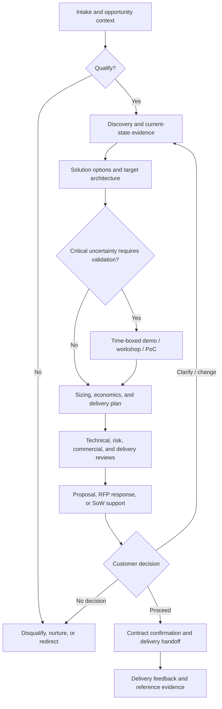
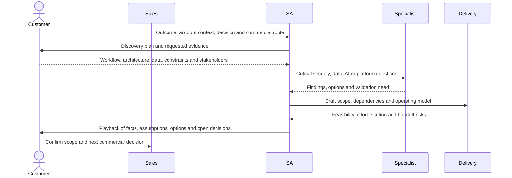
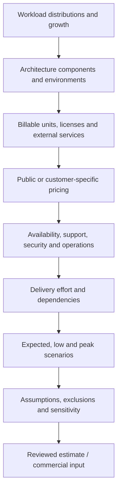
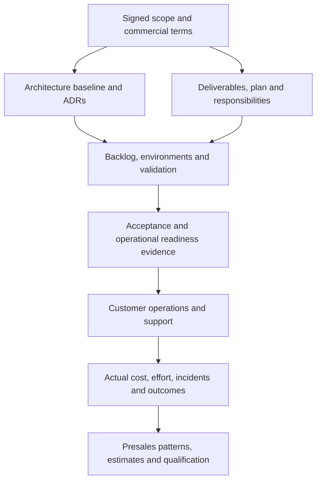

# Solution architecture presales work & cloud pursuit process

> Last reviewed: 2026-07-20. See the [freshness policy](../appendix/maintenance.md). Cloud partner programs, incentives, product names, pricing, and eligibility rules change frequently; verify them in the relevant partner portal and contract before making a customer commitment.

## Learning objectives

After this chapter you will be able to:

- explain the solution architect's role from opportunity qualification through delivery handoff;
- run business, technical, security, data, AI, operational, and commercial discovery;
- turn uncertain requirements into a reviewable solution, estimate, proposal, and statement of work;
- govern demos, proofs of concept, vendor co-sell, funding, and technical validation;
- apply the process to AWS, Microsoft Azure and Fabric, and Google Cloud pursuits.

## Presales architecture is decision engineering

The presales solution architect helps a customer and seller decide whether a proposed change is valuable, feasible, operable, governable, and commercially credible. The output is not the largest possible bill of materials or the most impressive demo. It is a defensible path from a customer outcome to a deliverable solution.

The SA must keep five things aligned:

| Concern | Presales question | Evidence |
|---|---|---|
| Business | Why act, why now, and what changes if this succeeds? | baseline, value hypothesis, sponsor, decision date |
| Technical | Can the proposed system meet requirements and integrate with reality? | current state, target views, NFRs, options, validation |
| Risk | Can data, security, privacy, AI, regulatory, and operational risks be controlled? | classifications, threat/risk findings, control owners |
| Delivery | Can a named team implement, migrate, operate, and support it? | scope, dependencies, skills, plan, acceptance, handoff |
| Commercial | Are the estimate, contract route, funding, and responsibilities credible? | assumptions, unit drivers, pricing artifact, SoW inputs |

Presales work ends in a decision such as qualify, discover further, validate, propose, defer, or disqualify. “Keep talking” is not a useful stage.

## The end-to-end pursuit



### Presales gates

| Gate | Minimum evidence | Valid decisions |
|---|---|---|
| Qualification | customer problem, sponsor, fit, urgency, route, next decision | qualify, nurture, redirect, disqualify |
| Discovery exit | baseline, stakeholders, scope, constraints, data, NFRs, unknowns | shape, run assessment, stop |
| Solution review | options, recommended architecture, risks, assumptions, operations | estimate, validate, redesign, stop |
| Validation exit | predefined criteria and reproducible results | proceed, constrain, change option, stop |
| Proposal readiness | scope, acceptance, estimate, responsibilities, dependencies, approvals | submit, hold, revise |
| Handoff readiness | signed scope, decision history, credentials/data plan, owners, open risks | mobilize, resolve gap before start |

Do not let CRM stage names substitute for these evidence gates. Sales stages describe commercial progress; architecture gates describe decision readiness.

## Role boundaries

Presales is collaborative. A typical pursuit includes:

| Role | Accountable for |
|---|---|
| Account executive or seller | customer relationship, opportunity strategy, commercial close |
| Presales solution architect | discovery integrity, technical recommendation, assumptions and risks |
| Specialist SA / engineer | depth in security, data, AI, networking, migration, Fabric, SAP, or industry |
| Delivery lead | implementation feasibility, staffing, plan, acceptance, transition |
| Commercial / FinOps lead | pricing basis, discounts, margins, commitments, contract route |
| Security, privacy, legal, compliance | specialist decisions and contractual/regulatory review |
| Vendor account and technical teams | platform validation, programs, funding, quota, roadmap context |
| Customer sponsor | outcome, priority, funding, decision authority |
| Customer technical and operational owners | requirements, constraints, access, acceptance, future operation |

The SA does not promise discounts, roadmap features, funding approval, legal compliance, delivery dates, or production performance without the accountable owner and supporting evidence. Record who made each commitment.

## 1. Intake and qualification

Start with a short opportunity charter:

```yaml
opportunity:
  customer: Northstar Logistics
  outcome: reduce shipment-case resolution effort without increasing repeat contact
  sponsor: VP Customer Operations
  decision_date: 2026-09-30
  use_profile: grounded support copilot
  in_scope: [shipment policy, order lookup, draft response]
  prohibited: [autonomous refund, legal advice]
  candidate_cloud: undecided
  commercial_route: services_plus_cloud_consumption
  known_constraints: [Canada residency, existing Microsoft identity]
  top_unknowns: [source quality, peak concurrency, Fabric capacity interaction]
  next_customer_decision: approve two-week assessment
```

### Qualification dimensions

- **Outcome:** Is there an important business or mission problem with a baseline?
- **Authority:** Is there a sponsor, technical owner, budget path, and decision process?
- **Urgency:** Is there a real event, deadline, risk, or value window?
- **Fit:** Does the organization have relevant capability, delivery capacity, references, and vendor alignment?
- **Feasibility:** Are the data, integration, security, region, and operational constraints plausibly solvable?
- **Commercial path:** Is this advisory work, resale, marketplace, consumption, managed service, or implementation?
- **Competition and status quo:** What alternatives are being considered, including doing nothing?
- **Evidence gap:** What must be learned before a credible recommendation or estimate?

Disqualify when the purpose is unsuitable, required authority is absent, the deadline is impossible, the customer expects an unsupported guarantee, or the pursuit consumes scarce specialists without a plausible decision path. A well-recorded “not now” protects trust.

## 2. Plan discovery

Discovery is a sequence, not one unstructured call.



Send an agenda, roles, requested artifacts, and decisions before each session. Afterward, circulate a factual playback with assumptions, disagreements, owners, and dates. Do not hide uncertainty in internal notes.

### Business and workflow discovery

- What outcome is measured today, by whom, and at what baseline?
- Which workflow, population, geography, volume, seasonality, and exception paths are in scope?
- What is the economic cost of delay, error, manual work, downtime, or risk?
- Who benefits, who changes behavior, and who might be harmed?
- What decision will the customer make, by when, and using which criteria?

### Current-state technology discovery

- Context, container, deployment, network, identity, data, and integration views
- inventory, versions, lifecycle status, dependencies, traffic, capacity, and licenses
- environments, CI/CD, infrastructure as code, observability, backup, disaster recovery, support
- technical debt, unsupported products, constraints, incumbent contracts, and exit obligations
- cloud organization/tenant, accounts/subscriptions/projects, landing zone, connectivity, and quotas

### Data, analytics, AI, and Fabric discovery

- authoritative sources, owners, schemas, volume, velocity, quality, lineage, classification, residency
- batch, streaming, BI, semantic model, ML, GenAI, retrieval, memory, and agent workloads
- concurrency, refresh windows, query patterns, token/media distribution, capacity peaks, and growth
- governance, Purview/catalog, access, sharing, deletion, retention, and cross-border constraints
- evaluation population, risk tier, human authority, acceptable failure, and model/provider constraints

For Fabric, ask about tenant region, existing Power BI licensing and capacities, F/P SKUs, workspace topology, domains, OneLake/data locations, gateways, semantic models, Spark/warehouse/data-engineering workloads, refresh and Direct Lake patterns, concurrency, tenant settings, sensitivity labels, deployment pipelines, and who will administer tenant, capacity, gateways, and workspaces.

### Security, compliance, and procurement discovery

- identity provider, federation, privileged access, workload identity, segregation, and break-glass process
- network boundaries, private connectivity, egress, encryption, keys, secrets, logging, incident response
- data categories, regulated workloads, contractual controls, audit evidence, and approval authorities
- vendor security review, data processing terms, sub-processors, support, marketplace, and procurement lead time
- AI-specific prompt injection, data leakage, model change, tool authority, content provenance, and human remedy

### NFR and operational discovery

Obtain scenario-based thresholds for availability, latency, recovery, performance, capacity, data loss, quality, safety, privacy, cost, sustainability, accessibility, and portability. Name who will operate the workload, what support plan applies, and which team owns incidents after launch.

## 3. Shape options before products

Create two or three viable approaches plus the status quo. Compare them against the dominant quality attributes and customer constraints.

| Option | Example | Use when | Main trade-off |
|---|---|---|---|
| Process / configuration | improve existing search and workflow | root cause is not missing AI/platform | limited new capability |
| Managed platform | cloud-managed data, AI, integration, or application services | speed and operating leverage matter | provider/service dependency |
| Portable platform | containers, open formats, abstraction where useful | control or exit is important | more engineering and operations |
| Hybrid / staged | retain systems of record; add a governed cloud capability | migration risk or sequencing dominates | integration and dual operation |
| Rebuild / transform | new cloud-native workflow and operating model | business change justifies disruption | highest change and delivery risk |

The recommendation should state why the selected option wins, what it costs in complexity, what would change the decision, and which features are excluded.

### Minimum target architecture

Include:

1. system context and affected actors;
2. trust, network, identity, data, region, and vendor boundaries;
3. control plane, data plane, management plane, and evidence plane;
4. application/data/AI runtime request and failure paths;
5. environments, deployment, observability, backup, recovery, and support;
6. shared-responsibility and RACI boundaries;
7. consumption drivers linked to the estimate;
8. migration/mobilization increments and exit path;
9. assumptions, ADRs, risks, validation, and acceptance evidence.

Do not claim “multi-cloud” as a benefit without identifying the workloads that genuinely move, the compatible contracts, duplicated controls, data gravity, skills, egress, testing, and operating cost.

## 4. Estimate from architecture and workload



### Estimation rules

- Use workload distributions and growth, not one average request.
- Include dev, test, staging, production, DR, management, logging, security, backup, data transfer, support, and third-party services.
- Model on-demand and eligible commitment/benefit scenarios separately.
- Show region, currency, price date, term, taxes excluded/included, and customer-specific discount status.
- Separate cloud consumption, software licenses, professional services, managed operations, and contingency.
- Use ranges for uncertain demand and delivery effort; run sensitivity on the largest drivers.
- Link each line item to an architecture component and owner.
- Label estimates as estimates. A calculator export is not a contract or guaranteed invoice.

For AI, include input/output/cached/reasoning tokens or provisioned throughput, embeddings, search/indexing, reranking, guardrails/evaluations, tools, state/memory, content filtering, network, observability, retries, and human review. Calculate cost per qualified business outcome as well as monthly spend.

### Estimate dossier

```yaml
estimate:
  version: 0.4
  price_date: 2026-07-20
  currency: CAD
  scenarios: [expected, peak, disaster_recovery]
  term_months: 36
  environments: [dev, test, prod]
  growth_assumption: 25_percent_yearly
  excluded: [tax, negotiated_discount, customer_network_circuit]
  largest_drivers: [model_output_tokens, Fabric_CUs, cross_region_egress]
  sensitivity:
    - driver: peak_concurrency
      low: 50
      expected: 150
      high: 500
  source_artifacts: [architecture_v6, workload_profile_v3, calculator_export_v4]
  approved_by: [solution_architect, delivery_lead, commercial_owner]
```

## 5. Govern demos, workshops, and proofs of concept

Choose the lightest validation that resolves the decision:

| Method | What it proves | What it does not prove |
|---|---|---|
| Product demo | feature and user-flow fit | customer integration, scale, security, operability |
| Architecture workshop | design alignment and open decisions | runtime behavior |
| Technical spike | one integration or performance uncertainty | end-to-end production readiness |
| Proof of concept | defined feasibility hypotheses in a controlled scope | production SLA, full governance, final cost |
| Pilot | outcome and adoption with limited real users | unrestricted enterprise scale |

A PoC charter names hypotheses, success/failure thresholds, data classification, allowed users, cloud account/tenant/project, budget, time box, owner, support, security controls, artifacts, IP/data disposition, and exit decision. Synthetic or masked data is preferred until production data is explicitly authorized.

Do not leave a PoC running as shadow production. Close resources, revoke access, export evidence, delete data under policy, and decide proceed, redesign, or stop.

## 6. Proposal, RFP, and statement-of-work support

The SA makes the technical promise precise. A proposal or SoW should connect:

```text
customer outcome → scope → architecture → deliverables → acceptance
→ responsibilities → assumptions/dependencies → plan → price basis → change control
```

### Required content

- business context, desired outcomes, and measurable success;
- in-scope use profiles, workloads, environments, regions, and users;
- architecture and design principles, with versioned diagrams;
- deliverables and acceptance criteria that a customer can verify;
- customer, partner, vendor, and third-party responsibilities;
- migration/data cutover, security, testing, training, and operational transition;
- dependencies, prerequisites, assumptions, exclusions, constraints, and risks;
- schedule by outcomes and gates, not only activities;
- consumption/licensing basis, services effort, validity, and change-control mechanism;
- support, warranty, managed-service boundary, and final handoff evidence.

Avoid ambiguous verbs such as “enable,” “support,” “integrate,” or “optimize” without a named artifact and acceptance condition. Distinguish an architecture assessment, reference implementation, production deployment, and managed outcome.

### RFP discipline

Maintain a compliance matrix: requirement ID, interpretation, response, evidence, exception, owner, and contractual status. Do not answer “compliant” based on a roadmap, optional add-on, untested configuration, or customer responsibility without qualification. Flag contradictions and ask formal clarification questions.

## 7. Internal reviews and red flags

Run technical, security/privacy, AI governance, delivery, commercial, legal, and executive-deal reviews proportional to consequence.

Stop or escalate when:

- the sponsor, decision, baseline, or funding path is unclear;
- the proposal depends on an unreleased feature or unconfirmed quota;
- an estimate excludes the dominant cost driver;
- delivery has not reviewed staffing, dependencies, or acceptance;
- the customer expects regulatory certification or a guaranteed AI outcome;
- production data or credentials are requested for an uncontrolled demo;
- the architecture bypasses the customer's identity, landing zone, logging, or governance standards;
- vendor funding or discounts are represented as approved before written confirmation;
- the requested date can only be met by hiding prerequisite work;
- presales creates a custom solution the organization cannot support.

Record conditional approvals and their expiry. Silence in a review meeting is not acceptance.

## AWS pursuit overlay

AWS guidance can be mapped to the common process without turning the proposal into a service catalog.

| Presales need | AWS mechanism | SA use |
|---|---|---|
| Organizational readiness | [AWS Cloud Adoption Framework](https://aws.amazon.com/cloud-adoption-framework/) | assess Business, People, Governance, Platform, Security, and Operations capability gaps |
| Workload quality review | [AWS Well-Architected Framework](https://docs.aws.amazon.com/wellarchitected/latest/framework/welcome.html) | test Operational Excellence, Security, Reliability, Performance Efficiency, Cost Optimization, and Sustainability trade-offs |
| Migration assessment | [AWS application portfolio assessment guidance](https://docs.aws.amazon.com/prescriptive-guidance/latest/application-portfolio-assessment-guide/introduction.html) | structure discovery, prioritized assessment, portfolio analysis, waves, and continuous improvement |
| Migration tooling | [AWS discovery, planning, and recommendation tools](https://docs.aws.amazon.com/prescriptive-guidance/latest/migration-tools/discovery.html) | collect inventory, dependencies, utilization, and directional business-case inputs |
| Cost model | [AWS Pricing Calculator](https://calculator.aws/) | create grouped, exportable estimates with documented usage assumptions |
| Partner co-sell | [APN Customer Engagements program](https://aws.amazon.com/partners/programs/ace/) | share and maintain eligible opportunities through ACE Pipeline Manager and coordinate with AWS Sales |

### AWS presales checklist

- Confirm organization/account strategy, landing zone/control model, identity, SCPs, regions, network, DNS, logging, keys, backup, and support ownership.
- Map requirements to Well-Architected questions and any relevant lens; use the review as a constructive architecture conversation, not a certification claim.
- For migration, separate **assess**, **mobilize**, and **migrate/modernize** outcomes; identify application rationalization, landing-zone, portfolio, security, operating-model, and wave-planning workstreams.
- Validate service availability, quotas, cross-account design, data transfer, resilience topology, support plan, and Marketplace/private-offer route.
- In the estimate, model data transfer, NAT/network processing, logs, backups, multi-AZ/Region, support, commitments, and variable AI usage.
- If working as an AWS Partner, register or accept the opportunity through the current Partner Central/ACE process only with authorized customer data; keep the opportunity status and next action current.
- Treat Migration Acceleration Program funding, credits, opportunity validation, and discount eligibility as conditional until confirmed in the applicable AWS system and written terms.

## Microsoft Azure and Fabric pursuit overlay

| Presales need | Microsoft mechanism | SA use |
|---|---|---|
| Adoption journey | [Microsoft Cloud Adoption Framework](https://learn.microsoft.com/azure/cloud-adoption-framework/) | structure Strategy, Plan, Ready, Adopt, Govern, Secure, and Manage decisions |
| Workload quality review | [Azure Well-Architected Framework](https://learn.microsoft.com/azure/well-architected/what-is-well-architected-framework) | assess Reliability, Security, Cost Optimization, Operational Excellence, and Performance Efficiency |
| Reference designs | [Azure Architecture Center](https://learn.microsoft.com/azure/architecture/) | compare patterns without treating reference architecture as customer design |
| Cost model | [Azure pricing and calculator](https://azure.microsoft.com/pricing/) | model regions, reservations/savings plans, Azure Hybrid Benefit, support, and usage |
| Partner co-sell | [Microsoft Partner Center co-sell overview](https://learn.microsoft.com/partner-center/referrals/co-sell-overview) | coordinate Microsoft, partner-to-partner, private, services, and marketplace opportunities |
| Fabric adoption | [Microsoft Fabric adoption roadmap](https://learn.microsoft.com/power-bi/guidance/fabric-adoption-roadmap-maturity-levels) | assess organizational maturity, COE, governance, enablement, and rollout |
| Fabric capacity | [Plan Fabric capacity size](https://learn.microsoft.com/fabric/enterprise/plan-capacity) | estimate CU/SKU needs and validate with trial/metrics evidence |

### Azure presales checklist

- Confirm Entra tenant, management-group/subscription model, landing zones, policy, identity, connectivity, DNS, regions, private access, Defender, Sentinel/Purview, keys, backup, DR, and operations.
- Use CAF Strategy/Plan to connect business outcomes, people, skills, operating model, estate discovery, estimates, and adoption plan; use Ready to identify landing-zone prerequisites before workload dates are promised.
- Map the workload to Azure Well-Architected pillars and service/workload guides; document trade-offs and customer-owned controls.
- Validate subscription and quota availability, licensing/Hybrid Benefit assumptions, Marketplace/private-offer or MACC considerations, support, and data-transfer costs.
- For a Microsoft partner pursuit, use current Partner Center referral/co-sell categories and statuses. Do not assume that an offer, deal registration, incentive, MACC contribution, or Solution Assessment is eligible until the current portal and program owner confirm it.

### Fabric presales checklist

Fabric is a SaaS analytics platform with shared capacity behavior, tenant-wide administration, multiple workload engines, and Power BI licensing interactions. It needs its own workstream inside the Azure pursuit.

1. **Business and adoption:** define BI, analytics, data-engineering, real-time, data-science, and AI outcomes; assess creator/consumer populations, skills, COE, support, and maturity.
2. **Tenant and region:** confirm tenant home region, capacity region, allowed workloads/features, trial state, regulatory/residency constraints, and who owns tenant settings.
3. **Workspace and domain model:** define domains, dev/test/prod workspaces, ownership, access groups, item certification/endorsement, sharing, deployment pipelines, and lifecycle.
4. **Data architecture:** map OneLake, shortcuts, lakehouses, warehouses, event/real-time data, semantic models, gateways, source egress, lineage, quality, retention, and disaster-recovery expectations.
5. **Security and governance:** define Entra groups, admin separation, sensitivity labels, DLP/protection, Purview integration, audit, external sharing, service principals, private/network controls, and exception process.
6. **Capacity:** characterize each workload's data size, refresh, query/concurrency, Spark jobs, warehouse operations, background work, peaks, and growth. Use the Fabric SKU Estimator only as a starting point; validate through trial/load tests and the Capacity Metrics app.
7. **Licensing and commercials:** distinguish F capacity, existing P capacity where applicable, Power BI Pro/PPU and viewer requirements, reservations, pause/resume behavior, storage, networking, and Azure billing owner.
8. **Operations:** assign Fabric, capacity, gateway, domain, and workspace administrators; define monitoring, throttling response, release, support, cost allocation, and workload onboarding.

Do not promise a Fabric SKU from data volume alone. Capacity Unit consumption depends on workload type, background/interactive operations, concurrency, smoothing/throttling, and implementation. Record the workload profile and observed metrics behind the recommendation.

## Google Cloud pursuit overlay

| Presales need | Google Cloud mechanism | SA use |
|---|---|---|
| Organizational readiness | [Google Cloud Adoption Framework](https://cloud.google.com/adoption-framework) | assess Lead, Learn, Scale, and Secure readiness themes |
| Workload quality review | [Google Cloud Well-Architected Framework](https://cloud.google.com/architecture/framework) | review Operational Excellence, Security/Privacy/Compliance, Reliability, Cost, Performance, and system-design decisions |
| Migration assessment | [Migration Center](https://cloud.google.com/migration-center/docs/get-started-with-migration-center) | run estimates and asset discovery with an authorized organization/project or trial route |
| Migration economics | [Migration Center cost estimation](https://cloud.google.com/migration-center/docs/estimate/overview) | compare infrastructure/workload assumptions and multi-year scenarios |
| General cost model | [Google Cloud Pricing Calculator](https://cloud.google.com/products/calculator) | create architecture-based service estimates |
| Partner collaboration | [Google Cloud Partner Network](https://partners.cloud.google.com/) | coordinate current co-sell, marketplace, services, and partner program processes |

### Google Cloud presales checklist

- Confirm organization, domains/Cloud Identity, folders/projects, billing accounts, IAM groups/service accounts, organization policies, landing-zone/foundation, Shared VPC, DNS/connectivity, regions, keys, logging, Security Command Center, backup, and operations.
- Use Adoption Framework themes to surface sponsorship, learning/skills, platform scaling, and security gaps that a technical design alone cannot solve.
- Apply the Architecture Framework and relevant AI/ML or industry perspectives to the workload; document reliability targets, quotas, project boundaries, observability, and failure-domain design.
- For migration, decide whether a rapid estimate, Migration Center inventory/discovery, dependency analysis, or detailed workload assessment is required. Protect uploaded inventory and obtain customer authorization for any partner/vendor access.
- Estimate BigQuery/storage/egress, logging, network services, support, commitments, accelerator availability, Vertex AI/model usage, and multi-region replication from workload drivers.
- Validate APIs, quotas, GPU/TPU/model/region availability, support, Marketplace/private-offer route, and billing permissions before promising a schedule.
- Google launched the Google Cloud Partner Network rollout in 2026; use the current partner portal for opportunity registration, co-sell, incentives, credits, and competency requirements rather than relying on older Partner Advantage terminology or screenshots.

## Cross-cloud process map

| Common pursuit stage | AWS | Microsoft Azure / Fabric | Google Cloud |
|---|---|---|---|
| Readiness | CAF six perspectives | CAF Strategy, Plan, Ready | Adoption Framework Lead, Learn, Scale, Secure |
| Foundation | organizations/accounts, landing zone, controls | tenant, management groups, subscriptions, landing zone; Fabric tenant/capacity/workspaces | organization, folders, projects, billing, cloud foundation |
| Workload review | Well-Architected six pillars/lenses | Azure Well-Architected five pillars; Fabric workload/governance review | Architecture Framework pillars/perspectives |
| Migration assessment | portfolio assessment and discovery tooling | Azure Migrate/CAF migration planning | Migration Center discovery and estimates |
| Estimate | AWS Pricing Calculator | Azure Pricing Calculator; Fabric SKU Estimator + metrics | Google Cloud Pricing Calculator / Migration Center |
| Partner co-sell | ACE in Partner Central | referrals/co-sell in Partner Center | current Google Cloud Partner Network portal |
| Delivery transition | assess, mobilize, migrate/modernize; operations | Ready/Adopt plus Govern/Secure/Manage | foundation, migration/modernization and operational ownership |

The frameworks are evidence libraries, not competing sales scripts. Use the parts that answer the customer's decision and contractual scope.

## Vendor engagement packet

When asking a cloud account team or specialist for help, provide:

- customer and opportunity ID permitted for sharing;
- business outcome, sponsor, decision date, competition, and commercial route;
- architecture and workload profile;
- services, regions, quotas, licenses, marketplace, or program questions;
- estimate version and largest assumptions;
- security/compliance constraints without unnecessary sensitive data;
- requested decision, owner, and response date.

Vendor meetings without this packet often become generic product briefings. Record statements that affect scope, roadmap, quota, price, funding, or delivery and obtain the required written confirmation.

## Delivery handoff is part of presales quality



### Handoff packet

- signed proposal/SoW/order form and exact precedence of documents;
- opportunity charter, stakeholder map, decision log, and success measures;
- discovery evidence, current/target views, NFRs, ADRs, risk and assumption registers;
- estimate sources, licenses, discounts/credits status, budgets, and cost owners;
- PoC code/data/results and required cleanup or productionization gaps;
- scope, deliverables, acceptance, milestones, dependencies, exclusions, and change process;
- cloud organization/tenant/project/account access plan and customer prerequisites;
- security/privacy/compliance findings and pending approvals;
- RACI, escalation, support, operating model, training, and transition plan;
- open decisions with owner/date and a recorded delivery kickoff acceptance.

Delivery should be able to reject an incomplete handoff before the project clock starts. Measure estimate variance, scope changes, escaped assumptions, acceptance disputes, and cloud-cost variance; feed the findings into future qualification and estimation.

## The presales SA operating kit

Maintain version-controlled templates for:

1. opportunity charter and qualification scorecard;
2. discovery plan, evidence request, notes, and playback;
3. stakeholder, workflow, current-state, and dependency maps;
4. NFR scorecard, options matrix, architecture views, and ADRs;
5. data/AI/security/privacy questionnaires and risk register;
6. workload profile, bill of materials, calculator exports, and estimate assumptions;
7. demo/PoC charter, experiment log, results, and teardown;
8. RFP compliance matrix and clarification log;
9. proposal/SoW technical schedule, acceptance, RACI, assumptions, and exclusions;
10. cloud-program/co-sell record and vendor commitment log;
11. internal review decisions and approval evidence;
12. delivery handoff checklist and variance feedback.

Templates make missing evidence visible; they do not remove the need for judgment.

## Northstar worked pursuit

Northstar asks for an “AI customer-service platform in three months.” The SA qualifies the shipment-support outcome but separates autonomous refunds as a higher-risk future profile. Discovery shows Entra identity, Canada residency, existing Power BI/Fabric usage, fragmented policies, a non-standard order API, and uncertain peak volume.

The SA compares:

1. improve deterministic enterprise search;
2. build a grounded support copilot on the customer's strategic cloud;
3. deploy a broad autonomous service agent.

The recommendation is a staged grounded copilot. A two-week spike validates order-API latency and citation quality. The estimate includes model/search usage, three environments, private networking, logs, evaluation, Fabric capacity impact for analytics, support, and human review. The proposal excludes autonomous refunds, promises no unsupported accuracy guarantee, and binds acceptance to a representative evaluation and operational-readiness review.

AWS, Azure/Fabric, and Google Cloud mappings are prepared because the customer is comparing platforms, but the SA recommends one primary deployment based on identity, data gravity, region, skills, commercial commitments, and measured capability. The handoff includes the decision record and the evidence that would justify a later platform or autonomy change.

## Practical artifact

Produce a **presales pursuit dossier** containing:

- opportunity charter and qualify/nurture/disqualify decision;
- discovery plan and customer-confirmed playback;
- options, architecture, NFRs, assumptions, risks, and ADRs;
- workload/capacity profile and transparent estimate;
- PoC charter/results when validation is required;
- AWS, Microsoft/Fabric, or Google Cloud framework and program mapping;
- proposal/SoW technical inputs and RFP compliance matrix where relevant;
- internal approval, vendor commitment, and delivery handoff records;
- final outcome and estimate/scope variance feedback.

## Lab

Run a Northstar presales pursuit in three rounds:

1. **Qualify and discover:** produce the opportunity charter, stakeholder/session plan, evidence request, baseline, constraints, and five architecture-changing unknowns.
2. **Shape and validate:** compare three options, create a target architecture, select one PoC hypothesis, and build expected/peak cost scenarios for AWS, Azure/Fabric, or Google Cloud.
3. **Propose and hand off:** write acceptance criteria, responsibilities, assumptions, exclusions, vendor-program dependencies, delivery gates, and a signed handoff checklist.

The defense panel plays the sponsor, security owner, procurement lead, cloud vendor SA, and delivery lead. Each must be able to locate the evidence supporting promises made to them.

## Check yourself

1. What customer decision is the pursuit trying to enable, and when?
2. Which statement in the proposal is a fact, estimate, assumption, dependency, or commitment?
3. Can every cost line be traced to a workload and architecture component?
4. What does the demo or PoC prove—and explicitly not prove?
5. Which cloud-program or funding assumptions still require written confirmation?
6. Can delivery identify all prerequisites, open risks, acceptance criteria, and owners before kickoff?
7. What evidence would cause you to disqualify, constrain, or redesign the opportunity?

## Further reading

### AWS

- [AWS Cloud Adoption Framework](https://aws.amazon.com/cloud-adoption-framework/)
- [AWS Well-Architected Framework](https://docs.aws.amazon.com/wellarchitected/latest/framework/welcome.html)
- [AWS application portfolio assessment guide](https://docs.aws.amazon.com/prescriptive-guidance/latest/application-portfolio-assessment-guide/introduction.html)
- [AWS Pricing Calculator](https://calculator.aws/)
- [APN Customer Engagements program](https://aws.amazon.com/partners/programs/ace/)

### Microsoft Azure and Fabric

- [Microsoft Cloud Adoption Framework](https://learn.microsoft.com/azure/cloud-adoption-framework/)
- [Azure Well-Architected Framework](https://learn.microsoft.com/azure/well-architected/what-is-well-architected-framework)
- [Microsoft Partner Center co-sell overview](https://learn.microsoft.com/partner-center/referrals/co-sell-overview)
- [Microsoft Fabric adoption roadmap maturity levels](https://learn.microsoft.com/power-bi/guidance/fabric-adoption-roadmap-maturity-levels)
- [Microsoft Fabric governance](https://learn.microsoft.com/fabric/governance/)
- [Plan Microsoft Fabric capacity size](https://learn.microsoft.com/fabric/enterprise/plan-capacity)

### Google Cloud

- [Google Cloud Adoption Framework](https://cloud.google.com/adoption-framework)
- [Google Cloud Well-Architected Framework](https://cloud.google.com/architecture/framework)
- [Google Cloud Migration Center](https://cloud.google.com/migration-center/docs/get-started-with-migration-center)
- [Google Cloud Migration Center cost estimation](https://cloud.google.com/migration-center/docs/estimate/overview)
- [Google Cloud Partner Network](https://partners.cloud.google.com/)
