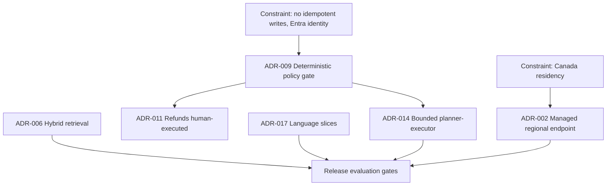

# The Northstar ADR set

> Last reviewed: 2026-09-20. See the [freshness policy](../appendix/maintenance.md). Vendor and platform capabilities change; every hosting or product claim in an ADR must be re-verified against the provider's current terms before the decision is accepted.

## Learning objectives

After this chapter you will be able to:

- write ADRs that are falsifiable, name one dominant quality attribute, and expire;
- decide which decisions can be accepted on a constraint alone and which must wait for evidence;
- show how a small set of ADRs constrain one another instead of standing alone.

## Decision this chapter teaches

Which architecture decisions deserve an ADR, and what state each is honestly in — *Accepted*, *Proposed*, or *Superseded* — given the evidence that exists today.

## How to read this set

These six ADRs use the template from [C4, sequence diagrams & AI ADRs](../01-ai-sa-foundations/03-diagrams-adrs.md), including its ADR-014. The numbering has gaps on purpose: a real project accumulates decisions faster than a book can print them, and the gaps show that the ADRs here are a selection, not a full log.

The most important column in the index is **Status**. Three are *Accepted* because a constraint decides them: no evidence could change the answer without changing the constraint. Three are *Proposed* because they need results Northstar does not have yet. An ADR that pretends to be Accepted before its evidence exists is the most common way this artifact turns into decoration.

| ADR | Decision | Status | Dominant attribute | Expires |
|---|---|---|---|---|
| 002 | Call models through a managed regional endpoint, not self-hosted | Proposed | Residency | 2027-03-20 |
| 006 | Hybrid retrieval with authority and effective-date filters | Proposed | Grounding | 2026-12-20 |
| 009 | A deterministic policy gate sits between the model and every tool | Accepted | Action integrity | 2027-03-20 |
| 011 | Refund execution stays human-executed | Accepted | Action integrity | 2026-12-20 |
| 014 | Bounded planner-executor for unusual support cases | Accepted | Action integrity | 2026-10-16 |
| 017 | Language slices are release gates, not averages | Accepted | Task quality (per slice) | 2027-03-20 |

## ADR-002: Call models through a managed regional endpoint, not self-hosted

Status: Proposed
Expires: 2027-03-20
Owner: Head of Security and Privacy, with the platform lead
Decided: not yet — blocked on the evidence listed below

### Context

Shipment-advice traffic contains Canadian customer data. Residency is non-negotiable and Northstar already runs on Microsoft identity and analytics. No team has GPU operations experience.

### Decision

For interactive shipment advice, send model calls to a managed endpoint that contractually keeps prompts, outputs, and logs in a Canadian region. Do not self-host open-weight models in release one.

### Options

| Option | Why plausible | Why it loses or wins |
|---|---|---|
| Managed regional endpoint | No GPU operations; fastest to a measurable release | Wins *if* the residency terms verify |
| Self-hosted open-weight model | Strongest control over data and version | Loses on time and operating cost; revisit if a provider cannot meet residency |
| Managed endpoint outside Canada | Widest model choice | Fails the constraint; excluded |
| Abstain: unified search only | Zero model risk | Kept as the comparison baseline for the trial, not this ADR's subject |

### Dominant quality attribute

Residency. Latency and cost are secondary; a faster route that crosses the border is a rejected option, not a trade-off.

### Consequences

Benefits: small platform team, and a route to a working release in weeks. Costs: dependence on one provider's regional availability; model choice is limited to what that region offers. Risk: a silent regional failover to another geography. Operational owner: the platform lead.

### Controls

Region is pinned in configuration and asserted at runtime; a request that would route elsewhere is refused, not degraded. Logs and traces stay in-region. A test injects a regional failure and confirms the system fails closed.

### Evidence

Required before Accepted: written contractual residency terms for prompts, outputs, and logs; a regional-failure test; a subprocessor review. *None yet.*

### Assumptions and defeaters

- The provider's Canadian region offers a model that meets the task-quality gate. If not, this ADR is superseded by the self-hosted option.
- The provider does not move or replicate data for abuse monitoring outside the region. If it does, a contractual exception or a different provider is required.

### Rollout and rollback

Release behind a feature flag to one queue. Roll back to unified search — the non-AI baseline — not to an out-of-region model.

### Review triggers

A new region or subprocessor, a change to the provider's data terms, a model deprecation, or any residency incident.

## ADR-006: Hybrid retrieval with authority and effective-date filters

Status: Proposed
Expires: 2026-12-20
Owner: Product owner for the assistant
Decided: not yet — blocked on the retrieval comparison

### Context

Policy is fragmented across four locations, expired revisions remain readable, and exact codes (surcharge and exception codes) matter as much as paraphrases. A wrong policy citation is the most likely visible failure.

### Decision

Retrieve with lexical and dense search together, then rerank. Filter every query by document authority and effective date *before* retrieval, so an expired or non-authoritative revision cannot be cited. Every answer claim points to an evidence identifier.

### Options

| Option | Why plausible | Why it loses or wins |
|---|---|---|
| Lexical only | Exact codes match; simple to run | Misses paraphrase; weak on tables |
| Dense only | Handles paraphrase | Misses exact codes and rare tokens |
| Hybrid with filters | Covers both; filters remove a whole failure class | Wins *if* it beats the baselines on the gate |
| Long-context stuffing | No index to maintain | Cost and latency scale with corpus; no provenance |

### Dominant quality attribute

Grounding: supported-claim precision and citation correctness.

### Consequences

Benefits: a cited answer an agent can verify quickly. Costs: an ingestion pipeline, versioning, and a curation project for conflicting policy. Risk: a stale index. Operational owner: the knowledge-operations lead.

### Controls

Publish policies as immutable versions; record the input digest, extraction version, effective time, and derived chunks. A correction invalidates dependent chunks. Access-control lists are enforced at retrieval, not after.

### Evidence

Required before Accepted: a retrieval comparison of the three retrieval options on the 30 Northstar policy questions, with corpus errors reported separately from retrieval, context, and answer errors. Threshold: a lower-bound grounded-answer rate that Northstar sets *before* seeing results. *None yet.*

### Assumptions and defeaters

- Policy conflicts can be resolved by authority and date. If two current revisions genuinely conflict, retrieval cannot fix that; a curation decision is required first.
- The corpus is small enough for one index. If it grows past that, revisit sharding.

### Rollout and rollback

Shadow mode on one queue before agents see any draft. Roll back by pinning the last known-good index version.

### Review triggers

An embedding-model change, a chunking change, a new policy source, or a citation-precision drop.

## ADR-009: A deterministic policy gate sits between the model and every tool

Status: Accepted
Expires: 2027-03-20
Owner: Head of Security and Privacy
Decided: 2026-09-14

### Context

The order API has no idempotency keys on writes and inconsistent status enums. A model can propose a malformed or hostile action, including one induced by injected text in a supplier notice. Every action must be attributable to a person and a workload identity.

### Decision

Every tool call the model proposes passes through a gate that is ordinary code, outside the model's context. The gate authorises the exact action against the caller's delegated authority, validates the arguments against a typed schema, ignores any destination or account the model authored, and records the decision.

### Options

| Option | Why plausible | Why it loses or wins |
|---|---|---|
| Instruct the model to be careful | Cheapest | A request, not a control; injection defeats it |
| Deterministic gate | Testable, auditable, independent of the model | Wins |
| Human approval on every call | Strongest | Unusable at volume; kept for consequential actions only |

### Dominant quality attribute

Action integrity.

### Consequences

Benefits: safety does not depend on model behaviour; the gate can be tested exhaustively. Costs: another service to run and to keep in step with tool schemas. Risk: a gate that is too permissive is worse than none, because it looks like assurance. Operational owner: the platform lead.

### Controls

Typed schemas per tool; server-side resolution of destinations; per-call authorisation against the user's Entra-derived authority; an audit record that separates "Alice asked the assistant" from "the workload invoked the tool."

### Evidence

Control tests: an injected instruction to redirect a payee is refused; a cross-tenant identifier is refused; an expired or altered approval is refused. All are release-blocking tests.

### Assumptions and defeaters

- Tool schemas are complete. A tool with a free-text argument that reaches a system of record is a defeater; it is wrapped or removed.
- The gate is the only path to the tools. Any direct route from the model runtime to an internal API invalidates this ADR.

### Rollout and rollback

Ships with the first tool. There is no rollback to "no gate"; the fallback is disabling the tool.

### Review triggers

A new tool, a schema change, a new identity mode, or any bypass finding.

## ADR-011: Refund execution stays human-executed

Status: Accepted
Expires: 2026-12-20
Owner: VP Customer Operations
Decided: 2026-09-14

### Context

A refund is a payment that cannot be silently retried, and the order API has no idempotency keys. The refund volume that would justify automation is unmeasured ([case-file assumption A6](../00-orientation/03-northstar-case.md)).

### Decision

For release one, the assistant may prepare a refund *preview* and a draft reply. A trained agent executes the refund in the existing system. The assistant has no write path to the refund tool.

### Options

| Option | Why plausible | Why it loses or wins |
|---|---|---|
| Autonomous refunds | The sponsor's ambition | No evidence; irreversible; fails the reversibility constraint |
| Refund with per-action human approval | Bounded risk, some automation | Deferred: needs approval-binding tests and idempotent writes first |
| Human-executed, assistant drafts | Safe now; measurable | Wins for release one |

### Dominant quality attribute

Action integrity.

### Consequences

Benefits: no financial-loss path from the assistant. Costs: the agent still performs the last step, so the time saving is smaller. Risk: the sponsor reads this as a permanent refusal; the ADR's review trigger says otherwise. Operational owner: the support operations lead.

### Controls

The gate (ADR-009) exposes no refund-write tool to the model. A test asserts that no such tool is reachable.

### Evidence

Refund counts above and below the supervisor cap (A6) are due on day 15 of the discovery plan. If most refunds are small and rule-governed, per-action approval becomes the natural next profile.

### Assumptions and defeaters

- Agents can execute refunds quickly enough that automation is not the bottleneck. If observation shows refund execution dominates handling time, the cost of this decision rises and it is reviewed early.

### Rollout and rollback

Not applicable: this decision removes a capability rather than adding one.

### Review triggers

Idempotent refund writes become available; approval-binding tests pass; A6 shows automation is worthwhile; a change in the supervisor cap.

## ADR-014: Bounded planner-executor for unusual support cases

Status: Accepted
Expires: 2026-10-16
Owner: Head of Customer Operations, with the platform lead
Decided: 2026-09-14

### Context

Most delay cases follow a known pattern; a minority are unusual (multi-leg shipments, conflicting notices). A fixed workflow fails on the unusual ones, and an unconstrained agent is unreviewable.

### Decision

For cases the routine workflow cannot resolve, use a planner that proposes a short sequence of *read-only* steps, and an executor that runs them through the policy gate. The plan is capped in steps, time, and cost, and every run ends in a draft for a human. It never writes to a system of record.

### Options

| Option | Why plausible | Why it loses or wins |
|---|---|---|
| Fixed workflow only | Predictable, cheap | Escalates every unusual case; low coverage |
| Routed workflow | More coverage, still predictable | Chosen for routine cases; not enough alone |
| Bounded planner-executor | Flexible on unusual cases, reviewable | Wins, *inside* the bounds |
| Unbounded agent | Maximum flexibility | Cannot be evaluated or contained; rejected |

### Dominant quality attribute

Action integrity.

### Consequences

Benefits: higher coverage on the long tail. Costs: variable cost and latency, and a harder evaluation. Risk: loops and plan drift. Operational owner: the platform lead.

### Controls

Step, time, and spend limits; read-only tools only; every step passes the policy gate; a loop detector; the run trace is stored with the draft so a reviewer can see what was consulted.

### Evidence

An agent-evaluation suite with repeated trials per task, reporting the success distribution and the critical-slice results; a comparison against the routed workflow on the same cases. The short expiry is deliberate: this decision is re-earned each quarter.

### Assumptions and defeaters

- The unusual-case share is large enough to matter. If it is under a few percent, the routed workflow plus escalation is simpler and this ADR is superseded.
- Read-only exploration cannot cause harm. A read tool that triggers side effects is a defeater and is removed.

### Rollout and rollback

Shadow mode, then one queue, then widening on the gates. Roll back to the routed workflow by configuration.

### Review triggers

A new tool, a model change, a rise in loop or cost incidents, or the 2026-10-16 expiry.

## ADR-017: Language slices are release gates, not averages

Status: Accepted
Expires: 2027-03-20
Owner: Product owner, with the head of the Québec queue
Decided: 2026-09-14

### Context

French and English must both meet the quality bar. A smaller, cheaper model can pass an aggregate score while a French slice regresses.

### Decision

The release gate is evaluated per language slice, with a pre-declared non-inferiority margin against the incumbent. A candidate that fails any required slice does not ship *on that route*, however good its aggregate is. A cheaper model may still be used on routes where every slice passes.

### Options

| Option | Why plausible | Why it loses or wins |
|---|---|---|
| Aggregate threshold | Simple | Hides a regression in the smaller slice |
| Per-slice gates | Catches it | Wins |
| Separate models per language | Optimises each | Kept as an option if one route cannot pass |

### Dominant quality attribute

Task quality, per slice.

### Consequences

Benefits: no silent French regression. Costs: more evaluation data and a slower model change. Risk: a small slice has wide uncertainty, so the gate uses a confidence bound, not a point estimate. Operational owner: the evaluation lead.

### Controls

The margin and slices are written down before results are seen; results report the lower confidence bound per slice; a failed slice blocks the route.

### Evidence

The same evaluation portfolio run with a language label on every case, reporting per-slice results with uncertainty.

### Assumptions and defeaters

- The French slice has enough labelled cases to be measured. If it does not, gathering cases comes before any model change.

### Rollout and rollback

Applies to every release from the first. There is no rollback: it is a gate, not a feature.

### Review triggers

A new language or channel (voice), a change in the margin, or a slice that cannot be measured.

## Reviewing the set

Read the set against three tests. An ADR that fails one is not ready.

| Test | Question | Where this set does it |
|---|---|---|
| Falsifiable | Can you name an observation that would supersede it? | Every ADR has *Assumptions and defeaters* |
| One dominant attribute | Does it say what wins a tie? | ADR-002 says residency beats latency and cost |
| Honest status | Does the status match the evidence that exists? | Three ADRs stay *Proposed* until their evidence arrives |

## Practical artifact

An **ADR log** for one use profile: at least four ADRs from the [ADR template](../../templates/adr.md), an index with status and expiry, and a diagram showing which ADRs constrain which.

## Lab

Write ADR-018 for Northstar: *Where do evaluation results and audit evidence live, and for how long?* Choose a status honestly. Acceptance criteria: two real alternatives, one dominant attribute, an expiry date, at least one defeater, and a note on what evidence would move it from Proposed to Accepted.

## Check yourself

1. Why are ADR-009 and ADR-017 Accepted while ADR-002 and ADR-006 are Proposed?
2. Which ADR has the shortest expiry, and what does that say about how much confidence Northstar has in it?
3. ADR-011 removes a capability. What makes it still worth an ADR?
4. If the provider in ADR-002 cannot meet residency terms, which ADRs change?

## Further reading

- [C4, sequence diagrams & AI ADRs](../01-ai-sa-foundations/03-diagrams-adrs.md)
- [Architecture Decision Records](https://adr.github.io/)
- [Worked discovery transcript](07-worked-discovery-transcript.md)
- [ADR template](../../templates/adr.md)
